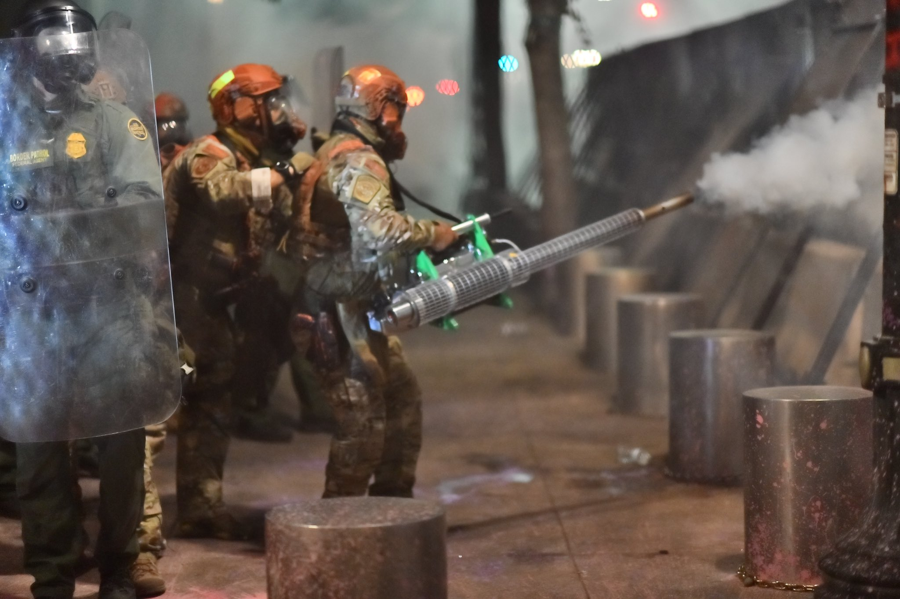

\mainmatter


```{r index-1, echo=FALSE}
is_on_ghactions <- identical(Sys.getenv("GITHUB_ACTIONS"), "true")
is_online <- curl::has_internet()
is_html <- knitr::is_html_output()
is_latex <- knitr::is_latex_output()
if (is_html) {
  out_width <- 500
} else if (is_latex) {
  out_width <-"100%"
}

```

# Introduction {-}


Late in the night on July 29th, during the height of the 2020 Uprising in Portland (OR), as protesters gathered outside the Hatfield Federal Courthouse to fight for racial justice, the Department of Homeland Security (DHS)'s Customs and Border Protection (CBP) used a thermal fogger to deploy unknown chemical agents on the crowd:

<br>

(ref:imgportland20200729) CBP agent using a thermal fogger in front of the federal courthouse, Portland OR [@Brown2020].

```{r imgportland20200729, echo=FALSE, out.width = out_width, fig.cap="(ref:imgportland20200729)", fig.align = "center", fig.alt = "Fully riot-geared and for some reason in green camo US Homeland Security agents (to the middle and the left of the photo) behind a row of two-foot tall, one-foot radius metal posts, behind a metal grate wall over 7 feet tall with metal support beams and concrete pylon buttressing. In the front of the left side is an agent holding a plastic clear riot shield, through which you can see a patch that say 'Border Patrol Federal Agent' in yellow and some insignia patches as well. In the middle are the agents in camo, one with a hand on the shoulder of another who is operating a thermal fogger machine shooting gas through the fence. The machine is maybe four or five feet long and has a body not unlike a bush whacker with a two-cycle engine, but fueling a vaporizer instead of a rotor. The agent is holding the machine with their right hand visibly and there is a black strap across their shoulder holding it up. The machine is mostly shiny metal, although the tip is showing signs of corrosion (no surprise based on the compounds and heat) and the supports of the body are a bright green"}

```


With this seemingly novel usage, DHS made a large swath of the populace aware of an insidious weapon that is actually not new, but -- in fact -- was [birthed](#Genesis) in the American occupation of Vietnam, [perfected](#The1968Convensions) for use against domestic protesters in the 1960s and '70s, and [sent abroad](#CBP) via CBP in the years since. 
The subsequent [return](#PortlandOR2020_2021) of the thermal fogger to use against civilians domestically by the same domestic law enforcement agency (CBP) that sent it abroad after its initial domestic use is an extension of the classical Imperialist Boomerang [@Cesaire1950; @Arendt1951; @Foucault1976; @Graham2013] that can be more aptly described as a tetherball.

Despite repeated use of thermal foggers to deploy chemical weapons over the last half century, the device appears to have slipped from the zeitgeist, only to reemerge in the city that experienced the most visible federal deployment of chemical weapons [@Flanigan2020] and weapons-based incidents of police brutality at racial justice protests (regardless of population size) [@pb20202021], perhaps due to the noteworthy density of photographers and videographers.

Although not all of the weapon's history is documented, enough is that we can quickly dispel the myth that this deployment was _new_ in any notable sense other than being recent.


