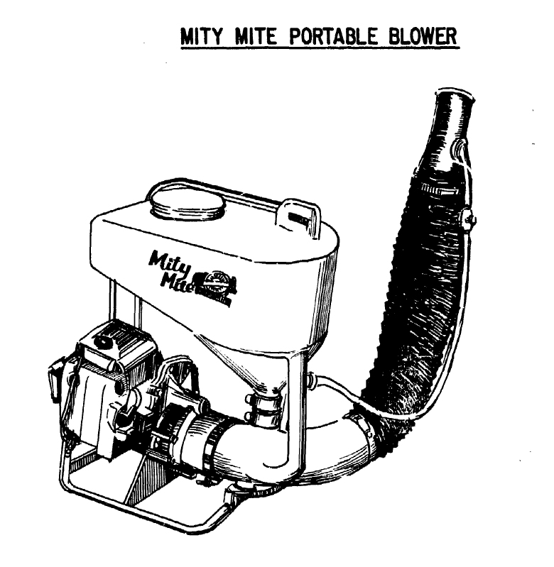
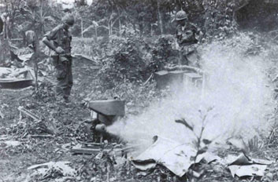

# Vietnam {- #Vietnam}

The modern day use of thermal foggers for chemical weapons deployment was born from the American colonization of Vietnam in the mid-to-late-20th Century [@Bunker1996]. 

## Context {-}

Early on in the deployment of US troops to occupy Vietnam, the need for large scale mosquito control became so great that soldiers began improvising insecticide foggers by mounting pesticide sprayers to diesel truck exhaust [@Spicknall1969]. 
The hack turned out to be much more effective, covering nine square miles per day, compared to 50,000 square feet (0.002 square miles) per day using a conventional manually operated fogger [@Spicknall1969].

As the occupation continued, US Army Soldiers were tasked with "rooting out" Viet Cong and People's Army of Vietnam soldiers, as well as innocents, from tunnels.
The specialized forces designated for the work were dubbed "Tunnel Rats" and tear gas was part of their arsenal to "flush" individuals from caves, which they regularly deployed via pyrotechnic grenades and powdered explosives [@NewYorkTimes1977; @Rottman2006; @Hemmings2019].

<br>

(ref:imgratmask) Tunnel rat in a gas mask, undated [@Hemmings2019]
  
```{r imgratmask, out.width = 500, fig.cap="(ref:imgratmask)", fig.alt = "B/W image. Open trench at bottom, center. Pipe runs across trench and into the dirt on either side. Person in gas mask crouched below pipe looking up and forward. Leg in pants and lace up boot stretched over trench leaning against right edge. Other leg and boot partially visible on left. Hand holding lit cigarette resting on foot on left.", echo = FALSE, fig.align = "center"}
knitr::include_graphics("img/rat_mask.png")
```

<br>

## Genesis {- #Genesis}

In 1965, the US Chemical Advisor to the South Vietnamese Army's (ARVN) III Corps participated in planning a "search and destroy" operation in the Iron Triangle, which was known to house an elaborate Viet Cong tunnel system, and suggested using a Mity Mite (Mitey Mite, Mighty Mite) fogger to aid in clearing tunnels [@USMACV1965].
On the first day of the operation (October 8th), the force located a tunnel and set into motion an elaborate scheme to fog the tunnels with [hexachloroethane (HC)](/hc) smoke from burning pots, marking the first known tactical use of a thermal fogger to deploy chemical weapons agents [@USMACV1965; @RottmanDelf2012].
Overall, the endeavor was dubbed a success in the report distributed the next month, despite the tunnel having been empty already [@USMACV1965].
And although (highly toxic; @Simonis2020) munitions smoke was used in this application, it was noted that tear gas would be "very effective in flushing VC from tunnels" should there been any present [@USMACV1965]. 

<br>
  
(ref:imgmitymite) [@USMACV1965]

```{r imgmitymite, out.width = 500, fig.cap="(ref:imgmitymite)", fig.alt = "Technical rendering sketch of a tank with the words Mity Mite on the side. Funnel on bottom of tank leads to exhaust hose below and pipe on bottom of tank has small flexible hose attaching to exhaust hose as well. Exhaust hose comes from below and curves upward to the right. Below the tanks and attached by a frame is a small motor.", echo = FALSE, fig.align = "center"}
    

```  

<br>


## Expansion {-}

The practice caught on quickly, and Mity Mites were soon issued to ARVN units [@USMACV1965] and became common tools for Tunnel Rats [@RottmanDelf2012].
The United States military was publishing on the utility of the fogger in official journals by the next year [@USArmy1966].

<br>
  
(ref:imgmightymite) A soldier uses a backpack Mity Mite to fog a tunnel [@USArmy1966]

```{r imgmightymite, out.width = 500, fig.cap="(ref:imgmightymite)", fig.alt = "B/W image in a dirt field. Helmeted soldier on one knee with tank strapped on back. Lifting a board with left hand and holding an exhaust tube from the tank under the board with right hand.", echo = FALSE, fig.align = "center"}
       
knitr::include_graphics("img/mighty_mite.png")
``` 
  

<br>

The Army used foggers to pump "air" or "smoke" into tunnels in combination with "riot control agents" during Operation Cedar falls in 1967 [@Lehrer1968]. 
And by 1968's Battle of Khe Sanh, it was standard practice to use foggers for tunnel excavation as well as mosquito and fly control [@Rottman2006]. 

<br>
  
(ref:imgunpacktest) Engineers unpack and test a Mitey-Mite blower [@USAES].

```{r imgunpacktest, out.width = 500, fig.cap="(ref:imgunpacktest)", fig.alt = "B/W image. In a clearing in a densely vegetated area, a small tank with an exhaust pipe blowing fog to the right. The cloud of fog covers much of the right side. Towards the back, 2 people wearing helmets and fatigues with sleeves rolled up stand with hands on hips on either side of the fogger, watching it.", echo = FALSE, fig.align = "center"}
   


```     
  

<br>

In 1969, the US Army Limited War Laboratory published a report on "riot control" methods that included a section on foggers and agents for use in them, naming the [General Ordinance Equipment Corporation](#GOEC) and [Federal Laboratories](#DefenseTech) models that were already in production [@Samuelsetal1969].


## International Melting Pot {-}

A handful of other countries were explicitly involved in supporting the US colonization in Vietnam, providing an pathway for the fogger idea to be rapidly picked up by the armed forces of other nations.
For example, by 1966 the Australian Tunnel Rats were particularly fond of fogging tunnels with acetylene [@vietnam_aus1; @vietnam_aus2].


<br>
  
(ref:vietnamaus1) Double Acetylene Generator and a Mighty Mite Air Blower Used to Blow Fumes into Viet Cong Tunnels [@vietnam_aus1]

```{r vietnamaus1, out.width = 500, fig.cap="(ref:vietnamaus1)", fig.alt = "Black and white photo of a Mighty Mite blower on the left and two containers of acetylene in the middle, both containers are metal boxes with labeling in small white text and then some bladder bag on top. There are large vaccum size hozes coming off the blower and going off frame to the right. The scene is the ground of a jungle that has been cleared a little, there are trees and foliage in the background and dense but matted down grass in the fore.", echo = FALSE, fig.align = "center"}
    
knitr::include_graphics("img/vietnam_aus1.jpg")
```     
  

<br>

<br>
  
(ref:imgvietnamaus2) Mighty Mite Machine Used to Contaminate Viet Cong Tunnel Systems with Acetylene [@vietnam_aus2]

```{r imgvietnamaus2, out.width = 500, fig.cap="(ref:imgvietnamaus2)", fig.alt = "An individual crouches on the ground next to a blower, facing off to the right, with his left hand slightly resting on it. The photo is aimed down at this person, so the two people looking at the fogger while standing are partially visible from the feet upwards. The photo is an old black and white image and there are items around the sides that are difficult to make out, including potentially a cache of chemical weapons grenades on the right side and some sandbacks in the back.", echo = FALSE, fig.align = "center"}
    
knitr::include_graphics("img/vietnam_aus2.jpg")
```     
  

<br>

And, [as expected](#TheReturn), the fogger quickly made it to Australian police departments, although with a decidedly different response from the news media, who called it "highly controversial" admist a Sydney Police spending scandal [@Allen1972].
Unnamed Australian arms experts who spoke on background said there was no application for the fogger in the country [@Allen1972], although that hasn't stopped its use elsewhere. 