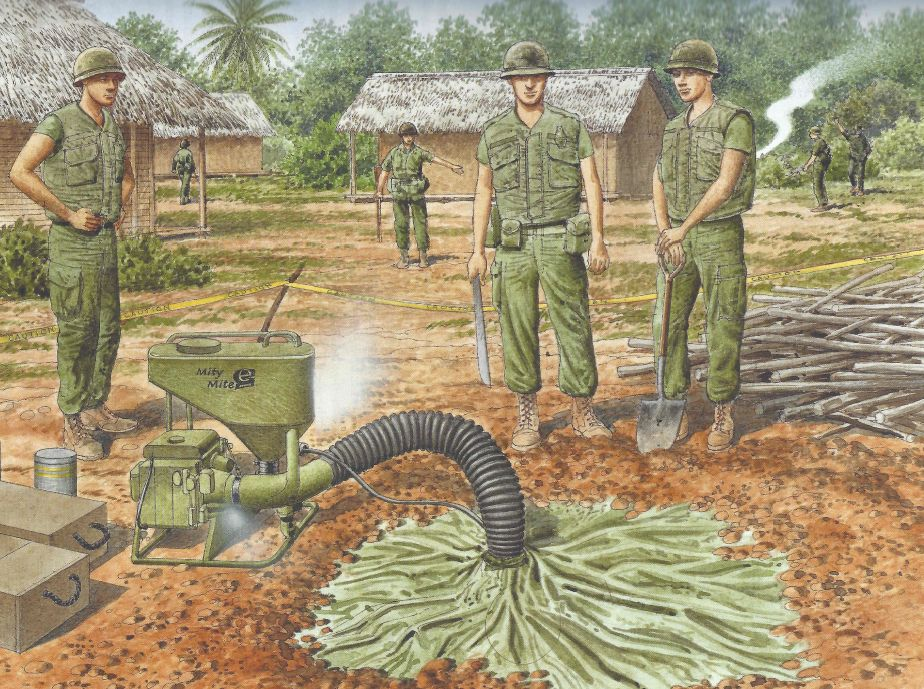
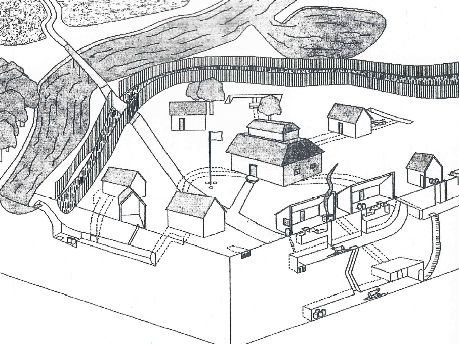
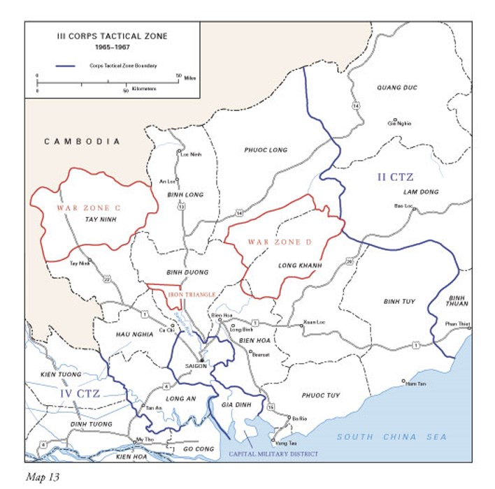
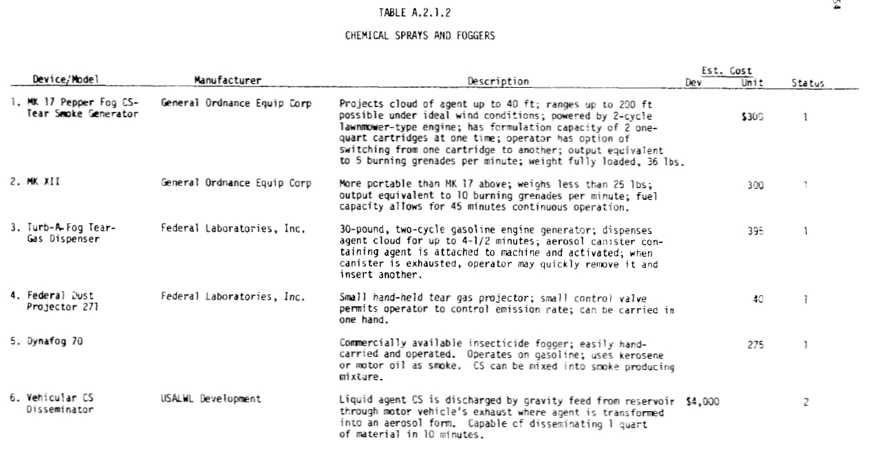

```{r index-1, echo=FALSE}
is_on_ghactions <- identical(Sys.getenv("GITHUB_ACTIONS"), "true")
is_online <- curl::has_internet()
is_html <- knitr::is_html_output()
is_latex <- knitr::is_latex_output()
if (is_html) {
  out_width0 <- 650
  out_width <- 500
  out_width2 <- 400
} else if (is_latex) {
  out_width <-"100%"
  out_width2 <-"100%"
}

```


# Vietnam {- #Vietnam}

The modern day use of thermal foggers for chemical weapons deployment was born from the American colonization of Vietnam in the mid-to-late-20th Century [@USMACV1965; @Bunker1996]. 

<br>

(ref:imgvcmm) US Military deploying a thermal fogger into a Vietnamese tunnel [@Delf2012].
  
```{r imgvcmm, out.width = out_width, fig.cap="(ref:imgvcmm)", fig.alt = "Book illustration (colorful, hand-rendered style) of green-clad US military service members in helmets flak vests, boots, etc, standing around a thermal fogger in the foreground. The fogger is a non-portable Mity Mite style fogger with a big reservoir and giant vacuum style hose running through a green tarp that's lying on the ground and covering the tunnel entrance. They are in a clearing with huts and the jungle in the background.", echo = FALSE, fig.align = "center"}

```
<br>


## Context {-}

### Mosquito Control {-}

Early in the deployment of US troops to occupy Vietnam, the need for large scale mosquito control became so great that soldiers began improvising insecticide foggers by piping insecticide into diesel truck exhaust:

>  An insecticide fogger, one of the most useful improvisations, was made by mounting a [55-gallon oil] drum filled with 6 to 7 percent malathion insecticide in diesel oil ... on a 3/4-ton truck and spraying the poisonous mixture out with the exhaust from the vehicle. The insecticide is drawn from the drum by the partial vacuum in a line connected to the exhaust pipe just behind the manifold, and sprayed out under pressure of the exhaust. 
>
> --- @Spicknall1969 

The hack turned out to be __*4,500 times*__ more effective, covering nine square miles per day compared to 50,000 square feet (0.002 square miles) per day using a conventional manually operated fogger [@Spicknall1969].
Given widespread mosquito concerns and the preponderance on diesel drums, the truck approach spread, and the concept of fogging was understood among servicemembers [@USMACV1965; @Spicknall1969]. 

### Tunnels  {-}

As the occupation continued, underground bunkers and tunnels dug by the Viet Cong (VC) and People's Army of Vietnam (PAV)  became a dominant presence on the both the literal and figurative battlefields [@Rottman2006; @Rottman2012].

<br>

(ref:imgtunnels) Hypothetical Vietnamese village with a two-level bunker tunnel system [@Hanesalo1996].
  
```{r imgtunnels, out.width = out_width, fig.cap="(ref:imgtunnels)", fig.alt = "Book illustration (blank and greys, hand-rendered style) of a two-level village tunnel system, connecting most of the structures with defensive trenches and bunkers. There are eight houses surrounding a community building and the nearest ones are cut-away so you can see into them and the ground beneath them, which shows the tunnels and bunkers. Each house has a shelter and they are connected via tunnels. There is a puji-stake moat with a sharpened bamboo fence around it surrounding the village and there's one road in, with a gate at the fence. There is a river or open water of some kind on the other side of the fence and then some fields and jungle. The community building is two stories and is next to a single flag on a pole in the center of the village. The flag is blank, and so functionally white.", echo = FALSE, fig.align = "center"}

```
<br>

Soldiers from the US, Australian, New Zealand, and other armies were tasked with clearing the tunnels and "rooting out" inhabitants [@Hemmings2019].
The specialized forces designated for the work were dubbed "Tunnel Rats" and tear gas was part of their arsenal to "flush" individuals from caves, which they regularly deployed via pyrotechnic grenades and powdered explosives [@NewYorkTimes1977; @Rottman2006].

<br>

(ref:imgratmask) Tunnel rat in a gas mask, undated [@Hemmings2019]
  
```{r imgratmask, out.width = out_width2, fig.cap="(ref:imgratmask)", fig.alt = "B/W image. Open trench at bottom, center. Pipe runs across trench and into the dirt on either side. Person in gas mask crouched below pipe looking up and forward. Leg in pants and lace up boot stretched over trench leaning against right edge. Other leg and boot partially visible on left. Hand holding lit cigarette resting on foot on left.", echo = FALSE, fig.align = "center"}
knitr::include_graphics("img/rat_mask.png")
```

<br>

## Genesis {- #Genesis}

### Implementation {- #FirstUse}

In October of 1965, the USMACV (United States Military Assistance Command, Vietnam) was supporting the South Vietnamese Army's (ARVN) III Corps in a "search and destroy" operation in the Iron Triangle, an area known to house an elaborate Viet Cong tunnel system [@USMACV1965].

<br>

(ref:imgirontriangle) US-defined War Zones C, D, and the Iron Triangle near Saigon, Vietnam [@USArmy2005]
  
```{r imgirontriangle, out.width = out_width2, fig.cap="(ref:imgirontriangle)", fig.alt = "Text-book style map of the III Corps Tactical Zone from 1965-1967, according to the legend. This is the area of Vietnam around Saigon, with some of the South China Sea visible to the south at the bottom and Cambodia to the north west in the upper left portion. Major highways and cities are indicated on the map, but the main points are the color highlighted boundaries of the two war zones and the iron triangle, which are all in reddish organge, and the full tactical zone in a darker blue. There is text in the bottom left that says Map 13 and there is a unit bar in the legend that gives distances in both miles and kilometers.", echo = FALSE, fig.align = "center"}

```

<br>


The US Chemical Advisor to the ARVN's Chemical Team participated in planning the operation, and suggested using a Mity Mite (a.k.a. Mitey Mite, Mighty Mite) 2-cycle thermal fogger to aid in clearing tunnels. 
A 6-member unit of ARVN Chemical Team members was organized on October 7th for implementation of the fogger [@USMACV1965].
The next day, the force located a tunnel and set into motion an elaborate scheme to fog the tunnels with [hexachloroethane (HC)](https://chemicalweaponsresearch.com/hc) smoke from burning pots, marking the first known tactical use of a thermal fogger to deploy chemical weapons agents [@USMACV1965; @Rottman2012].
Overall, the endeavor was dubbed a success, despite the tunnel already being empty [@USMACV1965].

Although (highly toxic; @Simonis2020) munitions smoke was used in this application, it was noted that tear gas would be "very effective in flushing VC from tunnels" should there been any present [@USMACV1965]. 

According to the *Lessons Learned* report filed by the USMACV the next month,

> This is believed to have been the first tactical employment of Mity Mite _by ARVN_. [emphasis added] 
>
> --- @USMACV1965

Note that there is no mention of use by USMACV prior to this deployment [@USMACV1965].


<br>


### What About Not In Tunnels? {-}

Seeing the Mity Mite in action got the wheels turning in the heads of USMACV officers, and the idea of deploying the fogger outside of tunnels was on the table [@USMACV1965].

This is made clear in the *Lessons Learned* report, where they state that the  

> Mity Mite portable blower can be used to ... generate an agent cloud for use against unmasked personnel __in the open__ ... [emphasis added] 
>
> --- @USMACV1965.

At the time, however, the set up used powder, pot, and grenade sources of chemical agents, which was inefficient and required extensive supplies and gasoline reserves [@USMACV1965].

<br>
  
(ref:imgmitymite) Technical drawing of a backpack fogger [@USMACV1965]

```{r imgmitymite, out.width = out_width, fig.cap="(ref:imgmitymite)", fig.alt = "Technical rendering sketch of a tank with the words Mity Mite on the side. Funnel on bottom of tank leads to exhaust hose below and pipe on bottom of tank has small flexible hose attaching to exhaust hose as well. Exhaust hose comes from below and curves upward to the right. Below the tanks and attached by a frame is a small motor.", echo = FALSE, fig.align = "center"}
    
knitr::include_graphics("img/mity_mite.jpg")
```  

<br>


## Expansion {-}

The practice caught on quickly, and Mity Mites were soon issued to ARVN units [@USMACV1965] and became common tools for Tunnel Rats [@Rottman2012].

<br>
  
(ref:imgmightymite) A soldier uses a backpack Mity Mite to fog a tunnel [@USArmy1966]

```{r imgmightymite, out.width = out_width, fig.cap="(ref:imgmightymite)", fig.alt = "B/W image in a dirt field. Helmeted soldier on one knee with tank strapped on back. Lifting a board with left hand and holding an exhaust tube from the tank under the board with right hand.", echo = FALSE, fig.align = "center"}
       
knitr::include_graphics("img/mighty_mite.png")
``` 
  

<br>

The Army used foggers to pump "air" or "smoke" into tunnels in combination with "riot control agents" during Operation Cedar falls in 1967 [@Lehrer1968]. 
And by 1968's Battle of Khe Sanh, it was standard practice to use foggers for tunnel excavation as well as mosquito and fly control [@Rottman2006]. 

<br>
  
(ref:imgunpacktest) Engineers unpack and test a Mitey-Mite blower [@USAES].

```{r imgunpacktest, out.width = out_width, fig.cap="(ref:imgunpacktest)", fig.alt = "B/W image. In a clearing in a densely vegetated area, a small tank with an exhaust pipe blowing fog to the right. The cloud of fog covers much of the right side. Towards the back, 2 people wearing helmets and fatigues with sleeves rolled up stand with hands on hips on either side of the fogger, watching it.", echo = FALSE, fig.align = "center"}
   

knitr::include_graphics("img/unpack_test.jpg")
```     
  

<br>

In 1969, the US Army Limited War Laboratory published a report on chemical weapons that included a section on foggers and agents for use in them, naming the [General Ordinance Equipment Corporation](#GOEC) and [Federal Laboratories](#DefenseTech) models that were already in production and a propsed development of a formalized truck-based fogger [@Samuelsetal1969]:


<br>
  
(ref:imgtablea212) Existing and proposed fogging devices [@Samuelsetal1969].

```{r imgtablea212, out.width = out_width0, fig.cap="(ref:imgtablea212)", fig.alt = "Screen cap of a photo copy of an old report, it's black and white and in bad shape, but legible for the most part. It's Table A.2.1.2, Chemical Sprays and Foggers. There are columns: Device/Model, Manufacturer, Description, Estimated Cost (for development or for purchase), and Status (available already or needing development). There are 6 rows, one for each Device/Model: MK17 Pepper Fog CS-Tear Smoke Generator, MK XII, Turb A Fog Tear Gas Dispenser, Federal Dust Projector 271, Dynafog 70, and a propsed vehicle based fogger based on the mosquito fogging approach.", echo = FALSE, fig.align = "center"}
   


```     
  

<br>

## International Melting Pot {-}

Other countries explicitly supported the US colonization in Vietnam, providing a pathway for the fogger to be rapidly picked up by the armed forces of other nations.

By 1966 the Australian Tunnel Rats were particularly fond of fogging tunnels with acetylene [@vietnam_aus1; @vietnam_aus2].


<br>
  
(ref:vietnamaus1) Double Acetylene Generator and a Mighty Mite Air Blower Used to Blow Fumes into Viet Cong Tunnels [@vietnam_aus1]

```{r vietnamaus1, out.width = out_width, fig.cap="(ref:vietnamaus1)", fig.alt = "Black and white photo of a Mighty Mite blower on the left and two containers of acetylene in the middle, both containers are metal boxes with labeling in small white text and then some bladder bag on top. There are large vaccum size hozes coming off the blower and going off frame to the right. The scene is the ground of a jungle that has been cleared a little, there are trees and foliage in the background and dense but matted down grass in the fore.", echo = FALSE, fig.align = "center"}
    
knitr::include_graphics("img/vietnam_aus1.jpg")
```     
  

<br>

<br>
  
(ref:imgvietnamaus2) Mighty Mite Machine Used to Contaminate Viet Cong Tunnel Systems with Acetylene [@vietnam_aus2]

```{r imgvietnamaus2, out.width = out_width, fig.cap="(ref:imgvietnamaus2)", fig.alt = "An individual crouches on the ground next to a blower, facing off to the right, with his left hand slightly resting on it. The photo is aimed down at this person, so the two people looking at the fogger while standing are partially visible from the feet upwards. The photo is an old black and white image and there are items around the sides that are difficult to make out, including potentially a cache of chemical weapons grenades on the right side and some sandbacks in the back.", echo = FALSE, fig.align = "center"}
    
knitr::include_graphics("img/vietnam_aus2.jpg")
```     
  

<br>

[As expected](#TheReturn), the fogger quickly made it to Australian police departments, although with a decidedly negative response from the news media, who called it "highly controversial" admist a Sydney Police spending scandal [@Allen1972].
Unnamed Australian arms experts who spoke on background said there was no application for the fogger in the country [@Allen1972], although that hasn't stopped its use elsewhere. 