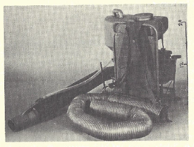
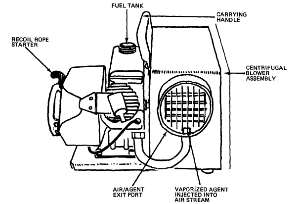
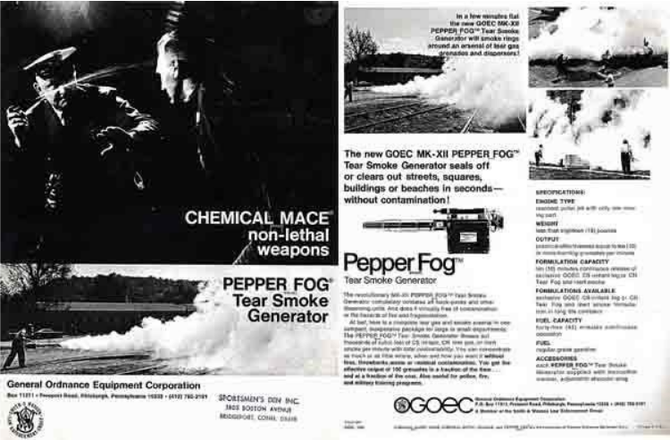
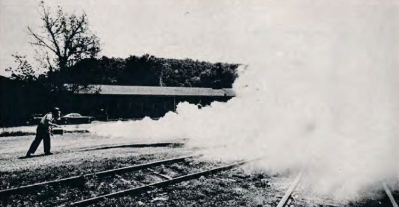
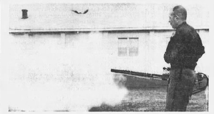
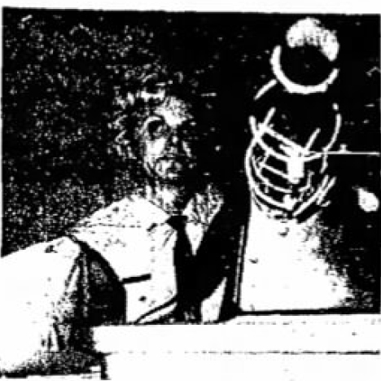

```{r index-1, echo=FALSE}
is_on_ghactions <- identical(Sys.getenv("GITHUB_ACTIONS"), "true")
is_online <- curl::has_internet()
is_html <- knitr::is_html_output()
is_latex <- knitr::is_latex_output()
if (is_html) {
  out_width <- 500
  out_width2 <- 300
} else if (is_latex) {
  out_width <-"100%"
  out_width2 <-"75%"
}

```

# The Return {- #TheReturn}

As to be expected following the basic trajectory of an Imperial Boomerang [@Cesaire1950; @Arendt1951; @Foucault1976], the repressive technique (thermal fogging) developed by an imperialist country (USA) to control colonial territories (Vietnam) was brought home by the imperialist nation to use on its own people [@Graham2013].

Indeed, it took just _three years_ from initial deployment [in Vietnam on October 8 1965](#FirstUse) to first application in the United States to gas Black racial justice protesters in [Miami, Florida on August 8th, 1968](#MiamiFL1968_08_08) during the Liberty City Riots [@Tschenschlok1995; @Lorentzen2018]. 

In alignment with the general "Imperial Circuit of Tear Gas" [@Schrader2019] between the US and Vietnam, the return of the fogger was aided significantly by the weapons industry, militarization of US police forces, transition of veterans to law enforcement upon returning home, and substantial propaganda in specialized and generalized outlets.

## Manufacturers {-}

American companies quickly jumped at the opportunity to refine the bulky, complicated Mitey Mite and sell thermal foggers to the military and domestic police departments.
As early as 1969, The International Association of Chiefs of Police included a detailed section on thermal fogging and available models in their Chemical Agents Manual [@Crockett1969], providing prime trade-focused marketing.
Indeed, both [Federal Laboratories](#FederalLaboratories) and [General Ordnance Equipment Corporation](#GOEC) models were included.

### Sears Roebuck {-}

The original Mighty Mite that [established](#FirstUse) the fogger as a method of chemical dispersal was manufactured by Sears, Roebuck, and Co. for insecticide application [@Applegate1969].

<br>

(ref:imgM106) M-106 Mity Mite Thermal Fogger, as promoted to law enforcement in @Applegate1969.

```{r imgM106, out.width = out_width, fig.alt = "Yellowed black and white photo of a stationary Mighty Mite thermal fogger. It's a backpack fogger, so there's a giant hose that's like a vacuum hose wrapped around in the middle and then another one coming off of the actual backpack, which is upright in the middle back right. there is a metal frame and a large reservoir tank sitting on top of the engine and other aspects of the machinery. There is a tube running out to the end of the hose nose from the back pack. On the right side of the image is a scale bar that makes it seem like the backpack is 24 inches tall." , echo = FALSE, fig.cap = "(ref:imgM106)", fig.align = "center"}
 
```

<br>

The bulkiness of the Mity Mite backpack proved to be a hindrance in mobile application, however, and while chemical weapons corporations began their fogger lines with hand-held models using 2-cycle engines, there was a push to produce a more streamlined and specialized tool for fogging chemical weapons at civilians [@Applegate1969; @Applegate1970].

<br>

(ref:imgjetfogger) Hand-held two-cycle thermal fogger [@Crockett1969].

```{r imgjetfogger, out.width = out_width, fig.alt = "Black and white technical drawing of a hand-held 2-cycle thermal fogger. The drawing is pretty minimal, but shows enough detail, in particular around the engine and fan, to get a sense of how it operates. There are also a few labels pointing out via arrows what the Recould Rope Starter, Fuel Tank, Carrying Handle, Creifugal Blower Assemble, and Air/Agent Exit Ports are, and to the where the Vaporized Agent is injected into the air stream.", echo = FALSE, fig.cap = "(ref:imgjetfogger)", fig.align = "center"}
 
```

<br>

Sears does not appear to have entered The Mity Mite into the law enforcement market, perhaps due to the company's existing legacy branding, and the model never established itself in the domestic market.


### Federal Laboratories {- #FederalLaboratories}

Federal Laboratories, one of the major US manufacturers of chemical weapons starting after World War I, developed a hand-held 2-cycle thermal fogger that did not need a backpack or hoses:

(ref:img298) The Federal Laboratories "Federal Fogger 298" [@FedLabs298].

```{r img298,  out.width = out_width2, fig.alt = "Black and white photo of a thermal fogger that is basically a 2-cycle weed-wacker engine on top of a chemical agent metal drum with a nozzle sticking out to the right that is about a yard long, it's dark and has some hardware on it. The drum says Federal Fogger and then other things that are illegible. The drum is a dark color and the main engine is light, with a dark handle and strap." , echo = FALSE, fig.cap = "(ref:img298)", fig.align = "center"}
knitr::include_graphics("img/federal_fogger_crop.jpg") 
```

(ref:fedlabimg) Officer demonstrating the Federal Laboratories 298 [@Applegate1992].

```{r fedlabimg,  out.width = out_width2, fig.alt = "Black and white photo of police officer in a gas mask and riot helmet with the shield flipped up and full uniform, but not riot gear. The officer is holding a hand-held fogger that has a white top on the part, some shiny metal in the middle and then dark on the bottom with a dark nozzle that is spewing some fog. The officer is standing in a field in front of a forest." , echo = FALSE, fig.cap = "(ref:fedlabimg)", fig.align = "center"}
knitr::include_graphics("img/federal_labs.jpg") 
```


### General Ordnance Equipment Corporation {- #GOEC}

The General Ordnance Equipment Corporation (GOEC), who invented and trademarked Chemical Mace earlier in the decade, had been bought-out by Smith and Wesson by the late 1960s when the fogger market opened up [@Gross2014].

Alan Litman, the brains behind GOEC, retained leadership of chemical weapons development after the buy-out, however [@Gross2014], and he must have seen an opportunity, as GOEC began selling hand-held thermal foggers in July 1968 [@Applegate1969].

They named their units "Pepper Fog" generators, a nod to their apparent ability to "pepper" the recipient with more concentrated bursts of fog if desired, compared to the steady stream output from the Mity Mite [@Applegate1969], and applied for a trademark on the phrase in October of the same year [@USTPO2018].
By the end of August 1969, GOEC (and thus Smith and Wesson) had received the trademark on "Pepper Fog", which they (and subsequent owners) retained until it expired in 1991 [@USTPO2018].

While GOEC did develop and sell a stationary 2-cycle model for vehicle mounting, it was their hand-held pulse-jet model that took the market by storm [@Crockett1969].

<br>

(ref:goecpf) General Ordnance Equipment Corporation thermal fogger [@GOECphoto], as shown in @Applegate1969.

```{r goecpf, out.width = out_width, fig.alt = "Yellowed black and white photo of a stationary pepper fog thermal fogger pointed to the left sitting by itself. The main body is a square box that's dark with a tag in the middle that's lighter and has dark writing on it that says pepper fog g o e c. The nozzle points to the left and is a longer thinner tube about twice as long as the main body. It is also dark and has a metal cage around it that is sparse and shiny. There's also a handle and some knobs on the top of the item and something that's a little bit difficult to make out off the back of the main body." , echo = FALSE, fig.cap = "(ref:goecpf)", fig.align = "center"}
knitr::include_graphics("img/goec_pf.png") 
```

<br>


They immediately began a heavy marketing campaign for their new invention, taking out full-page ads in police magazines [@GOECad1969; @GOECadLNS1970; @GOECadObserver1970]:

<br>

(ref:imggoecad1969) GOEC advertisement [@GOECad1969].

```{r imggoecad1969, out.width = out_width, fig.alt = "Photocopied, blurried black and white magazine spread advertisement for General Ordnance Equipment Company (GOEC). The ad shows both their chemical mace and their fogger, although the fogger takes up 3/4 of the page. The left side has two main panels, one for each weapon, the top is a mace one showing an officer spraying mace into someone's face and the bottom part is the picture of the person fogging the railroad. The right side is an explainer on the pepper fogger that has three photos (including a repeat of the railroad one) at the top, the item image in the middle, and then a whole bunch of specs that are too blury to read" , echo = FALSE, fig.cap = "(ref:imggoecad1969)", fig.align = "center"}
 
```

<br>

They also leveraged the connection between local law enforcement and the press to generate [free marketing](#Propa) with an [international reach](#Canada).

It is perhaps no surprise then that virtually all of the foggers photographed being used in the US prior to 2020 are GOEC models.


### Defense Technology {- #DefenseTechnology}

The corporate descendent of both GOEC and Federal Labs and current owner of the legacy branding ([Safariland](https://www.safariland.com) subsidiary [Defense Technology](https://www.defense-technology.com)) continues to sell items under a ["Pepper Fog" line](https://www.defense-technology.com/product-category/pepper-foggers/), including a ["pepper fog generator"](https://www.defense-technology.com/product/pepper-fog-generator/) that utilizes the same pulse-jet generation technique [@DTPFG]:

<br>

(ref:imgdefensetechgepf) Product image for thermal fogger [@DTPFGphoto].

```{r imgdefensetechgepf,  out.width = out_width, fig.alt = "Yellow-gold box shape tool with a handle on top, an image of an eagle in flight on the side, and some gauges on top.The back of the box tapers and appears to have switches and controls. Coming out of the front is a long tube that narrows at the end. The tube has a wire cage surrounding it." , echo = FALSE, fig.cap = "(ref:imgdefensetechgepf)", fig.align = "center"}
knitr::include_graphics("img/defense_tech_gepf.png") 
```

<br>

This has supplanted the models produced by the corporate ancestors to Defense Technology, which were bulkier and considerably heavier [@Samuelsetal1969].

## Rex Applegate {-}

A major figure in the translation of military "riot suppression" tactics to domestic law enforcement in the 1960s and 1970s was a former US Army Lt. Colonel named [Rex Applegate](https://en.wikipedia.org/wiki/Rex_Applegate).
Applegate took a commission as a second leuitenant, but had a lung ailment kept him from serving in combat in World War II and so was assigned to Military Police Company before being tapped by [Col. William Donovan](https://en.wikipedia.org/wiki/William_J._Donovan) to build and run the School for Spies and Assassins in the Office of Strategic Services [@Goldstein1998].
Larger than life, Rex even served as bodyguard to President Franklin Roosevelt, before retiring and moving to Mexico at the end of World War II to consult with Central and South American governments on "riot control" [@Goldstein1998].

Applegate returned to the US in the 1960s during the civil rights and anti-war protest era and began proselytizing the good word of the thermal fogger [@Applegate1969; @Applegate1970].
Indeed, Rex published what can only be described as a long-form written sales pitch for the GOEC Pepper Fog thermal fogger in the highly circulated _Guns_ magazine in 1970 [@Applegate1970].

<br>

(ref:imgdemo) Demonstration of a pepper fogger [@Applegate1970]

```{r imgdemo,  out.width = out_width, fig.alt = "Black and white photo of a person using a pepper fogger across some railroad tracks. The person is standing in the mid ground on the left side of the photo and fogging towards the right mid-ground where the train tracks come from. The fog obscures the origins of the tracks off to the background on the right side of the photo. Behind the person on the left side is a taller tree along short building a car and some foliage. Further behind is a ridge of some kind with trees on it. The train tracks are old and partially overgrown." , echo = FALSE, fig.cap = "(ref:imgdemo)", fig.align = "center"}
 
```

<br>

## News Media Propaganda {- #Propa}


Alongside the more overtly pro-police-use-of-chemical-weapons propaganda of Rex Applegate were other, perhaps more subtle forms of pro-fogger propaganda [@Macomber1970].
Newspapers around the country were more than happy to print "articles" that promoted the new arsenals police departments were building [@LaPrade1970], complete with product demo photos.

<br>

(ref:imgVance1970) Amarillo Texas Police Sergent Jerry Austin with a thermal fogger and shotgun [@Vance1970]. Amarillo's 1970 population was 127,010 [@USCB1970].

```{r imgVance1970, out.width = out_width, fig.alt = "Black and white newspaper clipping of an officer standing in front of a open garage door, next to a police car that is partially in frame on the left and front areas. A GOEC-style thermal fogger sits on the hood of the car in front of the officer, pointing towards and to the left of the camera. The officer is wearing beat clothing and a cop hat and also has a shotgun." , echo = FALSE, fig.cap = "(ref:imgVance1970)", fig.align = "center"}
knitr::include_graphics("img/Vance1970.jpg") 
```

<br>

<br>

(ref:imgAmanphoto1970) Richland County (Ohio) Sheriff's Captain Robert Dysart demonstrating a thermal fogger to a crowd of >200 people [@Amanphoto1970]. Richland County's 1970 population was 129,997 [@USCB1970].

```{r imgAmanphoto1970, out.width = out_width, fig.alt = "Black and white newspaper clipping of an officer standing in a field just front a forest/brush line, fogging out into the open area as part of a demonstration. The officer is wearing a riot helmet and coveralls and has the fogger slug over their right arm with a strap they are also holding with their left hand. The officer stands in the left part of the frame, fogging to the right, using a GOEC-style fogger with the nozzle tip right in the middle of the photo." , echo = FALSE, fig.cap = "(ref:imgAmanphoto1970)", fig.align = "center"}
knitr::include_graphics("img/Amanphoto1970.jpg") 
```

<br>

[General Ordnance Equipment Corporation](#GOEC)'s Pepper Fog model seems to have been the favorite, at least amongst the departments showing off their new cool toys for photographs.

<br>

(ref:imgGaylord1971) A McHenry County (Illinois) Sheriff's officer fogs some grass in a rural landscape during a training and press demo day [@Gaylord1971; @PlainDealer1971]. McHenry County's 1970 population was 111,555 [@USCB1970].

```{r imgGaylord1971,  out.width = out_width, fig.alt = "Black and white photo of an individual standing in a grass field with wood horse fence and trees and barns in the background. The individual is in light clothes and a black cap and is using both hands to hold a pepper fogger, which they are using to fog some grass on the right side of the photo. they are facing the camera, so the classic GOEC label is visible." , echo = FALSE, fig.cap = "(ref:imgGaylord1971)", fig.align = "center"}
knitr::include_graphics("img/Gaylord1971.jpg") 
```

<br>


<br>

(ref:imgWinter1970) Scott County (Iowa) deputy sheriff Jim Lewis, left, holds a new grenade launcher and a riot gun while Sheriff William Strout displays a pepper fogger and gas mask [@Winter1970]. Scott County's 1970 population was 142,687 [@USCB1970].

```{r imgWinter1970, out.width = out_width, fig.alt = "Black and white newspaper clipping of two officers standing in front of a large brick wall. Scott County deputy sheriff Jim Lewis, left, holds a new grenade launcher and a riot gun. he is donning a standard beat uniform with a bucket hat. Sheriff William Strout is on the right in street clothes and is holding a GOEC pepper fogger in his right hand and gas mask in his left. The officers are making an X with the barrells of the grenade launcher and fogger." , echo = FALSE, fig.cap = "(ref:imgWinter1970)", fig.align = "center"}
knitr::include_graphics("img/Winter1970.jpg") 
```

<br>


### Gary Wills {-}

Pulitzer Prize-winning [Garry Wills](https://en.wikipedia.org/wiki/Garry_Wills) (who at the time was considerably more conservative than he came to be later) penned an op-ed that ran in (at least) The Herald Statesman (Yonkers, New York) [@Wills1971a], The Daily Item (Port Chester, New York) [@Wills1971b], The Charlotte News (Charlotte, North Carolina) [@Wills1971c], and The Philadelphia Inquirer [@Wills1971d] in April 1971 in which he basically tells all the cry babies (pun intended) to suck it up because he "would not be afraid to undergo such experiences [as being pepper fogged] again" [@Wills1971a].

Notably, he touts the leading belief at the time that somehow thermal fogging is a "safe immobilizer of individuals" [@Wills1971a], despite the weapon not being demonstrably safer than gas grenades and not only not "immobilizing" but explicitly designed to mobilize immobile resisters.
Wills interestingly deems chemical weapons as "safer than dogs, which get out of control, bite bystanders (and even other cops) as well as 'the bad guys'" [@Wills1971a], despite their being indiscriminate to the point of impacting bystanders, police officers, etc..

He concludes his piece by calling tear gas "humane in ... foreign wars [and] domestic encounters" [@Wills1971a], speaking clearly to the return of the trip of the classically defined Imperial Boomerang [@Cesaire1950; @Arendt1951; @Foucault1976]. 


## Coming Soon To A Town Near You! {-}

US police had a hard time containing their glee when purchasing and testing thermal foggers for use on domestic civilians, as a general media blitz played out accross the country through the late 1960s and early 1970s [@PlainDealer1971].

### Illinois {-}

In the wake of the [1968 Democratic National Convention](#ChicagoIL1968_08_26), Chicago-area police played an outsized role in promoting the propaganda line.
The pepper fogger was touted as being able to "empty a house fast" by Cook County Illinois Sheriff Joseph Woods [@MtVernonRegisterNews1969_04_09; @DailyDispatch1969_04_09], a definitely off-spec and dangerous use [@Nixalite2009b].
The volume of fog emitted was also said to be able to fill [Soldier Field (capacity 61,500 fans)](https://en.wikipedia.org/wiki/Soldier_Field) in under a minute [@DailyDispatch1969_04_09].
Regardless, the Chicago-area Sheriff decided they needed three of them [@DailyDispatch1969_04_09].
The Sheriff's Major in charge of chemical arsensal Anthony Yucevicius noted the fogger's psychological effect on recipients, as well saying

> They make a terrifying noise and probably will have a scare effect on crowds. 
>
> --- @TheTerreHauteTribune1969_04_08.

Use expanded among and within states, as by 1972 the Illinois State Police also purchased three foggers, which they trained with in Springfield [@Robinson1972].
In news reports, the foggers were described as

> a cross between a machine gun, a power lawn mower, and a sun lamp. 
>
> --- @Robinson1972.

### Florida {-}

Similarly, following the [1968 Republican National Convention](#MiamiFL1968_08_08), Florida law enforcement took to the fogger [@Cain1968].
In Sanford (1970 pop. 17,393; @USCB1970), the local police department purchased a fogger for use with [CN gas](https://en.wikipedia.org/wiki/Phenacyl_chloride), noting that it could shoot fog 20 ft for up to a 15 minute stretch, and so would be effective for controlling large masses [@Cain1968].
They had, however, only used it in training and for demoing to the media [@Cain1968].

<br>

(ref:imgOrlandoEveningStar1968) Sanford Police Officer Roy Williams shows off a fogger [@OrlandoEveningStar1968].

```{r imgOrlandoEveningStar1968,  alt="Black and white newspaper clipping. A single officer stands in front of a ranch house style building, wearing a normal beat uniform. The officer is holding a GOEC-style pepper fogger aimed at the left of the photo to where the opening of the barrel is in the middle of the frame. The fogger is emitting a cloud of smoke obscuring the left side of the photo. ", out.width = out_width, echo = FALSE, fig.cap = "(ref:imgOrlandoEveningStar1968)", fig.align = "center"}  
 
```

<br>

### California {-}

Eager to not be shown up by the police in Berkeley, by 1970, the Los Angeles Sheriff's Department had already purchased their own fogger for their "big artillery" to use "when other forms of persuasion have failed" and started a media campaign [@Michals1970].
The department and new state regulations required officers to be trained in chemical weapons use, which was set up through Officer Robert Hawkins [@Michals1970].

<br>

(ref:imgCopleyNewsService1970) Los Angeles Sheriff's Department Officer demonstrating a fogger [@CopleyNewsService1970].

```{r imgCopleyNewsService1970, alt="Black and white newspaper clipping. A single officer stands in front of a some shrubs and trees house style building, wearing a normal beat uniform. The officer is holding a GOEC-style pepper fogger aimed at the right of the photo to where the opening of the barrel is pointed away but in the middle of the frame. The fogger is emitting a cloud of smoke obscuring the right side of the photo. ", out.width = out_width  , echo = FALSE, fig.cap = "(ref:imgCopleyNewsService1970)", fig.align = "center"} 
knitr::include_graphics("img/CopleyNewsService1970.jpg") 
```

<br>

### National Guard {-}

Following the Kent State Massacre, the Ohio National Guard, as well as others around the country began equipping their forces with thermal foggers, using the death of those students as justification for massive purchaing of "less lethal" options [@Bandy1970].

### Small Town USA {-}

No matter the size of the town, by the early 70s, police wanted in on that sweet sweet fogger action.
The Brigham City (Utah; 1970 pop. 14,007; @USCB1970) Police Department leveraged federal Omnibus Crime Act money to purchase a variety of weapons to use against protesters in 1971 [@BoxElderAgencies1971].

Police Chief Jay Christensen noted that the fogger provides a longer shelf-life than grenades and reportage noted that it 

> emits a continuous stream of smoke, chemical irritants, or **whatever solution** is fed into it. [emphasis added] 
>
> --- @Robinson1972

Use of federal funds to purchase chemical weapons, and specifically foggers, was not limited to one department.
Cities, counties, and states across the country used Omnibus Crime Bill money to up their chemical weapons caches, including foggers [@Conheim1972].
For example, Oakland County in Michigan (1970 pop. 907,871; @USCB1970) purchased two pepper foggers for their South County Tactical Mobile Unit with part of their $21,066 in 1970 [@Conheim1972].

Oneota New York (1970 pop. 16,030; @USCB1970) purchased a fogger in 1969 during the anti-war demonstrations, although the department bungled its response to protests [@Griffin1973].
As came to light during a public probe, Oneota Police Chief Joseph F. DeSalvatore requested a limited amount of training in the budget, and officers were therefore unable to deploy the fogger or other chemical weapons [@Griffin1973].

Gaston County North Caolina (1970 pop. 47,322; @USCB1970) Sheriffs purchased a fogger, which they turned on but not used to dispense agents multiple times by 1970 in their jail system "when there's been trouble brewing" [@Balloch1970].

<br>

(ref:imgTheGastoniaGazetteSun19701004) Gaston County Sheriff's Deputy Anne Huffsteller poses with a thermal fogger [@TheGastoniaGazetteSun1970_10_04].

```{r imgTheGastoniaGazetteSun19701004, alt="Black and white newspaper clipping. A single officer is behind a fogger and other objects. The officer is wearing a beat uniform and has curly light hair. the officer is only visible from the mid waist upwards, and the photo is very washed out so it is hard to distinguish items or details. ", out.width = out_width  , echo = FALSE, fig.cap = "(ref:imgTheGastoniaGazetteSun19701004)", fig.align = "center"} 
 
```

<br>

Apparently the threat of [death by chemical weapons fog](#BigMac) is sufficient to scare detained individuals into compliance.


Within a few years, however, departments began to realize they had no need for the machines, and began selling them with no use aside from testing [@DesMoinesTribune1975_05_06].
The Storm Lake Iowa (1970 pop. 8,591; @USCB1970) purchased a fogger in 1971 in advance of a motorcycle rally that never happened, and used free advertising in local media in attempts to pawn it [@DesMoinesTribune1975_05_06].
The article/ad mentions that officers have used foggers "on occasion" in Des Moines (Iowa's capital; 1970 pop. 201,404; @USCB1970) in addition to [one instance on the University of Iowa's campus](#IowaCity) [@DesMoinesTribune1975_05_06], although I have not located contemporaneous mentions.


## Crossing to Canada {- #Canada}

Canadian law enforcement was also quick to jump on the fogger train and the media were just as happy to propagandize their use [@Patterson1976].
A convention of US and Canadian police chiefs held in Halifax, Nova Scotia in 1976 provided a glimpse into the state of affairs by mid-decade, at which point a supply chain had clearly been developed, although weapons salesmen refused to be named or have their statements linked to employers [@Patterson1976].

<br>

(ref:imgMacKenzie1976) Sergeant Al Oakley shows off a pepper fogger [@MacKenzie1976].

```{r imgMacKenzie1976,  alt="Black and white newspaper clipping from the middle panel of a trip-tych. A single officer stands in front of a brick building, wearing a riot helmet that's light with a police logo on it and the chinstrap is undone. The officer is wearing a flak jacket loosely and holding a GOEC-style pepper fogger aimed at the front right of the photo to where the opening of the barrel is just in frame. The darkness of the fogger body and the officer's pants and jacket make the bottom left of the photo a bit of a black mush. ", out.width=out_width2  , echo = FALSE, fig.cap = "(ref:imgMacKenzie1976)", fig.align = "center"}
knitr::include_graphics("img/MacKenzie1976.jpg") 
```

<br>

