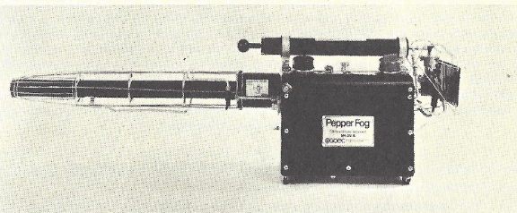

```{r index-1, echo=FALSE}
is_on_ghactions <- identical(Sys.getenv("GITHUB_ACTIONS"), "true")
is_online <- curl::has_internet()
is_html <- knitr::is_html_output()
is_latex <- knitr::is_latex_output()
if (is_html) {
  out_width <- 500
} else if (is_latex) {
  out_width <-"100%"
}

```

# The 1968 Conventions {-}

Deployment of chemical weapons on United States civilians by domestic law enforcement began in earnest in the late 1960s during the height of anti-war and civil rights protests, kicked off in particular by the 1968 Republican (Miami, Florida) and Democratic (Chicago, IL) National Conventions [@McArdle2018; @TaylorandMorris2018].
As a result of a [heavy propaganda and branding campaign](#TheReturn), the thermal fogger was becoming a mainstay of early police chemical weapons arsenals.
Importantly, by the summer of 1968, the Florida Highway Patrol, Chicago Police Department, and California State Police all had purchased foggers.

The lingering impact of the 1968 Conventions was felt for years to come, as the Kansas City (Missouri) Police Department armed up their chemical weapons cache in advance of the 1976 Republican National Convetion, including purchase of fogger fluids [@Hudson1976].

## Miami, August 8 {- #MiamiFL1968_08_08}

The first use of a thermal fogger to deploy chemical weapons in the US that I have been able to uncover was during the "[Liberty City Riots](https://en.wikipedia.org/wiki/1968_Miami_riot)", which took place in during the [1968 Republican National Convention](https://en.wikipedia.org/wiki/1968_Republican_National_Convention) (RNC) in Miami, Florida [@Tschenschlok1995; @Tschenschlok1996; @McArdle2018].
A white reporter with the Miami Herald attempted to gain access to rally of concerned Black people that was meant to be only among Black people that was occurring in Liberty City, a Black neighborhood, on August 7th [@Tschenschlok1995; @Tschenschlok1996].
When the reporter was ejected from the rally, Miami police responded with a large and heavy presence and during the standoff, a white motorist with a "Wallace for President" bumper sticker attempted to drive through but was met with resistance and drove into another car, and fled the scene on foot [@Tschenschlok1995; @Lorentzen2018].

Miami police used chemical weapons the night of the 7th, but the fogger did not make an appearance until the subsequent day.
Local, state, and federal officials met with Black organizational representatives the night of the 7th and had agreed to continue discussions the morning of the 8th, but instead sent staffers rather than appear themselves, which effectively ended discussions [@Tschenschlok1995; @Tschenschlok1996]. 
Apparently, Miami Police Department was unable to manage the situation and Florida Highway Patrol (FHP) was called in by the city [@Tschenschlok1995].

FHP used a truck with multiple foggers [@Lorentzen2018], described as "essentially a modified version of an insect-control machine" that "spread a thick fog of tear gas throughout the riot zone" [@Tschenschlok1995]. 

FHP used the truck-mounted thermal foggers indiscriminately and caused visible symptoms (gagging, etc.) in all present, including a 5-month old [@McArdle2018].
The fog quickly spread into neighborhood homes, forcing residents outside to seek fresh air [@Tschenschlok1995].


## Chicago, August 26 - 29 {- #ChicagoIL1968_08_26}

Later that month anti-war protests took place in Chicago, Illinois during the [Democratic National Convention](https://en.wikipedia.org/wiki/1968_Democratic_National_Convention), and a massive force of law enforcement (Chicago Police with assistance from over 6,000 National Guard members and 6,000 Army troops [@TaylorandMorris2018]) responded excessively, including with chemical weapons, on network news [@Schultz1969; @Karnow1983; @Farber1988; @Langguth2000]. 
After four days, hundreds had been given medical assistance for exposure to chemical weapons [@TaylorandMorris2018].

Although I have yet to find contemporary documentation of fogger use during the convention, an AP report on fogger use in [Berkeley the year later](#BerkeleyCA1969_02_21) states

> A similar device was used during demonstrations in Chicago during the Democratic convention last summer. - @TheDailyTribune1969_02_21

As such, I consider this a very likely deployment.
I am continuing to search for evidence.


## Berkeley, August 31 {- #BerkeleyCA1968_08_31}

A demonstration in Berkeley, California was called by the Young Socialist Alliance, Independent Socialist Club, and the Black Panther Party in solidarity with anti-war protesters in Chicago who the police had recently brutalized [@PatersonEveningNews1968_08_31; @TheCapitalTimes1968_08_31], including [use of a pepper fogger](#ChicagoIL1968_08_26) [@TheDailyTribune1969_02_21].
In response, police brutalized the protesters, and in the process brought out a hand-held pepper fogger, a "new police weapon... which produced a gas that caused sneezing" [@PatersonEveningNews1968_08_31].

<br>

(ref:imgberkeley19680831) Deployment of a thermal fogger by police in Berkeley, CA [@UPIphoto1968].

```{r imgberkeley19680831, echo=FALSE, out.width = out_width, fig.cap="(ref:imgberkeley19680831)", fig.align = "center", fig.alt = "B/W newspaper clipping. To left is an officer wearing long pants, long sleeved shirt, and a helmet walking forward carrying a fogger in the right hand. The fogger is blowing fog through a tube and a cloud is forming. Background is a storefront window and door. To the right 2 people are moving away from the fog, leaning on one another, and covering their faces with their hands."}
       
knitr::include_graphics("img/berkeley_1968_08_31.png")
``` 


Deployment of the thermal fogger was covered in newspapers around the country including Paterson, New Jersey [@PatersonEveningNews1968_08_31]; Hanford, California [@TheHanfordSentinel1968_08_31]; Honolulu, Hawaii [@TheHonoluluAdvertiser1968_09_01]; St. Louis, Missouri [@StLouisPostDispatch1968_08_31]; Franklin, Pennsylvania [@TheNewsHerald1968_08_31]; Madison, Wisconsin [@TheCapitalTimes1968_08_31]; and El Paso, Texas [@ElPasoHeraldPost1968_08_31], a city whose significance was already budding.

It is clear from the photograph shared with the United Press International (UPI) copy that the fogger used is a [GOEC](#GOEC) brand pepper fogger, which hit the market the month prior [@USTPO2018].
The GOEC thermal fogger was so new, it would not have a trademarked name ("Pepper Fog") for another year [@USTPO2018].

<br>

(ref:imggoecpf) Product image for thermal fogger [@GOECphoto].

```{r imggoecpf, echo=FALSE, out.width = out_width, fig.cap="(ref:imggoecpf)", fig.align = "center", fig.alt = "Yellowed black and white photo of a stationary pepper fog thermal fogger pointed to the left sitting by itself. The main body is a square box that's dark with a tag in the middle that's lighter and has dark writing on it that says pepper fog g o e c. The nozzle points to the left and is a longer thinner tube about twice as long as the main body. It is also dark and has a metal cage around it that is sparse and shiny. There's also a handle and some knobs on the top of the item and something that's a little bit difficult to make out off the back of the main body."}
       

``` 

<br>
