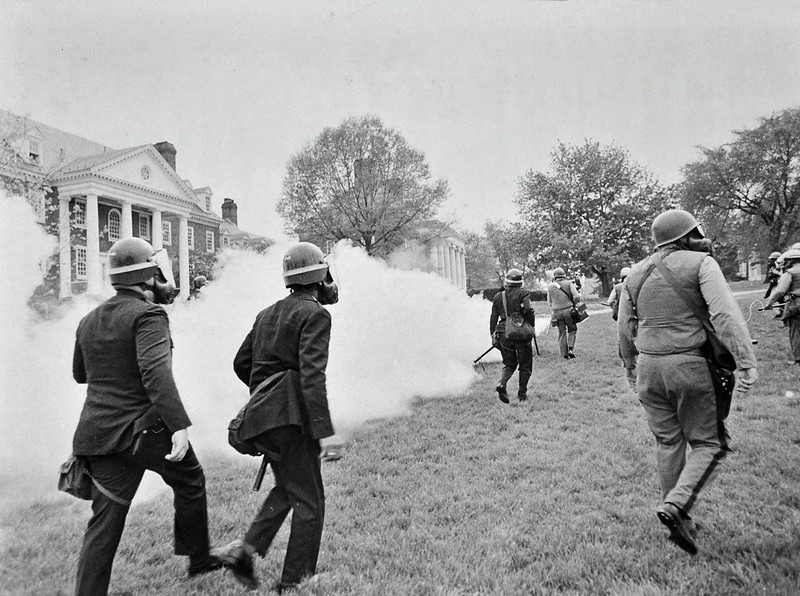

# Universities {-}

Perhaps instigated by the willingness of the California Highway Patrol to use chemical weapons (including thermal foggers) in Berkeley on and around the University of California campus, many law enforcement agencies escalated anti-war and racial just protests in University towns during the 1960s and 1970s via chemical weapons.
The willingness of police to fog literally any place where undergraduates standing up for racial justice and against imperialism were gathering was highlighted in May of 1970 when Maryland State Police deployed chemical weapons via tear gas into the University of Maryland Chapel.

## Durham NC, February 13 1969 {-}

Durham Police broke up the "Allen Building Demonstration" on the campus of Duke University in Durham using a variety of weapons, including a thermal fogger [@DMH1969; @Schreiberetal1971a; @Schreiberetal1971b].
The police reportedly chased protesters across campus with the fogger, including using it inside Duke Chapel [@Schreiberetal1971a; @Schreiberetal1971b].

 

  <figure>
    
    <figcaption> 
      Deployment of a thermal fogger by police on Duke Campus, Durham NC, 2/13/1969 [@DMH1969].  
    </figcaption>
  </figure>

 
 

 

  <figure>
    
    <figcaption> 
      Police with pepper fogger on Duke campus, Durham NC 2/13/1969 [@DMH1969].  
     </figcaption>
  </figure>

 
 

## Berkeley CA, February 21 1969 {- #BerkeleyCA1969_02_21}

A year after using the fogger on a protest held in solidarity with the Chicago Protest](#ChicagoIL1968_08_26), police in Berkeley again deployed a fogger to clear demonstrators including striking students from outside a University Regents and Sproul Hall plaza on the University of California campus. 

 

  <figure> 
    
     <figcaption> 
       Police use a pepper fogger and other weapons to clear a University plaza, Berkeley CA 2/21/1969 [@APphoto1969a].
     </figcaption>
  </figure>

 
 

This deployment was covered in papers across the country including the Press-Telegram (Long Beach, California) [@PressTelegram1969_02_21], The Jackson Sun (Jackson, Tennessee) [@TheJacksonSun1969_02_21], The Daily Tribune (Wisconsin Rapids, Wisconsin) [@TheDailyTribune1969_02_21], The Sumter Daily Item (Sumter, South Carolina) [@TheSumterDailyItem1969_02_21], The New Mexican (Santa Fe, New Mexico) [@TheNewMexican1969_02_21], Janesville Daily Gazette (Janesville, Wisconsin) [@JanesvilleDailyGazette1969_02_22], and Messenger-Inquirer (Owensboro, Kentucky) [@MessengerInquirer1969_02_22].

 

  <figure> 
    
     <figcaption> 
       Police use a pepper fogger and other weapons to clear a University plaza, Berkeley CA 2/21/1969 [@APphoto1969a].
     </figcaption>
  </figure>

 
 

Canadian newspapers detailed the fogger use as well, specifically the Red Deer Advocate Red Deer, Alberta, Canada) [@RedDeerAdvocate1969_02_21] and The Leader-Post (Regina, Saskatchewan) [@TheLeaderPost1969_02_21].

## Berkeley CA, February 28 1969 {-}

The following week, the police in Berkeley were joined by California National Guard troops to attack strikers, and continued to use the pepper fogger [@TheMiamiNews1969_03_01; @PressandSunBulletin1969_03_01]. 

 

  <figure>
    
     <figcaption> 
       National guardsmen and police use a pepper fogger and other weapons on striking students, Berkeley CA 2/28/1969 [@APphoto1969c].
     </figcaption>
  </figure>

 
 

 

  <figure>
    
     <figcaption> 
       View from behind of the police using a pepper fogger on striking students, Berkeley CA 2/28/1969 [@APphoto1969d].
     </figcaption>
  </figure>

 
 

## Berkeley CA, May 15 1969 {-}

Alameda County sheriffs deployed a pepper fogger on UC Berkeley's campus again during the "People's Park Riots" of 1969 [@LATimes1969; @Hayes1970].

The riot apparently started when the university tried to prevent individuals living on the street from a volunteer-run park they built on a lot owned by the school [@ThePressDemocrat1970_10_13].

## Seattle WA, August 14 1969 {-}

Seattle police deployed CN and CS gas via a new pepper fogger in their clash with "hundreds of unruly youths in the University District" [@StatesmanJournal1969_08_17].
Witnesses recounted that the machine was "highly effective", filling "2-3 blocks of a street with tear gas in about a minute" [@StatesmanJournal1969_08_17].

## College Park MD  May 4 1970 {- #CollegeParkMD1970_05_}

On May 4th, students gathered at campuses around the country to protest President Nixon's expansion of war into Cambodia, inlcuding in at the University of MAryland (UMD) campus in College Park [@WAS2013].
Police responded with chemical weapons that did not deter the protest, but rather moved it around the campus [@Cabe1970].
By later in the day, UMD students had heard about the Ohio National Guard shooting four Kent State students and took up a position in front on and inside the UMD Chapel [@WAS2013], which did not stop the chemical weapons barrage or the use of the fogger specifically [@Oates1970]

 

  <figure>
    
     <figcaption> 
       Police fog the University of Maryland [@Cabe1970].
     </figcaption>
  </figure>

 
 

 

  <figure>
    
     <figcaption> 
       Police fog the University of Maryland Chapel [@Cabe1970].
     </figcaption>
  </figure>

 
 

## Iowa City IA, May 6 1971 {-}

Johnson County sheriffs used chemical weapons against protesters in Iowa City, including two deputies carrying pepper foggers [@Eckholt1971].

The chemicals deployed smelled like insecticides and were described in print as "unidentified" because the Sheriff refused to identify the compounds [@Eckholt1971].

## Minneapolis MN, May 10 1972  {-}

Thousands of anti-war protesters gathered in cities around the US to demonstrate against the use of mines in Vietnam harbors [@ArgusLeader1972_05_11a].
In Minneapolis, crowds totalling a thousand protestered gathered on and near the University of Minnesota campus and police responded with chemical weapons deployed via grenades, sprays, a helicopter and a thermal fogger [@ArgusLeader1972_05_11b; @StarTribune1972_05_11].

The fogger was used to direct the crowd around campus and spread gas over large areas, such as the area known as Scholars Walk (~0.25 mile from Washington Avenue to the Auditorium) [@StarTribune1972_05_11].

## Gainesville FL, May 10 1972  {-}

Similarly, on the campus of the University of Florida in Gainesville, Florida Highway Patrol deployed a riot vehicle dubbed "The Monster" which "spewed tear gas" [@ArgusLeader1972_05_11b].
Although a fogger is not mentioned specifically, this is the same agency (Florida Highway Patrol) that first [deployed thermal foggers via a truck](Liberty City #MiamiFL1968_08_08) in 1968 [@Tschenschlok1995; @Lorentzen2018]. 

