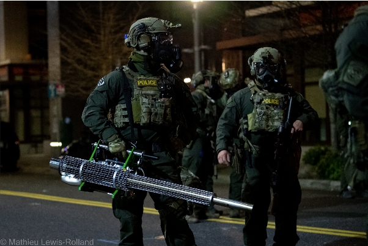
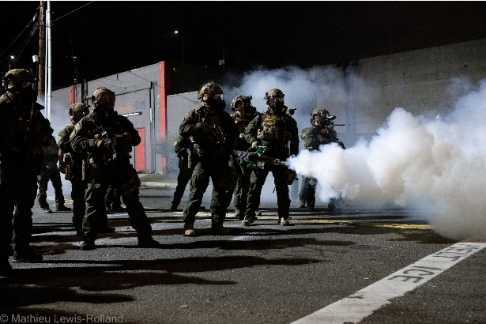

# Racial Justice {-}

Police are generally more apt to use heavy responses including chemical weapons against Black protesters in general [@DSPDX2020].
It is therefore not surprising to learn that law enforcement use foggers to deploy chemical weapons on racial justice protests.
Indeed, the first use of the fogger in the United States was during the [Liberty City Riots](#MiamiFL1968_08_08), a police action in response to Black community organizations holding conversation among themselves.

Although mentioned in a few outlets during the 1992 police response to the protests in response to the verdict in the Rodney King case, I have yet to find documentation of used explicitly during that time [@Askren1992].
For example, Riley County (Kansas; 1970 pop. 56,788; @USCB1970) Sheriffs had a fogger in their arsenal in 1992 according to Director Alvan Johnson [@Askren1992].


The thermal fogger made a very visible return to the public sphere in July of 2020, when US Customs and Border Protection (CBP) officers brought a bright-green version to Portland, OR during the [2020 Black Lives Matter protests](#PortlandOR2020_07_29) [@pb20202021].
Since then, the fogger has been deployed [three additional times by CBP in Portland](#PortlandORICE2020_2021), all at the property Immigration and Customs Enforcement (ICE) rents on the South Waterfront.

## Danville {-}

Foggers have been used in a variety of cities, not just major metropolitan areas. 

Danville, Illinois (1970 pop. 42,570; [@USCB1970]) Police used a pepper fogger to disperse a crowd of Black protesters that had used picnic tables to barricade a street through their neighborhood on a second night of demonstrations [@Palladium-Item1969], August 10th 1969.


## Portland OR {- #PortlandOR2020_2021}

### July 29 2020 {- #PortlandOR2020_07_29}

At the beginning of July 2020, then-president Trump deployed Department of Homeland Security (DHS) agents to "protect" federal property in Portland, OR [@DHS2020; @Flanigan2020; @Trump2020].
During the final days of the visible presence and response of federal agents in Summer 2020, Customs and Border Protection (CBP) unveiled their thermal fogger [@Recompiler2020_07_29], which has been identified through photos as an [IGEBA TF35](https://www.nixalite.com/product/igeba-tf-35) thermal fogger from Nixalite of America Inc.
This machine is designed and marketed for bird control, and while "_training tool for military/law enforcement_" is listed among its uses [@Nixalite2009a], its safety requirements explicitly state: 

> "_**19. Do not fog directly against persons...During operation keep distance of minimum [10 ft].**_"  - [@Nixalite2009b].

<br>

(ref:imgportland202007292) CBP agent deploying chemical agent via thermal fogger in front of the federal courthouse [@Brown2020].

```{r imgportland202007292, echo=FALSE, out.width = 500, fig.cap="(ref:imgportland202007292)", fig.align = "center", fig.alt = "Fully riot-geared and for some reason in green camo US Homeland Security agents (to the middle and the left of the photo) behind a row of two-foot tall, one-foot radius metal posts, behind a metal grate wall over 7 feet tall with metal support beams and concrete pylon buttressing. In the front of the left side is an agent holding a plastic clear riot shield, through which you can see a patch that say 'Border Patrol Federal Agent' in yellow and some insignia patches as well. In the middle are the agents in camo, one with a hand on the shoulder of another who is operating a thermal fogger machine shooting gas through the fence. The machine is maybe four or five feet long and has a body not unlike a bush whacker with a two-cycle engine, but fueling a vaporizer instead of a rotor. The agent is holding the machine with their right hand visibly and there is a black strap across their shoulder holding it up. The machine is mostly shiny metal, although the tip is showing signs of corrosion (no surprise based on the compounds and heat) and the supports of the body are a bright green."}
knitr::include_graphics("img/portland_2020_07_29.jpg") 
```

<br>


### Immigration and Customs Enforcement Rental Property {- #PortlandORICE2020_2021}

While the thermal fogger hasn't been deployed at the federal Courthouse in downtown Portland since July 29 2020, it has been used repeatedly by Department of Homeland Security agents at the private property US Immigration and Customs Enforcement (ICE) rents to use as a holding center for deportees in the South Waterfront neighborhood [@Simonis2021] -- the same building that saw the weeks-long Ocuppy ICE protests in 2018 [@Dubois2018]. 

The first of such deployments occurred during the fall of 2020.

Along with cities across the country, Portland hosted many events on October 17th focused around the racial and gender justice [@Recompiler2020_10_17].
In the evening, there was a gathering at Willamette Park in the Southwest part of the city, where organizers passed out balloons detailing harrowing experiences of migrants and immigrants detained by ICE [@Recompiler2020_10_17].
After marching to the ICE rental property, individuals tied the balloons to the gate to the parking garage, and Department of Homeland Security (DHS) agents including Customs and Border Protection (CBP) officers deployed massive amounts of chemical weapons, including via a thermal fogger, throughout the neighborhood [@Recompiler2020_10_17].

<br>

(ref:imgportland20201017) CBP agent fogging a South Waterfront neighborhood [@Lake2020].

```{r imgportland20201017, echo = FALSE, out.width = 500, fig.cap = "(ref:imgportland20201017)", fig.align = "center", fig.alt = "One person in green protective gear, wearing a bulletproof vest with weapons strapped to the body and wearing a helmet and gas mask is walking to the left carrying a fogger in the right hand arm extended down, nozzle pointing forward. A cloud of gas is coming from the nozzle. Next to them is someone dressed all in black with a bullet proof vest with the word POLICE across the back, also wearing a helmet and gas mask. It is night and there are additional clouds of gas and the shapes of people in the background. source: https://twitter.com/MasonLakePhoto/status/1317869903345414144"}
knitr::include_graphics("img/portland_2020_10_17.png") 
```
 
<br>

#### Inaugration 2021 {- #J20}

The same fogger (or at least the same model) was again brought out at the ICE rental property on January 20th 2021 during the Inauguration Day ("J20") Abolish ICE protests in response to an individual spray painting a piece of plywood tacked outside the building [@Recompiler2021_01_20]. 
The fogged up and down multiple blocks, with visible plumes entering units in the adjacent apartment complexes and covering the playground of an adjacent public school [@Recompiler2021_01_20; @Simonis2021].

<br>

(ref:imgportland20210120) CBP officer holding thermal fogger [@Staab2021].

```{r imgportland20210120, echo = FALSE, out.width = 500, fig.cap = "(ref:imgportland20210120)", fig.align = "center", fig.alt = "Night in a city, building lights in the background. One person standing alone in the center of a road, shown from the waist to the ankles. The person is wearing work pants with covered pockets at the thighs and calves, long sleeve shirt, and a glove on the right hand. In the left hand they are gripping the handle of a neon green fogger tool. The long black nozzle, covered with a wire cage, projects backwards and the motor is towards the front. It is being held at hip height; the arm holding it is relaxed down."} 
knitr::include_graphics("img/portland_2021_01_20.png") 
```
 
<br>

That weekend, CBP deployed the fogger again during Abolish ICE protests, this time gassing even more of the neighborhood, including the local public school and veterans-preference housing [@Recompiler2021_01_23; @Simonis2021].


<br>

(ref:imgportland202101231) CBP agent holding thermal fogger [@Lewis-Rolland2021a].

```{r imgportland202101231, echo = FALSE, out.width = 500, fig.cap = "(ref:imgportland202101231)", fig.align = "center", fig.alt = "Night time with the light from a street light visible in the background. Two officers dressed in full protective gear with bulletproof vests holding supplies on, with the word POLICE stenciled in yellow. They are both wearing helmets and gas masks. The nearer one is holding a gas fogger in the right hand. Thefogger looks like a long tube between 3 and 4 feet long with a handle and motor parts near the back. The tube is covered with a wire cage until about the last half foot, which is a plain and narrower tube. Behind these two officers are some dimly lit buildings and one or two other officers but they are not clear."}
 
```

<br>


<br>

(ref:imgportland202101232) CBP agent fogging an intersection in the South Waterfront neighborhood [@Lewis-Rolland2021b].

```{r imgportland202101232, echo = FALSE, out.width = 500, fig.cap = "(ref:imgportland202101232)", fig.align = "center", fig.alt = "Nine people wearing full protective gear including helmets and gas masks standing spread out across a street at night. One is holding a gas fogger in one hand and gas is spewing and a cloud is forming in front of them. There is also some gas cloud behind the group. All of them seem to be wearing weapons on their gear but details are not clear. It is night. There is a grey building in the background with a red door and red trim. A white stripe on the roadway has the words MELT ICE spray painted on it."}   
 
```
  
<br>


