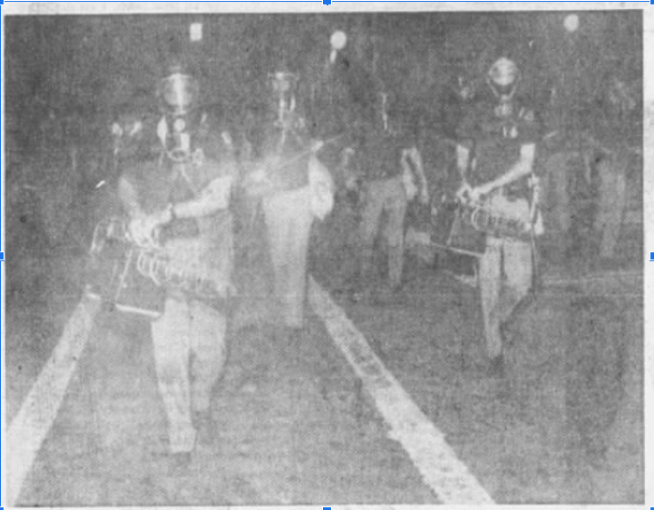

```{r index-1, echo=FALSE}
is_on_ghactions <- identical(Sys.getenv("GITHUB_ACTIONS"), "true")
is_online <- curl::has_internet()
is_html <- knitr::is_html_output()
is_latex <- knitr::is_latex_output()
if (is_html) {
  out_width <- 500
} else if (is_latex) {
  out_width <-"100%"
}

```

# Celebrations {-}

On occassion, police forces have used foggers against protests or riots that are more of a celebratory nature but still do not respond to their commands to disperse.

### 1975 New Years Eve {-}

New Year's Eve 1975 was apparently quite raucous in Florida, as many cities experienced revelry that got out-of-hand enough to elicit police use of force [@TheTampaTribune1976_01_02].
In Ft. Lauderdale, party-goers pulled down a traffic light and police deployed multiple foggers on a crowd of 2,500 on the beach [@TheTampaTribune1976_01_02].

<br>

(ref:imgftlauderdale19751231) Police carrying pepper foggers towards the beach [@UPIphoto1975].

```{r imgftlauderdale19751231, echo = FALSE, out.width = out_width, fig.cap = "(ref:imgftlauderdale19751231)", fig.align = "center", fig.alt = "B/W image: Two people in foreground wearing helmets and face shields with gas masks and uniforms with short sleeves walking towards the camera, carrying boxy looking tools with nozzles pointing forward, with both hands. Person behind, also in short sleeve uniform, helmet, and gas mask carrying slim sabre or rod across the body. Behind these people seem to be more people but there are no clear details."}
 
```

<br>


The mayhem was noteworthy enough to garner publication in the Berkeley Gazette [@BerkeleyGazette1976_01_02] as well as the Tampa Tribune [@TheTampaTribune1976_01_02].


### 1974 NHRA Nationals {-}

Indiana State Police used a pepper fogger and gas grenades on a crowd of 2,000 drag racing fans blocking a highway between the track and campsites at the Hot Rod Association's US Nationals in Clermont IN, September 1 1974 [@Courier1974_09_02; @TheBillingsGazette1982_01_10].


