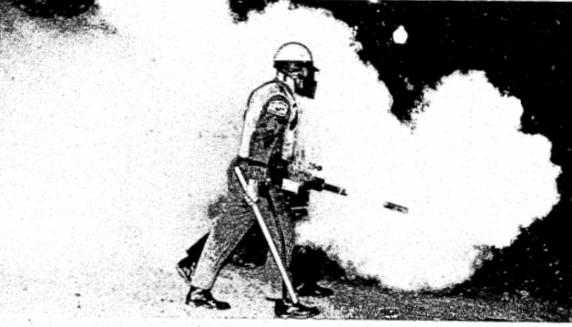

# Deployments {-}

## Miami FL, August 8 1968 {-}

The first use of a thermal fogger to deploy chemical weapons in the US that I have been able to uncover was during the "[Liberty City Riots](https://en.wikipedia.org/wiki/1968_Miami_riot)", which took place in during the [1968 Republican National Convention](https://en.wikipedia.org/wiki/1968_Republican_National_Convention) (RNC) [@Tschenschlok1995; @Tschenschlok1996; @McArdle2018].
A white reporter with the Miami Herald attempted to gain access to rally of concerned Black people that was meant to be only among Black people that was occurring in Liberty City, a Black neighborhood, on August 7th [@Tschenschlok1995; @Tschenschlok1996].
When the reporter was ejected from the rally, Miami police responded with a large and heavy presence and during the standoff, a white motorist with a "Wallace for President" bumper sticker attempted to drive through but was met with resistance and drove into another car, and fled the scene on foot [@Tschenschlok1995; @Lorentzen2018].

Miami police used chemical weapons the night of the 7th, but the fogger did not make an appearance until the subsequent day.
Local, state, and federal officials met with Black organizational representatives the night of the 7th and had agreed to continue discussions the morning of the 8th, but instead sent staffers rather than appear themselves, which effectively ended discussions [@Tschenschlok1995; @Tschenschlok1996]. 
Apparently, Miami Police Department was unable to manage the situation and Florida Highway Patrol (FHP) was called in by the city [@Tschenschlok1995].

FHP used a truck with multiple foggers [@Lorentzen2018], described as "essentially a modified version of an insect-control machine" that "spread a thick fog of tear gas throughout the riot zone" [@Tschenschlok1995]. 

FHP used the truck-mounted thermal foggers indiscriminately and caused visible symptoms (gagging, etc.) in all present, including a 5-month old [@McArdle2018].
The fog quickly spread into neighborhood homes, forcing residents outside to seek fresh air [@Tschenschlok1995].

## Berkeley CA, August 31 1968 {-}

 
  

  <figure>
  
   <figcaption> Deployment of a thermal fogger by police in Berkeley CA, 8/31/1968; [@UPIphoto1968]  </figcaption>
  </figure>
  

  

A demonstration was called by the Young Socialist Alliance, Independent Socialist Club, and the Black Panther Party in solidarity with anti-war protesters in Chicago who the police had recently brutalized [@PatersonEveningNews1968_08_31; @TheCapitalTimes1968_08_31].
In response, police brutalized the protesters, and in the process brought out (the first-documented) hand-held pepper fogger, a "new police weapon... which produced a gas that caused sneezing" [@PatersonEveningNews1968_08_31].

Deployment of the thermal fogger was covered in newspapers around the country including Paterson, New Jersey [@PatersonEveningNews1968_08_31]; Hanford, California [TheHanfordSentinel1968_08_31]; Honolulu, Hawaii [@TheHonoluluAdvertiser1968_09_01]; St. Louis, Missouri [tLouisPostDispatch1968_08_31]; Franklin, Pennsylvania [@TheNewsHerald1968_08_31]; Madison, Wisconsin [@TheCapitalTimes1968_08_31]; and El Paso, Texas [@ElPasoHeraldPost1968_08_31], a city whose significance was already budding.

It is clear from the photograph shared with the United Press International (UPI) copy that the fogger used is a [GOEC](#GOEC) brand pepper fogger, which hit the market the month prior [@USTPO2018].
The GOEC thermal fogger was so new, it would not have a trademarked name ("Pepper Fog") for another year [@USTPO2018].

 

<figure>
  
  <figcaption>
  Product image for thermal fogger; GOEC 1968
  </figcaption>
</figure>

  

## Durham NC, February 13 1969 {-}

Durham Police broke up the "Allen Building Demonstration" on the campus of Duke University in Durham using a variety of weapons, including a thermal fogger [@Schreiberetal1971].
The police reportedly chased protesters across campus with the fogger, including using it inside Duke Chapel [@Schreiberetal1971].

 
  

  <figure>
  
   <figcaption> Deployment of a thermal fogger by police on Duke Campus, Durham NC, 2/13/1969; UPI Telephoto  </figcaption>
  </figure>
  
 
 

 
  

  <figure>
  
   <figcaption> Police with pepper fogger on Duke campus, Durham NC 2/13/1969; UPI Telephoto  </figcaption>
  </figure>
  
 
 

## Berkeley CA, February 21 1969 {-}

Police deployed a fogger to clear demonstraters including striking students from outside a University Regents and Sproul Hall plaza on the University of California campus. 

 
  

  <figure> 
  
   <figcaption> Police use a pepper fogger and other weapons to clear a University plaza, Berkeley CA 2/21/1969; AP Wirephoto  </figcaption>
  </figure>
  
 
 

This deployment was covered across the country and in Canada on February 21 [Press-Telegram (Long Beach, California), Red Deer Advocate Red Deer, Alberta, Canada), The Sumter Daily Item (Sumter, South Carolina), The New Mexican (Santa Fe, New Mexico), The Leader-Post (Regina, Saskatchewan), The Jackson Sun (Jackson, Tennessee), and The Daily Tribune (Wisconsin Rapids, Wisconsin)] and 22 [Janesville Daily Gazette (Janesville, Wisconsin) and Messenger-Inquirer (Owensboro, Kentucky)], 1969.

## Berkeley CA, February 28 1969 {-}

The following week, the police were joined by California National Guard troops to attack strikers, and continued to use the pepper fogger. 

 
  

  <figure>
  
   <figcaption> National guardsmen and police use a pepper fogger and other weapons on striking students, Berkeley CA 2/28/1969; AP Wirephoto  </figcaption>
  </figure>
  
 
 

 
  

  <figure>
  
   <figcaption> View from behind of the police using a pepper fogger on striking students, Berkeley CA 2/28/1969; AP Wirephoto  </figcaption>
  </figure>
  
 
 

This deployment was covered in the Miami News (Miami, Florida) and the Press and Sun-Bulletin (Binghamton, New York) on March 1st 1969.

## Berkeley CA, May 15 1969 {-}

Alameda County sheriffs deployed a pepper fogger on UC Berkeley's campus again during the "People's Park Riots" of 1969 [@LATimes1969; @Hayes1970].

The riot apparently started when the university tried to prevent individuals living on the street from a volunteer-run park they built on a lot owned by the school [@UPI1970].

## Danville IL, Aug 10 1969 {-}

Danville Police used a pepper fogger to disperse a crowd of Black protesters that had used picnic tables to barricade a street through their neighborhood on a second night of demonstrations [@AP1969a].

## Seattle WA, August 14 1969 {-}

Seattle police deployed CN and CS gas via a new pepper fogger in their clash with "hundreds of unruly youths in the University District" [@AP1969b].
Witnesses recounted that the machine was "highly effective", filling "2-3 blocks of a street with tear gas in about a minute" [@AP1969b].

## San Bernardino CA, Unknown 1969 {-}

Although undated, this photograph printed in The Delta Democrat-Times (Greenville, Mississippi Thursday) on November 20, 1969 references a "recent" use of the fogger on students. 
Bolstered by the well-reported use of the fogger on students in 1971, this event appears credible. 

 
  

  <figure>
  
   <figcaption> Police use a pepper fogger on a crowd of students at San Gordonio High School, San Bernardino 1969; UPI Photo  </figcaption>
  </figure>
  
 
 

## Iowa City IA, May 6 1971 {-}

Johnson County sheriffs used chemical weapons against protesters in Iowa City, including two deputies carrying pepper foggers [@Eckholt1971].

The chemicals deployed smelled like insecticides and were described in print as "unidentified" because the Sheriff refused to identify the compounds [@Eckholt1971].

## San Bernardino CA, December 3 1971 {-}

A combination of San Bernardino police, San Bernardino County sheriffs, and California Highway Patrol used tear gas from a pepper fogger to break up a "major racial confrontation" among students at San Gorgonio High School and across a 20-block area surrounding campus [@Yetzeretal1971].

## Minneapolis MN, May 10 1972  {-}

Thousands of anti-war protesters gathered in cities around the US to demonstrate against the use of mines in Vietnam harbors [@AP1972a].
In Minneapolis, crowds totalling a thousand protestered gathered on and near the University of Minnesota campus and police responded with chemical weapons deployed via grenades, sprays, a helicopter and a thermal fogger [@AP1972b; @StarTribune1972].

The fogger was used to direct the crowd around campus and spread gas over large areas, such as the area known as Scholars Walk (~0.25 mile from Washington Avenue to the Auditorium) [@StarTribune1972].

## Gainesville FL, May 10 1972  {-}

Similarly, on the campus of the University of Florida in Gainesville, Florida Highway Patrol deployed a riot vehicle dubbed "The Monster" which "spewed tear gas" [@AP1972b].
Although a fogger is not mentioned specifically, this is the same agency (Florida Highway Patrol) that first deployed thermal foggers via a truck in 1968 [@Tschenschlok1995; Lorentzen2018]. 

## McAlester OK, May 20 1974 {-}

Like many chemical weapons devices, thermal foggers are used in the carceral system, but unfortunately most deployments go undocumented or their documents never see the light of day. 
It seems that the only time we find out about prisoners being fogged is when a serious incident occurs triggering outside investigations and the judicial system.

In the 1970s, the McAlester ("Big Mac") Oklahoma State Penitentiary was the site of considerable resistance and rioting by inmates [@TheRag1975; @WinterSoldier1975].
A major tool used by the guards in retaliation was tear gas, which they deployed via shot shells, grenades, and pepper foggers [@Allen1974a; @Allen1975a; @Allen1975b; @Coffey1975b].
Given its use here, it is highly likely that the Oklahoma State Penitentiary systen used pepper foggers before (and likely after) [@Johnson1974].

The guards regularly isolated the uprising's leaders in the solitary confinement building known as "The Rock", sealed the building, and gassed it so thick it lasted for days [@Allen1974b; @TheRag1975].
During the May 20 gassings in response to riots, Black prisoner Robert Forsythe, a 33-year old serving time for a robbery, happened to be in solitary confinement due to being caught with contraband money and was not associated with the uprising direclty, and so inexperienced with the effects of gas [@Johnson1974; @TheRag1975; @Wilson1993].
Although reports are conflicting on details, guards started fogging and gassing prisoners who were, at most, rattling their doors [@Hobbs1974].
The likely reason for the barrage was retaliatory, as it was "unjustified" according to a veteran guard [@Coffey1975a].

During the gassings, a pepper fogger was specifically used in the building and created "fumes of gas [that] were awfully heavy, one of the worst I've ever seen" according to veteran corrections officers' trial testimony [@Allen1975b; @Coffey1975a].
The gassing lasted for four hours despite yells for help, resulting in serious injuries including burned and blistered skin, eyes swollen shut, and breathing difficulties [@Coffey1975b]. 
That intense fogging and lack of medical attention over the next two days were main factors contributing to Forsythe's injuries and death two days later, according to medical experts' testimony [@Allen1974b; @Allen1975a; @Allen1975b].

Although the guards involved were indicted by a grand jury and brought to trial, they ultimately were acquitted of all charges [@UPI1975a; @UPI1975b].

## Miami FL, July 17 1974 {-}
 
Dade County Sherrifs used foggers to sweep a field in search of a murder suspect that had elluded K-9 units, helicopters, a plane, and an attempt to flush him out by burning the field [@TampaBayTimes1974]. 
The suspect was so well dug in that he could withstand significant gassing that suprised a Sheriff's seargent who participated in the operation [@TampaBayTimes1974].

## Clermont IN, Septmeber 1 1974  {-}

Indiana State Police used a pepper fogger and gas grenades on a crowd of 2,000 drag racing fans blocking a highway between the track and campsites at the Hot Rod Association's US Nationals in 1974 [@AP1974].

Versions of an AP article describing the incident were published in The Courier (Waterloo, Iowa) on September 2, 1974 and The Billings Gazette (Billings, Montana) on September 3, 1974 [@AP1974].

## Ft Lauderdale FL, December 31 1975  {-}

New Year's Eve 1975 was apparently quite raucous in Florida, as many cities experienced celebrations that got out-of-hand enough to elicit police use of force [@UPI1976].
In Ft. Lauderdale, revelers pulled down at traffic light and police deployed multiple foggers on a crowd of 2,500 on the beach [@UPI1976].

 
  

  <figure>
  
   <figcaption> Police carrying pepper foggers towards a crowd in the street, Ft Lauderdale, FL 12/31/1975; UPI Photo  </figcaption>
  </figure>
  

 

The mayhem was noteworthy enough to garner publication in the Berkeley Gazette (Berkeley, California) as well as the Tampa Tribune (Tampa, Florida) [@UPI1976].

## Raiford FL, July 5 1981 {-}

According to the superintendent, a riot was caused in the Florida State Prison's Union Correctional Institution on July 5th by 22 prisoners who were intoxicated, and the only way to subdue them was to deploy a thermal fogger [@UPI1981].
As a result of two officers being "slightly injured" and three inmates being stabbed, an investigation was launched that caused the event to be picked up in the newspapers [@UPI1981].

## Bullitt KY, December 15 1981 {-}

Although not an intentional deployment, in at least one documented incident, a pepper fogger used in firefighter training exercises caused severe symptoms and led to an investigation [@Judd1981].
The Southeast Bullitt Volunteer Fire Department In Kentucky was conducting a smoke training exercise using a pepper fogger on loan from the fire marshal's office when their "victim" and 16 others (including firefighters) began experiencing coughing fits, headaches, and chest pains [@Judd1981].

Although Smith and Wesson (the Pepper Fogger manufacturer at the time) claimed this was a one-off incident, the Kentucky State Fire Marshal's office had received other reports of firefighters becoming sick when using foggers in smoke training [@Judd1981]. 
Residue tests later revealed no unexpected compounds [@Courier-Journal1982], indicating the toxicity had come from the design-for-use "safe" smoke.

## North Kingstown RI, March 22 1982 {-}

The Brown and Sharpe company called in local police and Rhode Island State Police officers to help try to break a (at the time) 22-long strike at their factory in North Kigston, Rhode Island [@AP1982; @Carbone2017]. 
A North Kingstown officer named TJ Varone deployed tear gas via a pepper fogger on a group of 75 people, primarily workers' wives and Brown University students, that was blocking the main entrance to the tool factory  [@AP1982; @Carbone2017].
The picketers braved the gas for a considerable amount of time, requiring close-range fogging to finally disperse them [@Carbone2017].

The fogging did not, however, break the strike [@Carbone2017].

 
  

  <figure>
  
   <figcaption> Police fogging striking workers, North Kingstown RI 3/22/1982; AP Wirephoto  </figcaption>
  </figure>
  
 
 

Newspaper and television coverage of the fogging circled the globe [@Carbone2017].

