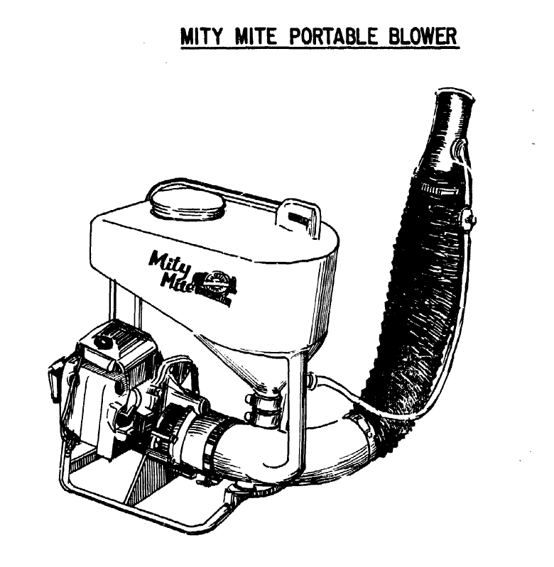
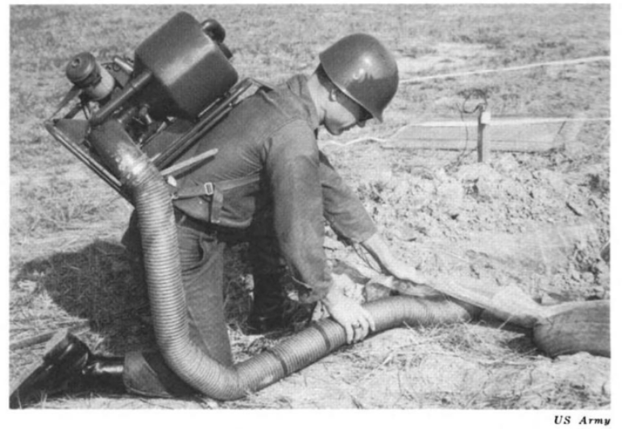

# Vietnam {-}

The modern day use of thermal foggers for chemical weapons deployment was born from the American colonization of Vietnam in the mid-to-late-20th Century [@Bunker1996]. 

## Context {-}

Early on in the deployment of US troops to occupy Vietnam, the need for large scale mosquito control became so great that soldiers began improvising insecticide foggers by mounting pesticide sprayers to diesel truck exhaust [@Spicknall1969]. 
The hack turned out to be much more effective, covering nine square miles per day, compared to 50,000 square feet (0.002 square miles) per day using a conventional manually operated fogger [@Spicknall1969].

As the occupation continued, US Army Soldiers were tasked with "rooting out" Viet Cong and People's Army of Vietnam soldiers, as well as innocents, from tunnels.
The specialized forces designated for the work were dubbed "Tunnel Rats" and tear gas was part of their arsenal to "flush" individuals from caves, which they regularly deployed via pyrotechnic grenades and powdered explosives [@NewYorkTimes1977; @Rottman2006; @Hemmings2019].

 

  <figure>
    
    <figcaption>
      Tunnel rat in a gas mask, undated; Unknown credit from @Hemmings2019.
    </figcaption>
  </figure>

 

## Genesis {-}

In 1965, the US Chemical Advisor to the South Vietnamese Army's (ARVN) III Corps participated in planning a "search and destroy" operation in the Iron Triangle, which was known to house an elaborate Viet Cong tunnel system, and suggested using a Mity Mite fogger to aid in clearing tunnels [@USMACV1965].
On the first day of the operation (October 8th), the force located a tunnel and set into motion an elaborate scheme to fog the tunnels with [hexachloroethane (HC)](/hc) smoke from burning pots, marking the first known tactical use of a thermal fogger to deploy chemical weapons agents [@USMACV1965; @RottmanDelf2012].
Overall, the endeavor was dubbed a success in the report distributed the next month, despite the tunnel having been empty already [@USMACV1965].
And although (highly toxic; @Simonis2020) munitions smoke was used in this application, it was noted that tear gas would be "very effective in flushing VC from tunnels" should there been any present [@USMACV1965]. 

 

  <figure>
    
    <figcaption>
      [@USMACV1965]
    </figcaption>
  </figure>

 

## Expansion {-}

The practice caught on quickly, and Mity Mites were soon issued to ARVN units [@USMACV1965] and became common tools for Tunnel Rats [@RottmanDelf2012].
The United States military was publishing on the utility of the fogger in official journals by the next year [@USArmy1966].

 

  <figure>
    
    <figcaption>
      A soldier uses a backpack Mity Mite to fog a tunnel, undated [@USArmy1966]
    </figcaption>
  </figure>

 

The Army used foggers to pump "air" or "smoke" into tunnels in combination with "riot control agents" during Operation Cedar falls in 1967 [@Lehrer1968]. 
And by 1968's Battle of Khe Sanh, it was standard practice to use foggers for tunnel excavation as well as mosquito and fly control [@Rottman2006]. 

 

  <figure>
    
    <figcaption>
      Engineers unpack and test a Mitey-Mite blower, undated [@USAES]
    </figcaption>
  </figure>

 

