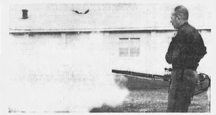
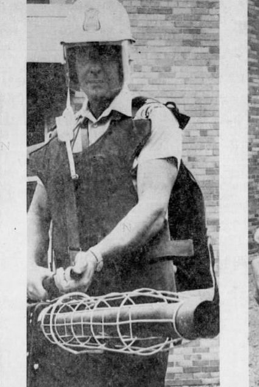

# The Return {- #TheReturn}

As to be expected following the basic trajectory of an Imperial Boomerang [@Cesaire1950; @Arendt1951; @Foucault1976], the repressive technique (thermal fogging) developed by an imperialist country (USA) to control colonial territories (Vietnam) was brought home by the imperialist nation to use on its own people [@Graham2013].

Indeed, it took just _three years_ from initial deployment in Vietnam on October 8 1965 to first application in the United States to gas Black racial justice protesters in [Miami, Florida on August 8th, 1968](#MiamiFL1968_08_08) during the Liberty City Riots [@Tschenschlok1995; @Lorentzen2018]. 

In alignment with the general "Imperial Circuit of Tear Gas" [@Schrader2019] between the US and Vietnam, the return of the fogger was aided significantly by the weapons industry, militarization of US police forces, the transition of veterans to law enforcement occupations upon returning home, and substantial propaganda in a variety of specialized and generalized outlets.

## Manufacturers {-}

### Sears Roebuck {-}

The original Mighty Mite that established the fogger as a method of chemical dispersal was manufactured by a domestic company (Sears Roebuck) for insecticide application [@Applegate1969].

 

(ref:imgM106) M-106 Mighty Mite Thermal Fogger, as promoted to law enforcement in @Applegate1969. According to @Applegate1969, it is an "insecticide blower ... adopted for use in Vietnam... [that can disperse] the gas agent continuosly for [15 minutes]".

(\#fig:imgM106)(ref:imgM106)

 

The International Association of Chiefs of Police included this style of thermal fogger in their 1969 Chemical Agents Manual [@Crockett1969], providing a trade-focused marketing opportunity.
The bulkiness of the backpack proved to be a hinderance in mobile application, however, and there was an immediate push by existing corporations to produce a specialized tool for fogging chemical weapons at civilians [@Applegate1969; @Applegate1970].

### General Ordnance Equipment Corporation {- #GOEC}

The General Ordnance Equipment Corporation (GOEC), who developed and trademarked Chemical Mace the year prior, began marketing a hand-held thermal fogger using the phrase "Pepper Fog" in July 1968 on their [@Applegate1969].
They and applied for a trademark on the phrase in October of the same year [@USTPO2018].
By the end of August 1969, GOEC had received the trademark on "Pepper Fog", which they (and their subsequent owners including Smith and Wesson, Federal Laboratories, and Safariland) retained until it expired in 1991 [@USTPO2018].

 

(ref:goecpf) General Ordnance Equipment Corporation thermal fogger [@GOECphoto], as shown in @Applegate1969.

(\#fig:goecpf)(ref:goecpf)

 

They immediately began a heavy marketing campaign taking out full-page ads in police magazines that year [@GOECad1969; @GOECadLNS1970; @GOECadObserver1970].

### Federal Laboratories & Defense Technology {- #DefenseTechnology}

Indeed, to this day, the current owner of the legacy branding ([Safariland](https://www.safariland.com) subsidiary [Defense Technology](https://www.defense-technology.com)) continues to sell items under a ["Pepper Fog" line](https://www.defense-technology.com/product-category/pepper-foggers/), including a ["pepper fog generator"](https://www.defense-technology.com/product/pepper-fog-generator/) that utilizes the same pulse-jet generation technique [@DTPFG]:

 

(ref:imgdefensetechgepf) Product image for thermal fogger [@DTPFGphoto].

(\#fig:imgdefensetechgepf)(ref:imgdefensetechgepf)

 

This has supplanted the model produced by the corporate ancestor to Defense Technology (Federal Laboratories), which was a slightly bulkier version [@Samuelsetal1969].

## Rex Applegate {-}

A major figure in the translation of military "riot suppression" tactics to domestic law enforcement in the 1960s and 1970s was a former US Army Lt. Colonel named [Rex Applegate](https://en.wikipedia.org/wiki/Rex_Applegate).
Applegate took a commission as a second leuitenant, but had a lung ailment kept him from serving in combat in World War II and so was assigned to Military Police Company before being tapped by [Col. William Donovan](https://en.wikipedia.org/wiki/William_J._Donovan) to build and run the School for Spies and Assassins in the Office of Strategic Services [@Goldstein1998].
Larger than life, Rex even served as bodyguard to President Franklin Roosevelt, before retiring and moving to Mexico at the end of World War II to consult with Central and South American governments on "riot control" [@Goldstein1998].

Applegate returned to the US in the 1960s during the civil rights and anti-war protest era and began proselytizing the good word of the thermal fogger [@Applegate1969; @Applegate1970].
Indeed, Rex published what can only be described as a long-form written sales pitch for the GOEC Pepper Fog thermal fogger in the highly circulated _Guns_ magazine in 1970 [@Applegate1970].

 

(ref:imgdemo) Demonstration of a pepper fogger [@Applegate1970]

(\#fig:imgdemo)(ref:imgdemo)

 

## News Media Propaganda {-}

Alongside the more overtly pro-police-use-of-chemical-weapons propaganda of Rex Applegate were other, perhaps more subtle forms of pro-fogger propaganda [@Macomber1970].
Newspapers around the country were more than happy to print "articles" that promoted the new arsenals police departments were building [@LaPrade1970], complete with product demo photos.

 

(ref:imgVance1970) Amarillo Texas Police Sergent Jerry Austin with a thermal fogger and shotgun [@Vance1970]. Amarillo's 1970 population was 127,010 [@USCB1970].

(\#fig:imgVance1970)(ref:imgVance1970)

 

 

(ref:imgAmanphoto1970) Richland County (Ohio) Sheriff's Captain Robert Dysart demonstrating a thermal fogger to a crowd of >200 people [@Amanphoto1970]. Richland County's 1970 population was 129,997 [@USCB1970].

(\#fig:imgAmanphoto1970)(ref:imgAmanphoto1970)

 

[General Ordnance Equipment Corporation](#GOEC)'s Pepper Fog model seems to have been the favorite, at least amongst the departments showing off their new cool toys for photographs.

 
(ref:imgGaylord1971) A McHenry County (Illinois) Sheriff's officer fogs some grass in a rural landscape during a training and press demo day [@Gaylord1971; @PlainDealer1971]. McHenry County's 1970 population was 111,555 [@USCB1970].

(\#fig:imgGaylord1971)(ref:imgGaylord1971)

 

 

(ref:imgWinter1970) Scott County (Iowa) deputy sheriff Jim Lewis, left, holds a new grenade launcher and a riot gun while Sheriff William Strout displays a pepper fogger and gas mask [@Winter1970]. Scott County's 1970 population was 142,687 [@USCB1970].

(\#fig:imgWinter1970)(ref:imgWinter1970)

 

### Gary Wills {-}

Pulitzer Prize-winning [Garry Wills](https://en.wikipedia.org/wiki/Garry_Wills) (who at the time was considerably more conservative than he came to be later) penned an op-ed that ran in (at least) The Herald Statesman (Yonkers, New York) [@Wills1971a], The Daily Item (Port Chester, New York) [@Wills1971b], The Charlotte News (Charlotte, North Carolina) [@Wills1971c], and The Philadelphia Inquirer [@Wills1971d] in April 1971 in which he basically tells all the cry babies (pun intended) to suck it up because he "would not be afraid to undergo such experiences [as being pepper fogged] again" [@Wills1971a].

Notably, he touts the leading belief at the time that somehow thermal fogging is a "safe immobilizer of individuals" [@Wills1971a], despite the weapon not being demonstrably safer than gas grenades and not only not "immobilizing" but explicitly designed to mobilize immobile resisters.
Interesting, Wills compares indiscriminate and uncontrollable chemical weapons as "safer than dogs, which get out of control, bit bystanders (and even other cops) as well as 'the bad guys'" [@Wills1971a].

He concludes his piece by calling tear gas "humane in ... foreign wars [and] domestic encounters" [@Wills1971a], speaking clearly to the return, classically defining an Imperial Boomerang [@Cesaire1950; @Arendt1951; @Foucault1976]. 

## Coming to Your Town Soon! {-}

It seems like US domestic police have a hard time containing their glee when purchasing and testing thermal foggers for use on domestic civilians, as a general media blitz played out accross the country through the late 1960s and early 1970s [@PlainDealer1971].

### Illinois {-}

In the wake of the [1968 Democratic National Convention](#ChicagoIL1968_08_26), Chicago-area police played an outsized role in promoting the propaganda line.
The pepper fogger was touted as being able to "empty a house fast" by Cook County Illinois Sheriff Joseph Woods [@MtVernonRegisterNews1969_04_09; @DailyDispatch1969_04_09], a definitely off-spec and dangerous use [@Nixalite2009b].
The volume of fog emitted was also said to be able to fill [Soldier Field (capacity 61,500 fans)](https://en.wikipedia.org/wiki/Soldier_Field) in under a minute [@DailyDispatch1969_04_09].
Regardless, the Chicago-area Sheriff decided they needed three of them [@DailyDispatch1969_04_09].
The Sheriff's Major in charge of chemical arsensal Anthony Yucevicius noted the fogger's psychological effect on recipients, as well saying

> They make a terrifying noise and probably will have a scare effect on crowds.

[@TheTerreHauteTribune1969_04_08].

Use expanded among and within states, as by 1972 the Illinois State Police also purchased three foggers, which they trained with in Springfield [@Robinson1972].
In news reports, the foggers were described as

> a cross between a machine gun, a power lawn mower, and a sun lamp.

[@Robinson1972].

### Florida {-}

Similarly, following the [1968 Republican National Convention](#MiamiFL1968_08_08), Florida law enforcement took to the fogger [@Cain1968].
In Sanford (1970 pop. 17,93; @USCB1970), the local police department purchased a fogger for use with [CN gas](https://en.wikipedia.org/wiki/Phenacyl_chloride), noting that it could shoot fog 20 ft for up to a 15 minute stretch, and so would be effective for controlling large masses [@Cain1968].
They had, however, only used it in training and for demoing to the media [@Cain1968].

 

(ref:imgOrlandoEveningStar1968) Sanford Police Officer Roy Williams shows off a fogger [@OrlandoEveningStar1968].

(\#fig:imgOrlandoEveningStar1968)(ref:imgOrlandoEveningStar1968)

 

### California {-}

Eager to not be shown up by the police in Berkeley, by 1970, the Los Angeles Sheriff's Department had already purchased their own fogger for their "big artillery" to use "when other forms of persuasion have failed" and started a media campaign [@Michals1970].
The department and new state regulations required officers to be trained in chemical weapons use, which was set up through Officer Robert Hawkins [@Michals1970].

 

(ref:imgCopleyNewsService1970) Los Angeles Sheriff's Department Officer demonstrating a fogger [@CopleyNewsService1970].

(\#fig:imgCopleyNewsService1970)(ref:imgCopleyNewsService1970)

 

### National Guard {-}

Following the Kent State Massacre, the Ohio National Guard, as well as others around the country began equipping their forces with thermal foggers, using the death of those students as justification for massive purchaing of "less lethal" options [@Bandy1970].

### Small Town USA {-}

No matter the size of the town, by the early 70s, police wanted in on that sweet sweet fogger action.
The Brigham City (Utah; 1970 pop. 14,007; @USCB1970) Police Department leveraged federal Omnibus Crime Act money to purchase a variety of weapons to use against protesters in 1971 [@BoxElderAgencies1971].

Police Chief Jay Christensen noted that the fogger provides a longer shelf-life than grenades and reportage noted that it 

> emits a continuous stream of smoke, chemical irritants, or _whatever solution_ is fed into it. [emphasis added]

[@Robinson1972]

Use of federal funds to purchase chemical weapons, and specifically foggers, was not limited to one department.
Cities, counties, and states across the country used Omnibus Crime Bill money to up their chemical weapons caches, including foggers [@Conheim1972].
For example, Oakland County in Michigan (1970 pop. 907,871; @USCB1970) purchased two pepper foggers for their South County Tactical Mobile Unit with part of their $21,066 in 1970 [@Conheim1972].

Oneota New York (1970 pop. 16,030; @USCB1970) purchased a fogger in 1969 during the anti-war demonstrations, although the department bungled its response to protests [@Griffin1973].
As came to light during a public probe, Oneota Police Chief Joseph F. DeSalvatore requested a limited amount of training in the budget, and officers were therefore unable to deploy the fogger or other chemical weapons [@Griffin1973].

Gaston County North Caolina (1970 pop. 47,322; @USCB1970) Sheriffs purchased a fogger, which they turned on but not used to dispense agents multiple times by 1970 in their jail system "when there's been trouble brewing" [@Balloch1970].

 

(ref:imgTheGastoniaGazetteSun19701004) Gaston County Sheriff's Deputy Anne Huffsteller poses with a thermal fogger [@TheGastoniaGazetteSun1970_10_04].

(\#fig:imgTheGastoniaGazetteSun19701004)(ref:imgTheGastoniaGazetteSun19701004)

 

Apparently the threat of [death by chemical weapons fog](#BigMac) is sufficient to scare detained individuals into compliance.

Within a few years, however, departments began to realize they had no need for the machines, and began selling them with no use aside from testing [@DesMoinesTribune1975_05_06].
The Storm Lake Iowa (1970 pop. 8,591; @USCB1970) purchased a fogger in 1971 in advance of a motorcycle rally that never happened, and used free advertising in local media in attempts to pawn it [@DesMoinesTribune1975_05_06].
The article/ad mentions that officers have used foggers "on occasion" in Des Moines (Iowa's capital; 1970 pop. 201,404; @USCB1970) in addition to [one instance on the University of Iowa's campus](#IowaCity) [@DesMoinesTribune1975_05_06], although I have not located contemporaneous mentions.

## Crossing to Canada {-}

Canadian law enforcement was also quick to jump on the fogger train and the media were just as happy to propagandize their use [@Patterson1976].
A convention of US and Canadian police chiefs held in Halifax, Nova Scotia in 1976 provided a glimpse into the state of affairs by mid-decade, at which point a supply chain had clearly been developed, although weapons salesmen refused to be named or have their statements linked to employers [@Patterson1976].

 

(ref:imgMacKenzie1976) Sergeant Al Oakley shows off a pepper fogger [@MacKenzie1976].

(\#fig:imgMacKenzie1976)(ref:imgMacKenzie1976)

 

