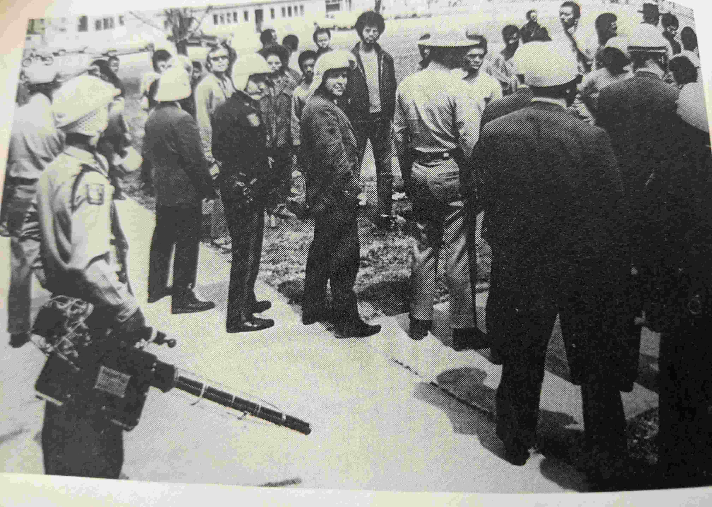

# High Schools {-}

Almost immediately, law enforcement extended use of foggers from [universities]{#Universities} to high schools, specifically using the weapons against Black youth protesters.

## San Gordonio {- #SanGordonio}

Although undated, this photograph printed in The Delta Democrat-Times (Greenville, Mississippi Thursday) [@TheDeltaDemocratTimes1969_11_20] on November 20, 1969 references a "recent" use of the fogger on students. 

 

  <figure>
    
     <figcaption> 
       Police use a pepper fogger on students at San Gordonio High School [@UPIphoto1969].  
     </figcaption>
  </figure>

 
 

This event appears credible, given the much more documented deployment on December 3, 1971.
On that day, a combination of San Bernardino police, San Bernardino County sheriffs, and California Highway Patrol used tear gas from a pepper fogger to break up a "major racial confrontation" among students at San Gorgonio High School and across a 20-block area surrounding campus [@Yetzeretal1971].

## Lawrence {- #Lawrence1970_04_21}

Lawrence, Kansas Police used tear gas, including from a thermal fogger, on April 21st, 1970 against Black high school and junior high students, their parents, and community members [@Monhollon2002].
The students had gathered that day after a week-long stand-off with administration in response to their failures to meet their demands regarding Black representation in curriculum, hiring, sports, and awards [@Monhollon2002].

Black students had occuppied the principal's office on May 13th and prominent members of the office occupation were arrested from the school that day and promptly suspended from school [@Monhollon2002].
Racial tensions escalated over the subsequent week flamed by presence and actions of the local Klu Klux Klan and Minutemen, some of whom were also police officers [@Monhollon2002].
The night of April 20th, the school board held a meeting where they barred suspended students from participating and did not reinstate them, nor did they address the demands, and there was a mass walkout [@Monhollon2002].

The next day, police were ready with heavy chemical weaponry, including the [GOEC Pepper Fog](#GOEC) fogger: 

 

  <figure>
    
     <figcaption> 
       Police bring a [GOEC](#GOEC) pepper fogger to gas Black high school and junior high students at Lawrence High School [@UKA1970].  
     </figcaption>
  </figure>

 
 
