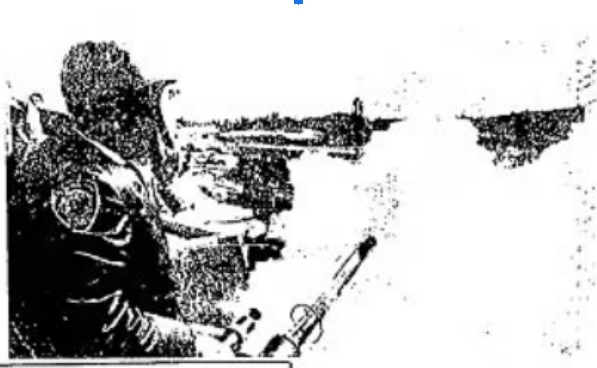

# High Schools {-}

Law enforcement has extended use of foggers from [universities]{#Universities} to high schools, as well. 

In particular, there are two documented deployments at [San Gordonio High School](#SanGordonio) in San Bernardino, California specifically against Black youth protesters.

## San Gordonio {- #SanGordonio}

Although undated, this photograph printed in The Delta Democrat-Times (Greenville, Mississippi Thursday) [@TheDeltaDemocratTimes1969_11_20] on November 20, 1969 references a "recent" use of the fogger on students. 

 
  

    <figure>
      
       <figcaption> 
         Police use a pepper fogger on a crowd of students at San Gordonio High School, San Bernardino 1969 [@UPIPhoto1969].  
       </figcaption>
    </figure>
  
 
 

This event appears credible, given the much more documented deployment on December 3, 1971.
On that day, a combination of San Bernardino police, San Bernardino County sheriffs, and California Highway Patrol used tear gas from a pepper fogger to break up a "major racial confrontation" among students at San Gorgonio High School and across a 20-block area surrounding campus [@Yetzeretal1971].

