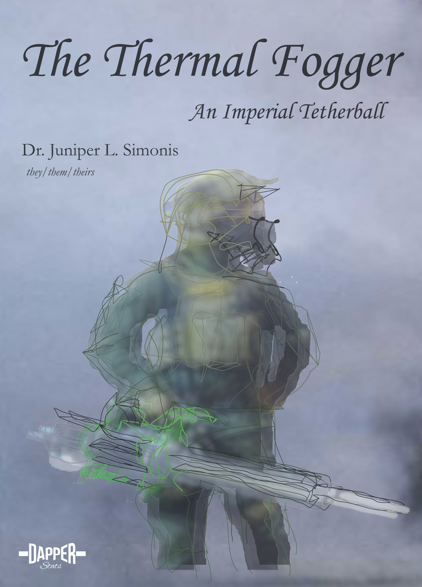

--- 
title: "The Thermal Fogger"
subtitle: "An Imperial Tetherball"
author: "Dr. Juniper L. Simonis (they/them/theirs)"
date: "2021-05-28"
description: "The history of use of thermal fogging in chemical warfare."
github-repo: "chemicalweaponsresearch/thermal_fogger"
cover-image: "img/cover.png"
url: "chemicalweaponsresearch.com/thermal_fogger"
colorlinks: yes
graphics: yes
bibliography: [packages.bib, references.bib]
biblio-style: apalike
link-citations: yes
knit: bookdown::render_book
site: bookdown::bookdown_site
---

#  {-}

(ref:imgcover) Deployment of a thermal fogger by police in Berkeley CA, 8/31/1968 [@UPIphoto1968]

(\#fig:imgcover)(ref:imgcover)

  

[An archived version of this book is available on Zenodo](https://doi.org/10.5281/zenodo.4668002).

