--- 
title: "The Thermal Fogger"
subtitle: "An Imperial Tetherball"
author: "Dr. Juniper L. Simonis"
date: "`r Sys.Date()`"
description: "The history of use of thermal fogging in chemical warfare."
github-repo: "chemicalweaponsresearch/thermal_fogger"
cover-image: "img/cover.png"
url: "thermalfogger.chemicalweaponsresearch.com"
colorlinks: yes
bibliography: [packages.bib, references.bib]
biblio-style: apalike
csl: ecology.csl
link-citations: yes
site: bookdown::bookdown_site
documentclass: krantz
lof: yes
monofontoptions: "Scale=0.7"
fontsize: 11pt
favicon: "img/icon.png"
---

```{r index-1, echo=FALSE}
options(tinytex.verbose = TRUE)
is_on_ghactions <- identical(Sys.getenv("GITHUB_ACTIONS"), "true")
is_online <- curl::has_internet()
is_html <- knitr::is_html_output(excludes = c("epub"))
is_latex <- knitr::is_latex_output()
is_not_latex <- !is_latex

if (is_html) {
  out_width_300 <- 300
  out_width_400 <- 400
  out_width_500 <- 500
  out_width_650 <- 650
} else if (is_latex) {
  out_width_300 <- "75%"
  out_width_400 <-"100%"
  out_width_500 <-"100%"
  out_width_650 <-"100%"
}
```


```{asis include = is_html}
#  Cover {-}
```


```{r cover, out.width = out_width_500, fig.alt = "Cover for the book, which has fogger clouds as background and says The Thermal Fogger An Imperial Thetherball at the top and Dr Juniper L Simonis they/them/theirs in the bottom right. The focal image is a blurred, sketched over, re-rendered, and otherwise edited photo of a US Customs and Border Protection agent in all green and tan camo riot gear holding a thermal fogger in their right hand.", echo = FALSE, include = is_html, fig.align = "center"}
knitr::include_graphics("img/cover.png")
```  


```{r include = FALSE}

knitr::write_bib(c(.packages(), 'bookdown', 'knitr', 'rmarkdown'), 'packages.bib')

```

<!--chapter:end:index.Rmd-->


# Preface {-}

[An archived version of this book is available on Zenodo](https://doi.org/10.5281/zenodo.4850406).

## Content Warning {-}

This book deals with police and corrections violence in frank terminology.
Pictures of chemical weapons being deployed on individuals, including those passively resisting, are included, but no injuries, blood, gore, etc. are shown.
Casualties, including fatalities, are discussed, including an individual being killed by corrections officers.

## Land Acknowledgment {-}

This work's impetus comes from present-day Portland, Oregon, United States of America -- the Indigenous land of the Chinook people, who were colonized and spread across multiple federally recognized tribes in Oregon, Washington and Idaho including Cowlitz, Siletz, Wasco, and Yakima.

Chemical weapons are a common tool among imperialist regimes.
The events cataloged in this book occur at many locations across the present-day United States and internationally, with specific references to Canada, Mexico, and Vietnam, where colonizing forces of (predominately Northwestern) Europe have used forced labor from enslaved Black people to impose significant force on Indigenous cultures and individuals.

No words can fully encompass the place in which each of the stories told in this book occur.
I will work to add important contextual information and acknowledgments, and please remember that each use of a thermal fogger or other brutal police force described here impacted many, many lives.

I ask you to take time to reflect on the countless individuals from communities, tribes, peoples, and cultures around the world that have been fogged with some chemical agent whose names we will never know, whose stories we will never hear.

## Inherent Bias {-}

This book has been produced by collating historical documentation and records, which are inherently biased towards the views of white, male colonizers, as will be plainly evident in the documents.
As such, it is important to recognize that there are almost certainly records that I have not yet found or which have been lost to time.
Even more critical, however, is that many uses of thermal foggers have likely never been recorded at all (even if "legally required"), as will be made clear through the documents that have been recovered.

## Author Position {-}

I, [Dr. Juniper L. Simonis](https://juniperlsimonis.com) (_they/them/theirs_), am a 37-year-old middle-class, white, non-binary, queer, physically and psychologically disabled person. 
I come to the study of the history of chemical weapons use in America via my personal experience being the recipient of law enforcement's chemical weapons and my ensuing scientific research into its impacts on the environment.

I have a PhD in Ecology and Evolutionary Biology from Cornell, where I studied aquatic ecology and biogeochemistry -- disciplines I have put to use to studying the impact of chemical weapons.
Through my ecological research, I have uncovered historical and current information into the impacts of chemical weapons that I was not seeing being represented in the present day broad cultural discourse. 

From this need to share historical information came this book, a way for me to pass along a window into the racist, classist, capitalistic, and colonialistic throughline of the thermal fogger.

I am an abolitionist in multiple senses: I believe that the use of chemical weapons, police, and the carceral system should all be abolished, full-stop.

Through this work, I have discovered an extensive history that makes me feel a deep connection to my protest elders who experienced thermal foggers decades ago.
I hope that my work will bring light to their stories.
We are but the most recent chapter in a long history of United States Law Enforcement using chemical weapons against its own people.

## Financial Statement {-}

All work for this product was conducted by Dr. Juniper L. Simonis via internal time at DAPPER Stats.
No external funding was provided.

## Licenses {-}

This book it created under a [dual license](https://github.com/chemicalweaponsresearch/thermal_fogger/blob/main/LICENSE.md) that recognizes a separation between the software and non-software components.
All underlying documents (photos, etc.) are cited in the [References](#References) and references do not indicate the original licensor endorses this book or its authors.

## Acknowledgments {-}

My deepest heartfelt condolences to the family of Robert Forsythe.
I cannot even begin to imagine the impact Bobby's murder and the subsequent trial and media presence had on you and your community.
I hope that by shining a light on his story now, more people will come to understand just how horrendous the prison system is and fight for its abolition.

The story of Robert Forsythe is almost certainly not unique, but became public knowledge because of the trial against the corrections officers.
I recognize that many others have been killed by thermal foggers, yet we will never know their names.

This booklet is based on a variety of sources past and present, and to the journalists and photographers: thank you for sharing your work with the world. 

I have no idea how many people have been involved in digitizing historical newspapers, as their names are never on anything, but y'all are fantastic and I appreciate you so much.

Sandra Simonis provided significant help with writing alt-text for images.

Twitter users NewNameJeanette and WillHickox notified me of the [Lawrence High School](#Lawrence1970_04_21) protest and use of the thermal fogger, for which I am very thankful.

Christophe Dervieux provided an example of how to render figure alt-text in an appendix: https://cderv.rbind.io/2021/06/29/fig-alt-appendix/.

The cover image is based on @Lewis-Rolland2021a.

## Contribute Information {-} 

If you are aware of incidents where a pepper fogger was used to deploy chemical weapons that we have not included, please reach out [via the Chem Weapons Research Website](https://chemicalweaponsresearch.com/contact/) or submit an [issue](https://github.com/chemicalweaponsresearch/thermal_fogger/issues/new/choose) or [pull request](https://github.com/chemicalweaponsresearch/thermal_fogger/compare) on our [GitHub repository for the book](https://github.com/chemicalweaponsresearch/thermal_fogger).

<!--chapter:end:00-preface.Rmd-->

\mainmatter


# Introduction


Late in the night on July 29th, during the height of the 2020 Uprising in Portland (OR), as protesters gathered outside the Hatfield Federal Courthouse to fight for racial justice, the Department of Homeland Security (DHS)'s Customs and Border Protection (CBP) used a thermal fogger to deploy unknown chemical agents on the crowd:

<br>

(ref:imgportland20200729) CBP agent using a thermal fogger in front of the federal courthouse, Portland OR [@Brown2020].

```{r imgportland20200729, echo=FALSE, out.width = out_width_500, fig.cap="(ref:imgportland20200729)", fig.align = "center", fig.alt = "Fully riot-geared and for some reason in green camo US Homeland Security agents (to the middle and the left of the photo) behind a row of two-foot tall, one-foot radius metal posts, behind a metal grate wall over 7 feet tall with metal support beams and concrete pylon buttressing. In the front of the left side is an agent holding a plastic clear riot shield, through which you can see a patch that say 'Border Patrol Federal Agent' in yellow and some insignia patches as well. In the middle are the agents in camo, one with a hand on the shoulder of another who is operating a thermal fogger machine shooting gas through the fence. The machine is maybe four or five feet long and has a body not unlike a bush whacker with a two-cycle engine, but fueling a vaporizer instead of a rotor. The agent is holding the machine with their right hand visibly and there is a black strap across their shoulder holding it up. The machine is mostly shiny metal, although the tip is showing signs of corrosion (no surprise based on the compounds and heat) and the supports of the body are a bright green"}
knitr::include_graphics("img/portland_2020_07_29.jpg")
```

<br>

With this seemingly novel usage, DHS made a large swath of the populace aware of an insidious weapon that is actually not new, but -- in fact -- was [birthed](#Genesis) in the American occupation of Vietnam, [perfected](#The1968Convensions) for use against domestic protesters in the 1960s and '70s, and [sent abroad](#CBP) via CBP in the years since. 
The subsequent [return](#PortlandOR2020_2021) of the thermal fogger to use against civilians domestically by the same domestic law enforcement agency (CBP) that sent it abroad after its initial domestic use is an extension of the classical Imperialist Boomerang [@Cesaire1950; @Arendt1951; @Foucault1976; @Graham2013] that can be more aptly described as a tetherball.

Despite repeated use of thermal foggers to deploy chemical weapons over the last half century, the device appears to have slipped from the zeitgeist, only to reemerge in the city that experienced the most visible federal deployment of chemical weapons [@Flanigan2020] and weapons-based incidents of police brutality at racial justice protests (regardless of population size) [@pb20202021], perhaps due to the noteworthy density of photographers and videographers.

Although not all of the weapon's history is documented, enough is that we can quickly dispel the myth that this deployment was _new_ in any notable sense other than being recent.


## The Science of Thermal Fogging {#Science}

Broadly speaking, a fog is a visible aerosol that hangs in the air near the ground, and while it occurs on its own accord, humans have devised a variety of methods to generate fog.
And many, if not all, of those methods have been used to deploy chemical weapons on people.
The focus of this book is on __thermal__ fogging.
The idea behind thermal fogging is the same whether you're targeting mosquitoes in a marsh or protesters on a street: flash-vaporize a liquid being forced into a stream of cooler air, causing a fog to form as it condenses; move to increase the size of the cloud. 

The original chemical weapons thermal foggers employed the exhaust lines of diesel trucks or manifolds of 2-cycle engines to heat the formulation, which worked but were bulky and difficult to control in open areas [@Crockett1969].
These models were quickly supplanted by foggers leveraging resonant [pulsejet technology](https://en.wikipedia.org/wiki/Pulsejet) that were streamlined, lighter, and gave control of the stream to the operator [@Applegate1969]

<br>

(ref:imgCrockett1969) Concept drawing from the International Association of Chiefs of Police chemical agents manual [@Crockett1969].

```{r imgCrockett1969, echo = FALSE, out.width = out_width_500, fig.cap = "(ref:imgCrockett1969)", fig.align = "center", fig.alt = "B/W image drawing with text from an old white paper book. The text says FOG DISSEMINATION at the top then a paragraph with `Fog dissemination devices operate by rapidly vaporizing a high boiling point liquid agent formulation. This is accomplished by injecting the liquid agent into a hot gas flow and allowing the vaporized agent to contact the cooler ambient air where the agent condenses into a fog and ultimately into extremely small agent particles.` In the middle is the drawing with a square on the left with a long rectangle coming out of it to the right with a cloud out the further end of the rectangle. There are bits of text around it, pointing to the box it says `FUEL`, `SPARK`, and `COMBUSTION CHAMBER`. in the middle of the rectange it says `HOT GASES` in the middle of arrows pointing out towards the cloud. Along the rectangle another injection area is noted for `Liquid Agent Injection` Text on the bottom says `FIGURE 4. FOG DISSEMINATION. A liquid chemical agent is vaporized by a hot gas flow and released as a fog cloud`."}
 
```

<br>

Regardless of the heating method specifics, the machine creates a visible fog from the mixture of gasoline exhaust, chemical weapons, and ambient air moisture, as desired. 

Although the mixture does cool considerably from its peak temperature before being released, the chemicals are heated to such high temperatures that they thermally decompose, creating a much more toxic mixture of gases that condense to form the fog.
Indeed, the thermal cracking temperatures of common chemical contemporary chemical weapons are well below the temperatures achieved in a thermal fogger:

- Phenacyl chloride (CN): 248 C [@Compton1987]
- 2-chlorobenzalmalononitrile (CS): 450 - 550 C [@Xueetal2015]
- Oleoresin Capsicum (OC): < 200 C [@HendersonandHenderson1992]
- Hexachloroethane (HC): 185 C [@IARC1979]
- Terephthalic Acid (TPA): 445 C [@KimyonokandUluturk2016]

As a result, it is impossible for anyone to definitively know what chemicals they are fogging someone with, but it is fair to say the mixtures are likely to have considerably higher toxicities than product labels and safety sheets indicate, which are already concerning [@defteccs].


<!--chapter:end:01-introduction.Rmd-->


# Vietnam {#Vietnam}

The modern day use of thermal foggers for chemical weapons deployment was born from the American colonization of Vietnam in the mid-to-late-20th Century [@USMACV1965; @Bunker1996]. 

<br>

(ref:imgvcmm) US Military deploying a thermal fogger into a Vietnamese tunnel [@Delf2012].
  
```{r imgvcmm, out.width = out_width_500, fig.cap="(ref:imgvcmm)", fig.alt = "Book illustration (colorful, hand-rendered style) of green-clad US military service members in helmets flak vests, boots, etc, standing around a thermal fogger in the foreground. The fogger is a non-portable Mity Mite style fogger with a big reservoir and giant vacuum style hose running through a green tarp that's lying on the ground and covering the tunnel entrance. They are in a clearing with huts and the jungle in the background.", echo = FALSE, fig.align = "center"}
knitr::include_graphics("img/vcmm.jpg")
```
<br>


## Context

### Mosquito Control

Early in the deployment of US troops to occupy Vietnam, the need for large scale mosquito control became so great that soldiers began improvising insecticide foggers by piping insecticide into diesel truck exhaust:

>  An insecticide fogger, one of the most useful improvisations, was made by mounting a [55-gallon oil] drum filled with 6 to 7 percent malathion insecticide in diesel oil ... on a 3/4-ton truck and spraying the poisonous mixture out with the exhaust from the vehicle. The insecticide is drawn from the drum by the partial vacuum in a line connected to the exhaust pipe just behind the manifold, and sprayed out under pressure of the exhaust. 
>
> --- @Spicknall1969 

The hack turned out to be __*4,500 times*__ more effective, covering nine square miles per day compared to 50,000 square feet (0.002 square miles) per day using a conventional manually operated fogger [@Spicknall1969].
Given widespread mosquito concerns and the preponderance on diesel drums, the truck approach spread, and the concept of fogging was understood among servicemembers [@USMACV1965; @Spicknall1969]. 

### Tunnels 

As the occupation continued, underground bunkers and tunnels dug by the Viet Cong (VC) and People's Army of Vietnam (PAV)  became a dominant presence on the both the literal and figurative battlefields [@Rottman2006; @Rottman2012].

<br>

(ref:imgtunnels) Hypothetical Vietnamese village with a two-level bunker tunnel system [@Hanesalo1996].
  
```{r imgtunnels, out.width = out_width_500, fig.cap="(ref:imgtunnels)", fig.alt = "Book illustration (blank and greys, hand-rendered style) of a two-level village tunnel system, connecting most of the structures with defensive trenches and bunkers. There are eight houses surrounding a community building and the nearest ones are cut-away so you can see into them and the ground beneath them, which shows the tunnels and bunkers. Each house has a shelter and they are connected via tunnels. There is a puji-stake moat with a sharpened bamboo fence around it surrounding the village and there's one road in, with a gate at the fence. There is a river or open water of some kind on the other side of the fence and then some fields and jungle. The community building is two stories and is next to a single flag on a pole in the center of the village. The flag is blank, and so functionally white.", echo = FALSE, fig.align = "center"}
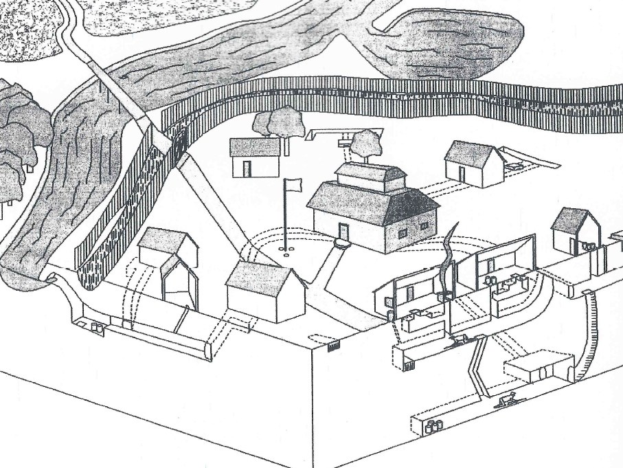
```
<br>

Soldiers from the US, Australian, New Zealand, and other armies were tasked with clearing the tunnels and "rooting out" inhabitants [@Hemmings2019].
The specialized forces designated for the work were dubbed "Tunnel Rats" and tear gas was part of their arsenal to "flush" individuals from caves, which they regularly deployed via pyrotechnic grenades and powdered explosives [@NewYorkTimes1977; @Rottman2006].

<br>

(ref:imgratmask) Tunnel rat in a gas mask, undated [@Hemmings2019]
  
```{r imgratmask, out.width = out_width_400, fig.cap="(ref:imgratmask)", fig.alt = "B/W image. Open trench at bottom, center. Pipe runs across trench and into the dirt on either side. Person in gas mask crouched below pipe looking up and forward. Leg in pants and lace up boot stretched over trench leaning against right edge. Other leg and boot partially visible on left. Hand holding lit cigarette resting on foot on left.", echo = FALSE, fig.align = "center"}
knitr::include_graphics("img/rat_mask.png")
```

<br>

## Genesis {#Genesis}

### Implementation {#FirstUse}

In October of 1965, the USMACV (United States Military Assistance Command, Vietnam) was supporting the South Vietnamese Army's (ARVN) III Corps in a "search and destroy" operation in the Iron Triangle, an area known to house an elaborate Viet Cong tunnel system [@USMACV1965].

<br>

(ref:imgirontriangle) US-defined War Zones C, D, and the Iron Triangle near Saigon, Vietnam [@USArmy2005]
  
```{r imgirontriangle, out.width = out_width_400, fig.cap="(ref:imgirontriangle)", fig.alt = "Text-book style map of the III Corps Tactical Zone from 1965-1967, according to the legend. This is the area of Vietnam around Saigon, with some of the South China Sea visible to the south at the bottom and Cambodia to the north west in the upper left portion. Major highways and cities are indicated on the map, but the main points are the color highlighted boundaries of the two war zones and the iron triangle, which are all in reddish organge, and the full tactical zone in a darker blue. There is text in the bottom left that says Map 13 and there is a unit bar in the legend that gives distances in both miles and kilometers.", echo = FALSE, fig.align = "center"}
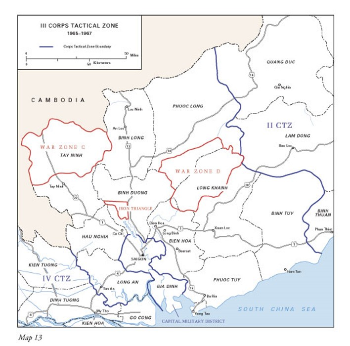
```

<br>


The US Chemical Advisor to the ARVN's Chemical Team participated in planning the operation, and suggested using a Mity Mite (a.k.a. Mitey Mite, Mighty Mite) 2-cycle thermal fogger to aid in clearing tunnels. 
A 6-member unit of ARVN Chemical Team members was organized on October 7th for implementation of the fogger [@USMACV1965].
The next day, the force located a tunnel and set into motion an elaborate scheme to fog the tunnels with [hexachloroethane (HC)](https://chemicalweaponsresearch.com/hc) smoke from burning pots, marking the first known tactical use of a thermal fogger to deploy chemical weapons agents [@USMACV1965; @Rottman2012].
Overall, the endeavor was dubbed a success, despite the tunnel already being empty [@USMACV1965].

Although (highly toxic; @Simonis2020) munitions smoke was used in this application, it was noted that tear gas would be "very effective in flushing VC from tunnels" should there been any present [@USMACV1965]. 

According to the *Lessons Learned* report filed by the USMACV the next month,

> This is believed to have been the first tactical employment of Mity Mite _by ARVN_. [emphasis added] 
>
> --- @USMACV1965

Note that there is no mention of use by USMACV prior to this deployment [@USMACV1965].


<br>


### What About Not In Tunnels?

Seeing the Mity Mite in action got the wheels turning in the heads of USMACV officers, and the idea of deploying the fogger outside of tunnels was on the table [@USMACV1965].

This is made clear in the *Lessons Learned* report, where they state that the  

> Mity Mite portable blower can be used to ... generate an agent cloud for use against unmasked personnel __in the open__ ... [emphasis added] 
>
> --- @USMACV1965.

At the time, however, the set up used powder, pot, and grenade sources of chemical agents, which was inefficient and required extensive supplies and gasoline reserves [@USMACV1965].

<br>
  
(ref:imgmitymite) Technical drawing of a backpack fogger [@USMACV1965]

```{r imgmitymite, out.width = out_width_500, fig.cap="(ref:imgmitymite)", fig.alt = "Technical rendering sketch of a tank with the words Mity Mite on the side. Funnel on bottom of tank leads to exhaust hose below and pipe on bottom of tank has small flexible hose attaching to exhaust hose as well. Exhaust hose comes from below and curves upward to the right. Below the tanks and attached by a frame is a small motor.", echo = FALSE, fig.align = "center"}
    
knitr::include_graphics("img/mity_mite.jpg")
```  

<br>


## Expansion

The practice caught on quickly, and Mity Mites were soon issued to ARVN units [@USMACV1965] and became common tools for Tunnel Rats [@Rottman2012].

<br>
  
(ref:imgmightymite) A soldier uses a backpack Mity Mite to fog a tunnel [@USArmy1966]

```{r imgmightymite, out.width = out_width_500, fig.cap="(ref:imgmightymite)", fig.alt = "B/W image in a dirt field. Helmeted soldier on one knee with tank strapped on back. Lifting a board with left hand and holding an exhaust tube from the tank under the board with right hand.", echo = FALSE, fig.align = "center"}
       
knitr::include_graphics("img/mighty_mite.png")
``` 
  

<br>

The Army used foggers to pump "air" or "smoke" into tunnels in combination with "riot control agents" during Operation Cedar falls in 1967 [@Lehrer1968]. 
And by 1968's Battle of Khe Sanh, it was standard practice to use foggers for tunnel excavation as well as mosquito and fly control [@Rottman2006]. 

<br>
  
(ref:imgunpacktest) Engineers unpack and test a Mitey-Mite blower [@USAES].

```{r imgunpacktest, out.width = out_width_500, fig.cap="(ref:imgunpacktest)", fig.alt = "B/W image. In a clearing in a densely vegetated area, a small tank with an exhaust pipe blowing fog to the right. The cloud of fog covers much of the right side. Towards the back, 2 people wearing helmets and fatigues with sleeves rolled up stand with hands on hips on either side of the fogger, watching it.", echo = FALSE, fig.align = "center"}
   

knitr::include_graphics("img/unpack_test.jpg")
```     
  

<br>

In 1969, the US Army Limited War Laboratory published a report on chemical weapons that included a section on foggers and agents for use in them, naming the [General Ordinance Equipment Corporation](#GOEC) and [Federal Laboratories](#DefenseTech) models that were already in production and a propsed development of a formalized truck-based fogger [@Samuelsetal1969]:


<br>
  
(ref:imgtablea212) Existing and proposed fogging devices [@Samuelsetal1969].

```{r imgtablea212, out.width = out_width_650, fig.cap="(ref:imgtablea212)", fig.alt = "Screen cap of a photo copy of an old report, it's black and white and in bad shape, but legible for the most part. It's Table A.2.1.2, Chemical Sprays and Foggers. There are columns: Device/Model, Manufacturer, Description, Estimated Cost (for development or for purchase), and Status (available already or needing development). There are 6 rows, one for each Device/Model: MK17 Pepper Fog CS-Tear Smoke Generator, MK XII, Turb A Fog Tear Gas Dispenser, Federal Dust Projector 271, Dynafog 70, and a propsed vehicle based fogger based on the mosquito fogging approach.", echo = FALSE, fig.align = "center"}
   

knitr::include_graphics("img/tablea212.jpg")
```     
  

<br>

## International Melting Pot

Other countries explicitly supported the US colonization in Vietnam, providing a pathway for the fogger to be rapidly picked up by the armed forces of other nations.

By 1966 the Australian Tunnel Rats were particularly fond of fogging tunnels with acetylene [@vietnam_aus1; @vietnam_aus2].


<br>
  
(ref:vietnamaus1) Double Acetylene Generator and a Mighty Mite Air Blower Used to Blow Fumes into Viet Cong Tunnels [@vietnam_aus1]

```{r vietnamaus1, out.width = out_width_500, fig.cap="(ref:vietnamaus1)", fig.alt = "Black and white photo of a Mighty Mite blower on the left and two containers of acetylene in the middle, both containers are metal boxes with labeling in small white text and then some bladder bag on top. There are large vaccum size hozes coming off the blower and going off frame to the right. The scene is the ground of a jungle that has been cleared a little, there are trees and foliage in the background and dense but matted down grass in the fore.", echo = FALSE, fig.align = "center"}
    
knitr::include_graphics("img/vietnam_aus1.jpg")
```     
  

<br>

<br>
  
(ref:imgvietnamaus2) Mighty Mite Machine Used to Contaminate Viet Cong Tunnel Systems with Acetylene [@vietnam_aus2]

```{r imgvietnamaus2, out.width = out_width_500, fig.cap="(ref:imgvietnamaus2)", fig.alt = "An individual crouches on the ground next to a blower, facing off to the right, with his left hand slightly resting on it. The photo is aimed down at this person, so the two people looking at the fogger while standing are partially visible from the feet upwards. The photo is an old black and white image and there are items around the sides that are difficult to make out, including potentially a cache of chemical weapons grenades on the right side and some sandbacks in the back.", echo = FALSE, fig.align = "center"}
    
knitr::include_graphics("img/vietnam_aus2.jpg")
```     
  

<br>

[As expected](#TheReturn), the fogger quickly made it to Australian police departments, although with a decidedly negative response from the news media, who called it "highly controversial" admist a Sydney Police spending scandal [@Allen1972].
Unnamed Australian arms experts who spoke on background said there was no application for the fogger in the country [@Allen1972], although that hasn't stopped its use elsewhere. 

<!--chapter:end:02-vietnam.Rmd-->


# The Return {#TheReturn}

As to be expected following the basic trajectory of an Imperial Boomerang [@Cesaire1950; @Arendt1951; @Foucault1976], the repressive technique (thermal fogging) developed by an imperialist country (USA) to control colonial territories (Vietnam) was brought home by the imperialist nation to use on its own people [@Graham2013].

Indeed, it took just _three years_ from initial deployment [in Vietnam on October 8 1965](#FirstUse) to first application in the United States to gas Black racial justice protesters in [Miami, Florida on August 8th, 1968](#MiamiFL1968_08_08) during the Liberty City Riots [@Tschenschlok1995; @Lorentzen2018]. 

In alignment with the general "Imperial Circuit of Tear Gas" [@Schrader2019] between the US and Vietnam, the return of the fogger was aided significantly by the weapons industry, militarization of US police forces, transition of veterans to law enforcement upon returning home, and substantial propaganda in specialized and generalized outlets.

## Manufacturers 

American companies quickly jumped at the opportunity to refine the bulky, complicated Mitey Mite and sell thermal foggers to the military and domestic police departments.
As early as 1969, The International Association of Chiefs of Police included a detailed section on thermal fogging and available models in their Chemical Agents Manual [@Crockett1969], providing prime trade-focused marketing.
Indeed, both [Federal Laboratories](#FederalLaboratories) and [General Ordnance Equipment Corporation](#GOEC) models were included.

### Sears Roebuck 

The original Mighty Mite that [established](#FirstUse) the fogger as a method of chemical dispersal was manufactured by Sears, Roebuck, and Co. for insecticide application [@Applegate1969].

<br>

(ref:imgM106) M-106 Mity Mite Thermal Fogger, as promoted to law enforcement in @Applegate1969.

```{r imgM106, out.width = out_width_500, fig.alt = "Yellowed black and white photo of a stationary Mighty Mite thermal fogger. It's a backpack fogger, so there's a giant hose that's like a vacuum hose wrapped around in the middle and then another one coming off of the actual backpack, which is upright in the middle back right. there is a metal frame and a large reservoir tank sitting on top of the engine and other aspects of the machinery. There is a tube running out to the end of the hose nose from the back pack. On the right side of the image is a scale bar that makes it seem like the backpack is 24 inches tall." , echo = FALSE, fig.cap = "(ref:imgM106)", fig.align = "center"}
knitr::include_graphics("img/M106.png") 
```

<br>

The bulkiness of the Mity Mite backpack proved to be a hindrance in mobile application, however, and while chemical weapons corporations began their fogger lines with hand-held models using 2-cycle engines, there was a push to produce a more streamlined and specialized tool for fogging chemical weapons at civilians [@Applegate1969; @Applegate1970].

<br>

(ref:imgjetfogger) Hand-held two-cycle thermal fogger [@Crockett1969].

```{r imgjetfogger, out.width = out_width_500, fig.alt = "Black and white technical drawing of a hand-held 2-cycle thermal fogger. The drawing is pretty minimal, but shows enough detail, in particular around the engine and fan, to get a sense of how it operates. There are also a few labels pointing out via arrows what the Recould Rope Starter, Fuel Tank, Carrying Handle, Creifugal Blower Assemble, and Air/Agent Exit Ports are, and to the where the Vaporized Agent is injected into the air stream.", echo = FALSE, fig.cap = "(ref:imgjetfogger)", fig.align = "center"}
knitr::include_graphics("img/jetfogger.jpg") 
```

<br>

Sears does not appear to have entered The Mity Mite into the law enforcement market, perhaps due to the company's existing legacy branding, and the model never established itself in the domestic market.


### Federal Laboratories {#FederalLaboratories}

Federal Laboratories, one of the major US manufacturers of chemical weapons starting after World War I, developed a hand-held 2-cycle thermal fogger that did not need a backpack or hoses:

(ref:img298) The Federal Laboratories "Federal Fogger 298" [@FedLabs298].

```{r img298,  out.width = out_width_300, fig.alt = "Black and white photo of a thermal fogger that is basically a 2-cycle weed-wacker engine on top of a chemical agent metal drum with a nozzle sticking out to the right that is about a yard long, it's dark and has some hardware on it. The drum says Federal Fogger and then other things that are illegible. The drum is a dark color and the main engine is light, with a dark handle and strap." , echo = FALSE, fig.cap = "(ref:img298)", fig.align = "center"}
knitr::include_graphics("img/federal_fogger_crop.jpg") 
```

(ref:fedlabimg) Officer demonstrating the Federal Laboratories 298 [@Applegate1992].

```{r fedlabimg,  out.width = out_width_300, fig.alt = "Black and white photo of police officer in a gas mask and riot helmet with the shield flipped up and full uniform, but not riot gear. The officer is holding a hand-held fogger that has a white top on the part, some shiny metal in the middle and then dark on the bottom with a dark nozzle that is spewing some fog. The officer is standing in a field in front of a forest." , echo = FALSE, fig.cap = "(ref:fedlabimg)", fig.align = "center"}
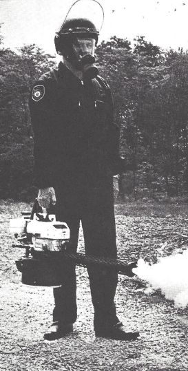 
```


### General Ordnance Equipment Corporation {#GOEC}

The General Ordnance Equipment Corporation (GOEC), who invented and trademarked Chemical Mace earlier in the decade, had been bought-out by Smith and Wesson by the late 1960s when the fogger market opened up [@Gross2014].

Alan Litman, the brains behind GOEC, retained leadership of chemical weapons development after the buy-out, however [@Gross2014], and he must have seen an opportunity, as GOEC began selling hand-held thermal foggers in July 1968 [@Applegate1969].

They named their units "Pepper Fog" generators, a nod to their apparent ability to "pepper" the recipient with more concentrated bursts of fog if desired, compared to the steady stream output from the Mity Mite [@Applegate1969], and applied for a trademark on the phrase in October of the same year [@USTPO2018].
By the end of August 1969, GOEC (and thus Smith and Wesson) had received the trademark on "Pepper Fog", which they (and subsequent owners) retained until it expired in 1991 [@USTPO2018].

While GOEC did develop and sell a stationary 2-cycle model for vehicle mounting, it was their hand-held pulse-jet model that took the market by storm [@Crockett1969].

<br>

(ref:goecpf) General Ordnance Equipment Corporation thermal fogger [@GOECphoto], as shown in @Applegate1969.

```{r goecpf, out.width = out_width_500, fig.alt = "Yellowed black and white photo of a stationary pepper fog thermal fogger pointed to the left sitting by itself. The main body is a square box that's dark with a tag in the middle that's lighter and has dark writing on it that says pepper fog g o e c. The nozzle points to the left and is a longer thinner tube about twice as long as the main body. It is also dark and has a metal cage around it that is sparse and shiny. There's also a handle and some knobs on the top of the item and something that's a little bit difficult to make out off the back of the main body." , echo = FALSE, fig.cap = "(ref:goecpf)", fig.align = "center"}
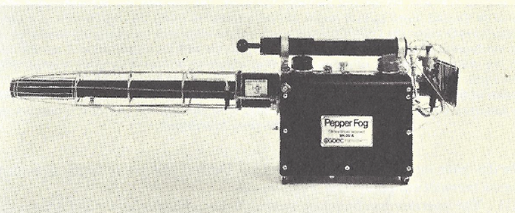 
```

<br>


They immediately began a heavy marketing campaign for their new invention, taking out full-page ads in police magazines [@GOECad1969; @GOECadLNS1970; @GOECadObserver1970]:

<br>

(ref:imggoecad1969) GOEC advertisement [@GOECad1969].

```{r imggoecad1969, out.width = out_width_500, fig.alt = "Photocopied, blurried black and white magazine spread advertisement for General Ordnance Equipment Company (GOEC). The ad shows both their chemical mace and their fogger, although the fogger takes up 3/4 of the page. The left side has two main panels, one for each weapon, the top is a mace one showing an officer spraying mace into someone's face and the bottom part is the picture of the person fogging the railroad. The right side is an explainer on the pepper fogger that has three photos (including a repeat of the railroad one) at the top, the item image in the middle, and then a whole bunch of specs that are too blury to read" , echo = FALSE, fig.cap = "(ref:imggoecad1969)", fig.align = "center"}
knitr::include_graphics("img/GOECad1969.png") 
```

<br>

They also leveraged the connection between local law enforcement and the press to generate [free marketing](#Propa) with an [international reach](#Canada).

It is perhaps no surprise then that virtually all of the foggers photographed being used in the US prior to 2020 are GOEC models.


### Defense Technology {#DefenseTechnology}

The corporate descendent of both GOEC and Federal Labs and current owner of the legacy branding ([Safariland](https://www.safariland.com) subsidiary [Defense Technology](https://www.defense-technology.com)) continues to sell items under a ["Pepper Fog" line](https://www.defense-technology.com/product-category/pepper-foggers/), including a ["pepper fog generator"](https://www.defense-technology.com/product/pepper-fog-generator/) that utilizes the same pulse-jet generation technique [@DTPFG]:

<br>

(ref:imgdefensetechgepf) Product image for thermal fogger [@DTPFGphoto].

```{r imgdefensetechgepf,  out.width = out_width_500, fig.alt = "Yellow-gold box shape tool with a handle on top, an image of an eagle in flight on the side, and some gauges on top.The back of the box tapers and appears to have switches and controls. Coming out of the front is a long tube that narrows at the end. The tube has a wire cage surrounding it." , echo = FALSE, fig.cap = "(ref:imgdefensetechgepf)", fig.align = "center"}
knitr::include_graphics("img/defense_tech_gepf.png") 
```

<br>

This has supplanted the models produced by the corporate ancestors to Defense Technology, which were bulkier and considerably heavier [@Samuelsetal1969].

## Rex Applegate 

A major figure in the translation of military "riot suppression" tactics to domestic law enforcement in the 1960s and 1970s was a former US Army Lt. Colonel named [Rex Applegate](https://en.wikipedia.org/wiki/Rex_Applegate).
Applegate took a commission as a second leuitenant, but had a lung ailment kept him from serving in combat in World War II and so was assigned to Military Police Company before being tapped by [Col. William Donovan](https://en.wikipedia.org/wiki/William_J._Donovan) to build and run the School for Spies and Assassins in the Office of Strategic Services [@Goldstein1998].
Larger than life, Rex even served as bodyguard to President Franklin Roosevelt, before retiring and moving to Mexico at the end of World War II to consult with Central and South American governments on "riot control" [@Goldstein1998].

Applegate returned to the US in the 1960s during the civil rights and anti-war protest era and began proselytizing the good word of the thermal fogger [@Applegate1969; @Applegate1970].
Indeed, Rex published what can only be described as a long-form written sales pitch for the GOEC Pepper Fog thermal fogger in the highly circulated _Guns_ magazine in 1970 [@Applegate1970].

<br>

(ref:imgdemo) Demonstration of a pepper fogger [@Applegate1970]

```{r imgdemo,  out.width = out_width_500, fig.alt = "Black and white photo of a person using a pepper fogger across some railroad tracks. The person is standing in the mid ground on the left side of the photo and fogging towards the right mid-ground where the train tracks come from. The fog obscures the origins of the tracks off to the background on the right side of the photo. Behind the person on the left side is a taller tree along short building a car and some foliage. Further behind is a ridge of some kind with trees on it. The train tracks are old and partially overgrown." , echo = FALSE, fig.cap = "(ref:imgdemo)", fig.align = "center"}
knitr::include_graphics("img/demo.png") 
```

<br>

## News Media Propaganda {#Propa}


Alongside the more overtly pro-police-use-of-chemical-weapons propaganda of Rex Applegate were other, perhaps more subtle forms of pro-fogger propaganda [@Macomber1970].
Newspapers around the country were more than happy to print "articles" that promoted the new arsenals police departments were building [@LaPrade1970], complete with product demo photos.

<br>

(ref:imgVance1970) Amarillo Texas Police Sergent Jerry Austin with a thermal fogger and shotgun [@Vance1970]. Amarillo's 1970 population was 127,010 [@USCB1970].

```{r imgVance1970, out.width = out_width_500, fig.alt = "Black and white newspaper clipping of an officer standing in front of a open garage door, next to a police car that is partially in frame on the left and front areas. A GOEC-style thermal fogger sits on the hood of the car in front of the officer, pointing towards and to the left of the camera. The officer is wearing beat clothing and a cop hat and also has a shotgun." , echo = FALSE, fig.cap = "(ref:imgVance1970)", fig.align = "center"}
knitr::include_graphics("img/Vance1970.jpg") 
```

<br>

<br>

(ref:imgAmanphoto1970) Richland County (Ohio) Sheriff's Captain Robert Dysart demonstrating a thermal fogger to a crowd of >200 people [@Amanphoto1970]. Richland County's 1970 population was 129,997 [@USCB1970].

```{r imgAmanphoto1970, out.width = out_width_500, fig.alt = "Black and white newspaper clipping of an officer standing in a field just front a forest/brush line, fogging out into the open area as part of a demonstration. The officer is wearing a riot helmet and coveralls and has the fogger slug over their right arm with a strap they are also holding with their left hand. The officer stands in the left part of the frame, fogging to the right, using a GOEC-style fogger with the nozzle tip right in the middle of the photo." , echo = FALSE, fig.cap = "(ref:imgAmanphoto1970)", fig.align = "center"}
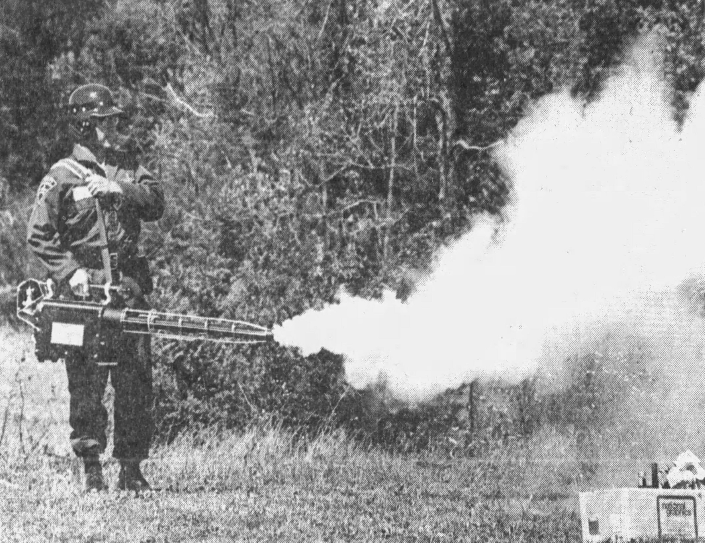 
```

<br>

[General Ordnance Equipment Corporation](#GOEC)'s Pepper Fog model seems to have been the favorite, at least amongst the departments showing off their new cool toys for photographs.

<br>

(ref:imgGaylord1971) A McHenry County (Illinois) Sheriff's officer fogs some grass in a rural landscape during a training and press demo day [@Gaylord1971; @PlainDealer1971]. McHenry County's 1970 population was 111,555 [@USCB1970].

```{r imgGaylord1971,  out.width = out_width_500, fig.alt = "Black and white photo of an individual standing in a grass field with wood horse fence and trees and barns in the background. The individual is in light clothes and a black cap and is using both hands to hold a pepper fogger, which they are using to fog some grass on the right side of the photo. they are facing the camera, so the classic GOEC label is visible." , echo = FALSE, fig.cap = "(ref:imgGaylord1971)", fig.align = "center"}
knitr::include_graphics("img/Gaylord1971.jpg") 
```

<br>


<br>

(ref:imgWinter1970) Scott County (Iowa) deputy sheriff Jim Lewis, left, holds a new grenade launcher and a riot gun while Sheriff William Strout displays a pepper fogger and gas mask [@Winter1970]. Scott County's 1970 population was 142,687 [@USCB1970].

```{r imgWinter1970, out.width = out_width_300, fig.alt = "Black and white newspaper clipping of two officers standing in front of a large brick wall. Scott County deputy sheriff Jim Lewis, left, holds a new grenade launcher and a riot gun. he is donning a standard beat uniform with a bucket hat. Sheriff William Strout is on the right in street clothes and is holding a GOEC pepper fogger in his right hand and gas mask in his left. The officers are making an X with the barrells of the grenade launcher and fogger." , echo = FALSE, fig.cap = "(ref:imgWinter1970)", fig.align = "center"}
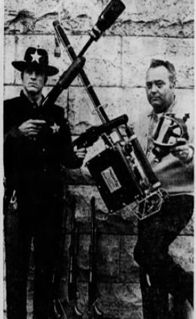 
```

<br>


### Gary Wills 

Pulitzer Prize-winning [Garry Wills](https://en.wikipedia.org/wiki/Garry_Wills) (who at the time was considerably more conservative than he came to be later) penned an op-ed that ran in (at least) The Herald Statesman (Yonkers, New York) [@Wills1971a], The Daily Item (Port Chester, New York) [@Wills1971b], The Charlotte News (Charlotte, North Carolina) [@Wills1971c], and The Philadelphia Inquirer [@Wills1971d] in April 1971 in which he basically tells all the cry babies (pun intended) to suck it up because he "would not be afraid to undergo such experiences [as being pepper fogged] again" [@Wills1971a].

Notably, he touts the leading belief at the time that somehow thermal fogging is a "safe immobilizer of individuals" [@Wills1971a], despite the weapon not being demonstrably safer than gas grenades and not only not "immobilizing" but explicitly designed to mobilize immobile resisters.
Wills interestingly deems chemical weapons as "safer than dogs, which get out of control, bite bystanders (and even other cops) as well as 'the bad guys'" [@Wills1971a], despite their being indiscriminate to the point of impacting bystanders, police officers, etc..

He concludes his piece by calling tear gas "humane in ... foreign wars [and] domestic encounters" [@Wills1971a], speaking clearly to the return of the trip of the classically defined Imperial Boomerang [@Cesaire1950; @Arendt1951; @Foucault1976]. 


<!--chapter:end:03-return.Rmd-->


# The 1968 National Conventions {#The1968Conventions}

Deployment of chemical weapons on United States civilians by domestic law enforcement began in earnest in the late 1960s during the height of anti-war and civil rights protests, kicked off in particular by the 1968 Republican (Miami, Florida) and Democratic (Chicago, IL) National Conventions [@McArdle2018; @TaylorandMorris2018].
As a result of a [heavy propaganda and branding campaign](#TheReturn), the thermal fogger was just becoming a mainstay of early police chemical weapons arsenals.
Importantly, by the summer of 1968, the Florida Highway Patrol, Chicago Police Department, and California State Police all had purchased foggers.

Beyond their legacy as the first domestic fogger deployments, the lingering impact of the 1968 Conventions was felt for years to come.
The Kansas City (Missouri) Police Department armed up their chemical weapons cache in advance of the 1976 Republican National Convention, including purchase of fogger fluids [@Hudson1976].

## Republican National Convention

### Miami, Florida {#MiamiFL1968_08_08}

The first use of a thermal fogger to deploy chemical weapons in the US that I have been able to uncover occured on August 8th 1968, during the "[Liberty City Riots](https://en.wikipedia.org/wiki/1968_Miami_riot)", which took place in the midst of the [1968 Republican National Convention](https://en.wikipedia.org/wiki/1968_Republican_National_Convention) (RNC) in Miami, Florida [@Tschenschlok1995; @Tschenschlok1996; @McArdle2018].
A white reporter with the Miami Herald attempted to gain access to rally of concerned Black people that was meant to be only among Black people that was occurring in Liberty City, a Black neighborhood, on August 7th [@Tschenschlok1995; @Tschenschlok1996].
When the reporter was ejected from the rally, Miami police responded with a large and heavy presence and during the standoff, a white motorist with a "Wallace for President" bumper sticker attempted to drive through but was met with resistance and drove into another car, and fled the scene on foot [@Tschenschlok1995; @Lorentzen2018].

Miami police used chemical weapons the night of the 7th, but the fogger did not make an appearance until the subsequent day.
Local, state, and federal officials met with Black organizational representatives the night of the 7th and had agreed to continue discussions the morning of the 8th, but instead sent staffers rather than appear themselves, which effectively ended discussions [@Tschenschlok1995; @Tschenschlok1996]. 
Apparently, Miami Police Department was unable to manage the situation and Florida Highway Patrol (FHP) was called in by the city [@Tschenschlok1995].

FHP used a truck with multiple foggers [@Lorentzen2018], described as "essentially a modified version of an insect-control machine" that "spread a thick fog of tear gas throughout the riot zone" [@Tschenschlok1995]. 

FHP used the truck-mounted thermal foggers indiscriminately and caused visible symptoms (gagging, etc.) in all present, including a 5-month old [@McArdle2018].
The fog quickly spread into neighborhood homes, forcing residents outside to seek fresh air [@Tschenschlok1995].


## Democratic National Convention 

### Chicago, Illinois {#ChicagoIL1968_08_26}

Later that month, from August 26th to 29th, anti-war protests took place in Chicago, Illinois during the [Democratic National Convention](https://en.wikipedia.org/wiki/1968_Democratic_National_Convention), and a massive force of law enforcement (Chicago Police with assistance from over 6,000 National Guard members and 6,000 Army troops [@TaylorandMorris2018]) responded excessively, including with chemical weapons, on network news [@Schultz1969; @Karnow1983; @Farber1988; @Langguth2000]. 
After four days, hundreds had been given medical assistance for exposure to chemical weapons [@TaylorandMorris2018].

Although I have yet to find contemporary documentation of fogger use during the convention, an AP report on fogger use in [Berkeley the year later](#BerkeleyCA1969_02_21) states

> A similar device was used during demonstrations in Chicago during the Democratic convention last summer. - @TheDailyTribune1969_02_21

As such, I consider this a very likely deployment.
I am continuing to search for evidence.


### Berkeley, California {#BerkeleyCA1968_08_31}

An August 31st demonstration in Berkeley, California was called by the Young Socialist Alliance, Independent Socialist Club, and the Black Panther Party in solidarity with anti-war protesters in Chicago who the police had recently brutalized [@PatersonEveningNews1968_08_31; @TheCapitalTimes1968_08_31], including [use of a pepper fogger](#ChicagoIL1968_08_26) [@TheDailyTribune1969_02_21].
In response, police brutalized the protesters, and in the process brought out a hand-held pepper fogger, a "new police weapon... which produced a gas that caused sneezing" [@PatersonEveningNews1968_08_31].

<br>

(ref:imgberkeley19680831) Deployment of a thermal fogger by police in Berkeley, CA [@UPIphoto1968].

```{r imgberkeley19680831, echo=FALSE, out.width = out_width_500, fig.cap="(ref:imgberkeley19680831)", fig.align = "center", fig.alt = "B/W newspaper clipping. To left is an officer wearing long pants, long sleeved shirt, and a helmet walking forward carrying a fogger in the right hand. The fogger is blowing fog through a tube and a cloud is forming. Background is a storefront window and door. To the right 2 people are moving away from the fog, leaning on one another, and covering their faces with their hands."}
       
knitr::include_graphics("img/berkeley_1968_08_31.png")
``` 


Deployment of the thermal fogger was covered in newspapers around the country including Paterson, New Jersey [@PatersonEveningNews1968_08_31]; Hanford, California [@TheHanfordSentinel1968_08_31]; Honolulu, Hawaii [@TheHonoluluAdvertiser1968_09_01]; St. Louis, Missouri [@StLouisPostDispatch1968_08_31]; Franklin, Pennsylvania [@TheNewsHerald1968_08_31]; Madison, Wisconsin [@TheCapitalTimes1968_08_31]; and El Paso, Texas [@ElPasoHeraldPost1968_08_31], a city whose significance was already budding.

It is clear from the photograph shared with the United Press International (UPI) copy that the fogger used is a [GOEC](#GOEC) brand pepper fogger, which hit the market the month prior [@USTPO2018].
The GOEC thermal fogger was so new, it would not have a trademarked name ("Pepper Fog") for another year [@USTPO2018].

<br>

(ref:imggoecpf) Product image for thermal fogger [@GOECphoto].

```{r imggoecpf, echo=FALSE, out.width = out_width_500, fig.cap="(ref:imggoecpf)", fig.align = "center", fig.alt = "Yellowed black and white photo of a stationary pepper fog thermal fogger pointed to the left sitting by itself. The main body is a square box that's dark with a tag in the middle that's lighter and has dark writing on it that says pepper fog g o e c. The nozzle points to the left and is a longer thinner tube about twice as long as the main body. It is also dark and has a metal cage around it that is sparse and shiny. There's also a handle and some knobs on the top of the item and something that's a little bit difficult to make out off the back of the main body."}
       

``` 

<br>

<!--chapter:end:04-conventions.Rmd-->

# Coming Soon To A Town Near You! 

Following the conventions, the fogger quickly became a part of the law enforcement arsenal. 
US police had a hard time containing their glee when purchasing and testing thermal foggers for use on domestic civilians, as a general media blitz played out across the country through the late 1960s and early 1970s [@PlainDealer1971].

## Expansion from the Nexuses

### Illinois 

In the wake of the [1968 Democratic National Convention](#ChicagoIL1968_08_26), Chicago-area police played an outsized role in promoting the propaganda line.
The pepper fogger was touted as being able to "empty a house fast" by Cook County Illinois Sheriff Joseph Woods [@MtVernonRegisterNews1969_04_09; @DailyDispatch1969_04_09], a definitely off-spec and dangerous use [@Nixalite2009b].
The volume of fog emitted was also said to be able to fill [Soldier Field (capacity 61,500 fans)](https://en.wikipedia.org/wiki/Soldier_Field) in under a minute [@DailyDispatch1969_04_09].
Regardless, the Chicago-area Sheriff decided they needed three of them [@DailyDispatch1969_04_09].
The Sheriff's Major in charge of chemical arsenal Anthony Yucevicius noted the fogger's psychological effect on recipients, as well saying

> They make a terrifying noise and probably will have a scare effect on crowds. 
>
> --- @TheTerreHauteTribune1969_04_08.

Use expanded among and within states, as by 1972 the Illinois State Police also purchased three foggers, which they trained with in Springfield [@Robinson1972].
In news reports, the foggers were described as

> a cross between a machine gun, a power lawn mower, and a sun lamp. 
>
> --- @Robinson1972.

### Florida 

Similarly, following the [1968 Republican National Convention](#MiamiFL1968_08_08), Florida law enforcement took to the fogger [@Cain1968].
In Sanford (1970 pop. 17,393; @USCB1970), the local police department purchased a fogger for use with [CN gas](https://en.wikipedia.org/wiki/Phenacyl_chloride), noting that it could shoot fog 20 ft for up to a 15 minute stretch, and so would be effective for controlling large masses [@Cain1968].
They had, however, only used it in training and for demoing to the media [@Cain1968].

<br>

(ref:imgOrlandoEveningStar1968) Sanford Police Officer Roy Williams shows off a fogger [@OrlandoEveningStar1968].

```{r imgOrlandoEveningStar1968,  alt="Black and white newspaper clipping. A single officer stands in front of a ranch house style building, wearing a normal beat uniform. The officer is holding a GOEC-style pepper fogger aimed at the left of the photo to where the opening of the barrel is in the middle of the frame. The fogger is emitting a cloud of smoke obscuring the left side of the photo. ", out.width = out_width_500, echo = FALSE, fig.cap = "(ref:imgOrlandoEveningStar1968)", fig.align = "center"}  
knitr::include_graphics("img/OrlandoEveningStar1968.jpg") 
```

<br>

### California 

Eager to not be shown up by the police in Berkeley, by 1970, the Los Angeles Sheriff's Department had already purchased their own fogger for their "big artillery" to use "when other forms of persuasion have failed" and started a media campaign [@Michals1970].
The department and new state regulations required officers to be trained in chemical weapons use, which was set up through Officer Robert Hawkins [@Michals1970].

<br>

(ref:imgCopleyNewsService1970) Los Angeles Sheriff's Department Officer demonstrating a fogger [@CopleyNewsService1970].

```{r imgCopleyNewsService1970, alt="Black and white newspaper clipping. A single officer stands in front of a some shrubs and trees house style building, wearing a normal beat uniform. The officer is holding a GOEC-style pepper fogger aimed at the right of the photo to where the opening of the barrel is pointed away but in the middle of the frame. The fogger is emitting a cloud of smoke obscuring the right side of the photo. ", out.width = out_width_500  , echo = FALSE, fig.cap = "(ref:imgCopleyNewsService1970)", fig.align = "center"} 
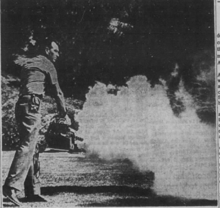 
```

<br>

## National Guard 

Following the Kent State Massacre, the Ohio National Guard, as well as others around the country began equipping their forces with thermal foggers, using the death of those students as justification for massive purchaing of "less lethal" options [@Bandy1970].

## Small Town USA 

No matter the size of the town, by the early 70s, police wanted in on that sweet sweet fogger action.
The Brigham City (Utah; 1970 pop. 14,007; @USCB1970) Police Department leveraged federal Omnibus Crime Act money to purchase a variety of weapons to use against protesters in 1971 [@BoxElderAgencies1971].

Police Chief Jay Christensen noted that the fogger provides a longer shelf-life than grenades and reportage noted that it 

> emits a continuous stream of smoke, chemical irritants, or **whatever solution** is fed into it. [emphasis added] 
>
> --- @Robinson1972

Use of federal funds to purchase chemical weapons, and specifically foggers, was not limited to one department.
Cities, counties, and states across the country used Omnibus Crime Bill money to up their chemical weapons caches, including foggers [@Conheim1972].
For example, Oakland County in Michigan (1970 pop. 907,871; @USCB1970) purchased two pepper foggers for their South County Tactical Mobile Unit with part of their $21,066 in 1970 [@Conheim1972].

Oneota New York (1970 pop. 16,030; @USCB1970) purchased a fogger in 1969 during the anti-war demonstrations, although the department bungled its response to protests [@Griffin1973].
As came to light during a public probe, Oneota Police Chief Joseph F. DeSalvatore requested a limited amount of training in the budget, and officers were therefore unable to deploy the fogger or other chemical weapons [@Griffin1973].

Gaston County North Caolina (1970 pop. 47,322; @USCB1970) Sheriffs purchased a fogger, which they turned on but not used to dispense agents multiple times by 1970 in their jail system "when there's been trouble brewing" [@Balloch1970].

<br>

(ref:imgTheGastoniaGazetteSun19701004) Gaston County Sheriff's Deputy Anne Huffsteller poses with a thermal fogger [@TheGastoniaGazetteSun1970_10_04].

```{r imgTheGastoniaGazetteSun19701004, alt="Black and white newspaper clipping. A single officer is behind a fogger and other objects. The officer is wearing a beat uniform and has curly light hair. the officer is only visible from the mid waist upwards, and the photo is very washed out so it is hard to distinguish items or details. ", out.width = out_width_500  , echo = FALSE, fig.cap = "(ref:imgTheGastoniaGazetteSun19701004)", fig.align = "center"} 
knitr::include_graphics("img/TheGastoniaGazetteSun1970_10_04.jpg") 
```

<br>

Apparently the threat of [death by chemical weapons fog](#BigMac) is sufficient to scare detained individuals into compliance.


Within a few years, however, departments began to realize they had no need for the machines, and began selling them with no use aside from testing [@DesMoinesTribune1975_05_06].
The Storm Lake Iowa (1970 pop. 8,591; @USCB1970) purchased a fogger in 1971 in advance of a motorcycle rally that never happened, and used free advertising in local media in attempts to pawn it [@DesMoinesTribune1975_05_06].
The article/ad mentions that officers have used foggers "on occasion" in Des Moines (Iowa's capital; 1970 pop. 201,404; @USCB1970) in addition to [one instance on the University of Iowa's campus](#IowaCity) [@DesMoinesTribune1975_05_06], although I have not located contemporaneous mentions.


## Crossing to Canada {#Canada}

Canadian law enforcement was also quick to jump on the fogger train and the media were just as happy to propagandize their use [@Patterson1976].
A convention of US and Canadian police chiefs held in Halifax, Nova Scotia in 1976 provided a glimpse into the state of affairs by mid-decade, at which point a supply chain had clearly been developed, although weapons salesmen refused to be named or have their statements linked to employers [@Patterson1976].

<br>

(ref:imgMacKenzie1976) Sergeant Al Oakley shows off a pepper fogger [@MacKenzie1976].

```{r imgMacKenzie1976,  alt="Black and white newspaper clipping from the middle panel of a trip-tych. A single officer stands in front of a brick building, wearing a riot helmet that's light with a police logo on it and the chinstrap is undone. The officer is wearing a flak jacket loosely and holding a GOEC-style pepper fogger aimed at the front right of the photo to where the opening of the barrel is just in frame. The darkness of the fogger body and the officer's pants and jacket make the bottom left of the photo a bit of a black mush. ", out.width=out_width_300  , echo = FALSE, fig.cap = "(ref:imgMacKenzie1976)", fig.align = "center"}
knitr::include_graphics("img/MacKenzie1976.jpg") 
```

<br>


<!--chapter:end:05-coming_soon.Rmd-->


# Scholastic Endeavors 

Perhaps instigated by the willingness of the California Highway Patrol to use chemical weapons (including thermal foggers) in [Berkeley on and around the University of California campus during the 1968 Convention protests](#BerkeleyCA1968_08_31), many law enforcement agencies escalated anti-war and racial just protests in University towns during the 1960s and 1970s via chemical weapons.

The willingness of police to fog literally any place where undergraduates standing up for racial justice and against imperialism were gathering was highlighted in May of 1970 when [Maryland State Police deployed chemical weapons via thermal fogger into the University of Maryland Chapel](#CollegeParkMD1970_05_04) [@Cabe1970].

Use of fogger-based chemical weapons against students, particularly students of color, was not limited to college campuses, but extended to high and middle schools.


## University Cities 

### Durham 

Durham North Carolina Police broke up the "Allen Building Demonstration" taking place February 13 1969 on the campus of Duke University in Durham using a variety of weapons, including a thermal fogger [@DMH1969; @Schreiberetal1971a; @Schreiberetal1971b].
The police reportedly chased protesters across campus with the fogger, including using it inside Duke Chapel [@Schreiberetal1971a; @Schreiberetal1971b].

<br>

(ref:imgdurham196902131) Deployment of a thermal fogger by police on Duke Campus [@DMH1969].

```{r imgdurham196902131, echo = FALSE, out.width = out_width_500, fig.cap = "(ref:imgdurham196902131)", fig.align = "center", fig.alt = "B/W Image: One person wearing gas mask and helmet, centered, stepping to the right. Person is holding slim white club in left hand and pepper-fogger in right hand. Fogger is pointing forward and a white cloud is surrounding the person to the front, back, and behind. The remaining background is black."}
knitr::include_graphics("img/durham_1969_02_13_1.jpg")
```
 
<br>

<br>

(ref:imgdurham196902132) Police with pepper fogger on Duke campus [@DMH1969].

```{r imgdurham196902132, echo = FALSE, out.width = out_width_500, fig.cap = "(ref:imgdurham196902132)", fig.align = "center", fig.alt = "B/W Image: Background has brick building with steps. In front of the building from center to right, a line of 5 police officers facing front and wearing helmets & gas masks holding slim white clubs about a yard long. They are standing with legs apart and clubs in both hands in front of their bodies. On the left 5 officers similarly dressed, facing towards one another. Four slim clubs are visible, and one officer is holding what appears to be a fogger in one arm hanging down at the side."}
   

```
 
<br>


### Berkeley 

#### February 21 1969 {#BerkeleyCA1969_02_21}

A year after [using the fogger on a protest held in solidarity with the Chicago Protest](#ChicagoIL1968_08_26), police in Berkeley again deployed a fogger to clear demonstrators including striking students from outside a University Regents and Sproul Hall plaza on the University of California campus. 

<br>

(ref:imgberkeley19690221a) Police use a pepper fogger and other chemical weapons to clear a University plaza [@APphoto1969a].

```{r imgberkeley19690221a, echo = FALSE, out.width = out_width_500, fig.cap = "(ref:imgberkeley19690221a)", fig.align = "center", fig.alt = "B/W newspaper clipping. Four people walking towards camera wearing helmets with face shields. Person on the left wearing white shirt and tie has several items hanging from belt. In right hand carrying radio with extended antenna. On right side person dressed in all black standing with a wide stance and holding pepper-fogger at hip height in right hand aimed forward. In center two more people dressed in all black, one with a short stick or club in left hand. Background is mostly cloudy with someone behind white shirt person, holding some sort of stick aloft.  Glimpses of additional bodies are visible in the cloudy background.    "}   
 
```
 
<br>

This deployment was covered in papers across the country including the Press-Telegram (Long Beach, California) [@PressTelegram1969_02_21], The Jackson Sun (Jackson, Tennessee) [@TheJacksonSun1969_02_21], The Daily Tribune (Wisconsin Rapids, Wisconsin) [@TheDailyTribune1969_02_21], The Sumter Daily Item (Sumter, South Carolina) [@TheSumterDailyItem1969_02_21], The New Mexican (Santa Fe, New Mexico) [@TheNewMexican1969_02_21], Janesville Daily Gazette (Janesville, Wisconsin) [@JanesvilleDailyGazette1969_02_22], and Messenger-Inquirer (Owensboro, Kentucky) [@MessengerInquirer1969_02_22].

<br>

(ref:imgberkeley19690221b) Police engulf a University plaza in chemical fog [@APphoto1969a].
 
```{r imgberkeley19690221b, echo = FALSE, out.width = out_width_500, fig.cap = "(ref:imgberkeley19690221b)", fig.align = "center", fig.alt = "B/W newspaper clipping. Rather difficult to make out the people differentially in the background, but there's a large group of folks standing in the back part of the photo, the mid ground is relatively empty but filling with a cloud of white smoke eminating from an area on the left that appears to be an officer holding a thermal fogger. Behind everyone is the student union. "}   
knitr::include_graphics("img/berkeley_1969_02_21b.jpg") 
```
 
<br>

Canadian newspapers detailed the fogger use as well, specifically the Red Deer Advocate Red Deer, Alberta, Canada) [@RedDeerAdvocate1969_02_21] and The Leader-Post (Regina, Saskatchewan) [@TheLeaderPost1969_02_21].

#### February 28 1969 

The following week, the police in Berkeley were joined by California National Guard troops to attack strikers, and continued to use the pepper fogger [@TheMiamiNews1969_03_01; @PressandSunBulletin1969_03_01]. 

<br>

(ref:imgberkeley196902281) National guardsmen and police fog UC Berkeley [@APphoto1969c].

```{r imgberkeley196902281, echo = FALSE, out.width = out_width_500, fig.cap = "(ref:imgberkeley196902281)", fig.align = "center",  fig.alt = "Guardsmen with bayonetted rifles and sheriff's deputies with tear and and pepper fogger walking through UC campus: B/W newspaper clipping:  Eight people in masks, shields, and tied boots walking from left to right, the one in front wearing a spray fogger strapped on back and holding the hose and nozzle in front. A cloud of fog is spraying from the nozzle. The second person is carrying a bayoneted rifle upright. The others are only partially visible as they are passing behind a tree. On the right ahead of the others an additional helmeted person can be seen turning towards the left. Two slim trees are in the foreground."}
 
```
 
<br>


<br>

(ref:imgberkeley196902282) View from behind of the police using a pepper fogger on striking students [@APphoto1969d].

```{r  imgberkeley196902282, echo = FALSE, out.width = out_width_500, fig.cap = "(ref:imgberkeley196902282)", fig.align = "center", fig.alt = "Four people walking away from camera, wearing helmets and holsters. Lead person has a fogger on their back and is holding the hose on the right spraying a fog ahead of them. Person on the right is carrying a bayoneted rifle raised above the left shoulder. The four are walking into the fog theyve produced. There are some small trees to the right."}
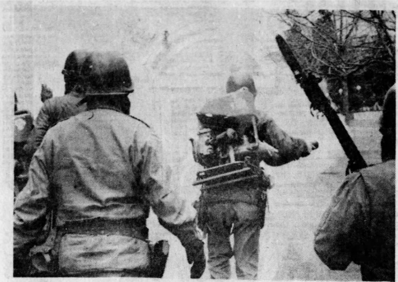 
```
 
<br>


#### May 15 1969 

Alameda County sheriffs deployed a pepper fogger on UC Berkeley's campus again during the "People's Park Riots" of 1969 [@LATimes1969; @Hayes1970].

The riot apparently started when the university tried to prevent individuals living on the street from a volunteer-run park they built on a lot owned by the school [@ThePressDemocrat1970_10_13].


The Sheriffs were joined by the California National Guard once again, who this time fogged neighborhoods from the back of a Jeep:

<br>

(ref:gasjeep) California National Guard's Gas Jeep [@gasjeep].

```{r  gasjeep, echo = FALSE, fig.cap = "(ref:gasjeep)", fig.align = "center", fig.alt = "B/W photo of An old style open-top army jeep with two National Guard troops in the front and one in the rear, the one in the rear is operating a thermal fogger. They are driving down what appears to be a residential street from right to left. There are houses and cars behind them and no one in sight on the street/sidewalk/etc."}
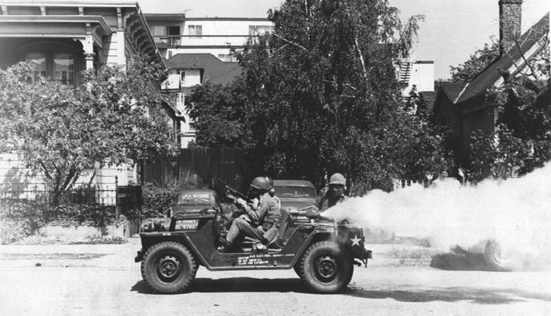 
```

### Seattle 

Seattle Washington police deployed CN and CS gas via a new pepper fogger in their clash with "hundreds of unruly youths in the University District" on August 14 1969 [@StatesmanJournal1969_08_17].
Witnesses recounted that the machine was "highly effective", filling "2-3 blocks of a street with tear gas in about a minute" [@StatesmanJournal1969_08_17].


### College Park {#CollegeParkMD1970_05_04}

On May 4th 1970, students gathered at campuses around the country to protest President Nixon's expansion of war into Cambodia, inlcuding in at the University of MAryland (UMD) campus in College Park [@WAS2013].
Police responded with chemical weapons that did not deter the protest, but rather moved it around the campus [@Cabe1970].
By later in the day, UMD students had heard about the Ohio National Guard shooting four Kent State students and took up a position in front on and inside the UMD Chapel [@WAS2013], which did not stop the chemical weapons barrage or the use of the fogger specifically [@Oates1970]


<br>

(ref:imgCabe1970) Police fog the University of Maryland [@Cabe1970].

```{r imgCabe1970, echo = FALSE, out.width = out_width_500, fig.cap = "(ref:imgCabe1970)", fig.align = "center", fig.alt = "Black and white photo of a college quad with brick facade white column buildingsbehind trees around the left, back, and part of right sides of the frame. Eight or so police officers walking away from the camera wear riot gear. A few in dark, a few in light. One in light near the front is carrying a fogger with a shoulder strap and spraying a big cloud off to the left, obscuring a large portion of the photograph."}
knitr::include_graphics("img/Cabe1970.jpg") 
```
 
<br>

<br>

(ref:imgOates1970) Police fog the University of Maryland Chapel [@Cabe1970].

```{r imgOates1970, echo = FALSE, out.width = out_width_500, fig.cap = "(ref:imgOates1970)", fig.align = "center", fig.alt = "Black and white photo of a college A whole bunch of police officers stand on or in front of a short (3 ft) brick wall surrounding the open field. A road, grass, and sidewalk are on this side of the wall, and a tree is just over it on that side. The open field behind the wall is filled with fog from one or perhaps two individuals fogging the chapel, which is where a large crowd gathers on the steps in the background. The chapel has a brick facade and white columns and a very large spire clock tower. The student protesters are visible on the steps of the chapel holding sigms."}   
knitr::include_graphics("img/Oates1970.jpg") 
```
 
<br>

The Maryland State Police liked the [GOEC](#GOEC) fogger so much they included it in their Manual on Civil Disturbances as a tool for deploying [CS gas](https://en.wikipedia.org/wiki/CS_gas) [@MSP]:


<br>

(ref:imgMSP) Maryland State Police's [GOEC](#GOEC) pepper fogger [@MSP].

```{r imgMSP, echo = FALSE, out.width = out_width_500, fig.cap = "(ref:imgMSP)", fig.align = "center", fig.alt = "Black and white photo of a GOEC Pepper Fog fogger on a white ground with a maryland state police badge and in front of a brick wall. The fogger is in the mid right and points off to the left."}
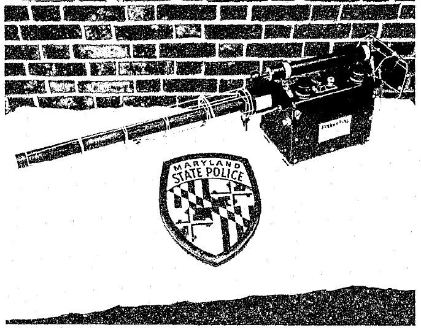 
```
 
<br>

### Iowa City {#IowaCity}

Johnson County sheriffs - including two deputies carrying pepper foggers - used chemical weapons against protesters in Iowa City, Iowa IA on May 6 1971  [@Eckholt1971].

The chemicals deployed smelled like insecticides and were described in print as "unidentified" because the Sheriff refused to publicly name the compounds, including to the news media [@Eckholt1971].


### Minneapolis {#Minneapolis1972_05_10}

Thousands of anti-war protesters gathered in cities around the US on May 10 1972 to demonstrate against the use of mines in Vietnam harbors [@ArgusLeader1972_05_11a].
In Minneapolis, crowds totalling a thousand protestered gathered on and near the University of Minnesota campus and police responded with chemical weapons deployed via grenades, sprays, a helicopter and a thermal fogger [@ArgusLeader1972_05_11b; @StarTribune1972_05_11].

The fogger was used to direct the crowd around campus and spread gas over large areas, such as the area known as Scholars Walk (~0.25 mile from Washington Avenue to the Auditorium) [@StarTribune1972_05_11].


### Gainesville  

Similarly to the anti-mine protests in [Minneapolis](#Minneapolis1972_05_10), on the campus of the University of Florida in Gainesville, Florida Highway Patrol deployed a riot vehicle dubbed "The Monster" which "spewed tear gas" [@ArgusLeader1972_05_11b].
Although a fogger is not mentioned specifically, this is the same agency (Florida Highway Patrol) that first [deployed thermal foggers via a truck](Liberty City #MiamiFL1968_08_08) in 1968 [@Tschenschlok1995; @Lorentzen2018]. 


## High Schools 

As soon as they laid their hands on foggers, law enforcement extended their use from [universities]{#Universities} to high schools, specifically using the weapons against Black youth protesters.

I will stop to repeat that again so that we (myself included) can all reflect on this.

Law enforcement agents used chemical weapons against Black junior and high school students during the Civil Rights Era, including a weapon (the thermal fogger) developed not even five years prior to [gas Vietnamese soldiers and civilians from tunnels](#Vietnam).

### San Gordonio {#SanGordonio}

Although undated, this photograph printed in The Delta Democrat-Times (Greenville, Mississippi Thursday) [@TheDeltaDemocratTimes1969_11_20] on November 20, 1969 references a "recent" use of the fogger on students. 


(ref:imgsanbernardino1969xxxx) Police use a pepper fogger on students at San Gordonio High School [@UPIphoto1969].

```{r imgsanbernardino1969xxxx, echo = FALSE, out.width = out_width_500, fig.cap = "(ref:imgsanbernardino1969xxxx)", fig.align = "center", fig.alt = "B/W faded image: To the left is a person wearing a uniform with a patch on the shoulder and a helmet. In their right hand is the nozzle to a fogger and it appears to be emitting fog. There is a white fog cloud covering most of the rest of the image."}  
knitr::include_graphics("img/san_bernardino_1969_xx_xx.jpg") 
```
 
<br>

Use of the thermal fogger by police that day seems likely, given their more documented deployment of it on December 3, 1971.
On that day, a combination of San Bernardino police, San Bernardino County sheriffs, and California Highway Patrol used tear gas from a pepper fogger to break up a "major racial confrontation" among students at San Gorgonio High School and across a 20-block area surrounding campus [@Yetzeretal1971].


### Lawrence {#Lawrence1970_04_21}

Lawrence, Kansas Police used tear gas, including from a thermal fogger, on April 21st, 1970 against Black high school and junior high students, their parents, and community members [@Monhollon2002].
The students had gathered that day after a week-long stand-off with administration in response to their failures to meet their demands regarding Black representation in curriculum, hiring, sports, and awards [@Monhollon2002].

Black students had occuppied the principal's office on May 13th and prominent members of the office occupation were arrested from the school that day and promptly suspended from school [@Monhollon2002].
Racial tensions escalated over the subsequent week flamed by presence and actions of the local Klu Klux Klan and Minutemen, some of whom were also police officers [@Monhollon2002].
The night of April 20th, the school board held a meeting where they barred suspended students from participating and did not reinstate them, nor did they address the demands, and there was a mass walkout [@Monhollon2002].

The next day, police were ready with heavy chemical weaponry, including the [GOEC Pepper Fog](#GOEC) fogger: 

<br>

(ref:imglawrence19700421) Police bring a [GOEC](#GOEC) pepper fogger to gas Black high school and junior high students at Lawrence High School [@UKA1970].

```{r imglawrence19700421, echo = FALSE, out.width = out_width_500, fig.cap = "(ref:imglawrence19700421)", fig.align = "center", fig.alt = "yellowed B/W faded image of police officers standing on a T of a sidewalk blocking the space from a group of predominately Black young people, who are standing behind them on the grass and facing the camera. Behind them are some cars and houses across a stree. The officer in the front left of the frame is carrying a Pepper Fog GOEC fogger."}
knitr::include_graphics("img/lawrence_1970_04_21.jpg") 
```
 
<br>

<!--chapter:end:06-scholastic_endeavors.Rmd-->


# Broadening Application 

The use of foggers, while not commonly overt, spread throughout the 1970s and 1980s, occasionally making an appearance in news media reports.

## Racial Justice 

Police are generally more apt to use heavy responses including chemical weapons against Black protesters in general [@DSPDX2020].
It is therefore not surprising to learn that law enforcement use foggers to deploy chemical weapons on racial justice protests.
Indeed, the first use of the fogger in the United States was during the [Liberty City Riots](#MiamiFL1968_08_08), a police action in response to Black community organizations holding conversation among themselves.

### Danville, Illinois 

Foggers have been used in a variety of cities, not just major metropolitan areas. 

Danville, Illinois (1970 pop. 42,570; [@USCB1970]) Police used a pepper fogger to disperse a crowd of Black protesters that had used picnic tables to barricade a street through their neighborhood on a second night of demonstrations [@Palladium-Item1969], August 10th 1969.

### Rodney King 

Although mentioned in a few outlets during the 1992 police response to the protests in response to the verdict in the Rodney King case, I have yet to find documentation of foggers being used explicitly during that time [@Askren1992].
For example, Riley County (Kansas; 1970 pop. 56,788; @USCB1970) Sheriffs had a fogger in their arsenal in 1992 according to Director Alvan Johnson [@Askren1992].


## Labor 

Another common target of police force are labor activists, and so it is not suprising to see the fogger being deployed against strikers at least once in US history.

### North Kingstown, Rhode Island

On March 22 1982, the Brown and Sharpe company called in local police and Rhode Island State Police officers to help try to break a (at the time) 22-long strike at their factory in North Kingstown, Rhode Island [@TheLexingtonHerald1982_03_23; @Carbone2017]. 
A North Kingstown officer named TJ Varone deployed tear gas via a pepper fogger on a group of 75 people, primarily workers' wives and Brown University students, that was blocking the main entrance to the tool factory  [@TheLexingtonHerald1982_03_23; @Carbone2017].
The picketers braved the gas for a considerable amount of time, requiring close-range fogging to finally disperse them [@Carbone2017].

(ref:imgnorthKingstown1982322) Police fog striking workers and their families [@APphoto1982].

```{r imgnorthKingstown1982322, echo = FALSE, out.width = out_width_500, fig.cap = "(ref:imgnorthKingstown1982322)", fig.align = "center", fig.alt = "B/W newspaper clipping: To the left there are several people crouched on the ground with their heads down and covered. Behind them is a small crowd of people turning and moving away. To the right are three officials in helmets and masks facing the people on the ground and holding a fogger in front that is spraying a cloud of fog right over those on the ground."}   
knitr::include_graphics("img/north_Kingstown_1982_3_22.png") 
```
 
<br>

The fogging did not, however, break the strike [@Carbone2017].

Newspaper and television coverage of the fogging circled the globe [@Carbone2017].


## Celebrations 

On occasion, police forces have used foggers against protests or riots that are more of a celebratory nature but still do not respond to their commands to disperse.


### 1974 NHRA Nationals 

Indiana State Police used a pepper fogger and gas grenades on a crowd of 2,000 drag racing fans blocking a highway between the track and campsites at the Hot Rod Association's US Nationals in Clermont IN, September 1 1974 [@Courier1974_09_02; @TheBillingsGazette1982_01_10].


### 1975 New Years Eve 

New Year's Eve 1975 was apparently quite raucous in Florida, as many cities experienced revelry that got out-of-hand enough to elicit police use of force [@TheTampaTribune1976_01_02].
In Ft. Lauderdale, party-goers pulled down a traffic light and police deployed multiple foggers on a crowd of 2,500 on the beach [@TheTampaTribune1976_01_02].

<br>

(ref:imgftlauderdale19751231) Police carrying pepper foggers towards the beach [@UPIphoto1975].

```{r imgftlauderdale19751231, echo = FALSE, out.width = out_width_500, fig.cap = "(ref:imgftlauderdale19751231)", fig.align = "center", fig.alt = "B/W image: Two people in foreground wearing helmets and face shields with gas masks and uniforms with short sleeves walking towards the camera, carrying boxy looking tools with nozzles pointing forward, with both hands. Person behind, also in short sleeve uniform, helmet, and gas mask carrying slim sabre or rod across the body. Behind these people seem to be more people but there are no clear details."}
knitr::include_graphics("img/ft_lauderdale_1975_12_31.png") 
```

<br>


The mayhem was noteworthy enough to garner publication in the Berkeley Gazette [@BerkeleyGazette1976_01_02] as well as the Tampa Tribune [@TheTampaTribune1976_01_02].


## Training Accidents 

While not an intentional deployment, in at least one documented incident, a pepper fogger used in firefighter training exercises caused severe symptoms and led to an investigation [@Judd1981].

### Bullitt Volunteer Fire Department 

On December 15 1981, The Southeast Bullitt Volunteer Fire Department In Kentucky was conducting a smoke training exercise using a pepper fogger on loan from the fire marshal's office when their "victim" and 16 others (including firefighters) began experiencing coughing fits, headaches, and chest pains [@Judd1981].

Although Smith and Wesson (the Pepper Fogger manufacturer at the time) claimed this was a one-off incident, the Kentucky State Fire Marshal's office had received other reports of firefighters becoming sick when using foggers in smoke training [@Judd1981]. 
Residue tests later revealed no unexpected compounds [@TheCourierJournal1982_01_10], indicating the toxicity had come from the design-for-use "safe" smoke.

<!--chapter:end:07-broaden.Rmd-->

# The Carceral System {#CarceralSystem}

Like many chemical weapons devices, thermal foggers are used in local, state, and federal carceral systems. 
Unfortunately most deployments go undocumented or such documents never see the light of day. 
It seems that the only time we find out about prisoners being fogged is when a serious incident occurs triggering outside investigations and the judicial system.


## Big Mac {#BigMac}

In the 1970s, the McAlester ("Big Mac") Oklahoma State Penitentiary was the site of considerable resistance and rioting by inmates [@TheRag1975; @WinterSoldier1975].
A major tool used by the guards in retaliation was tear gas, which they deployed via shot shells, grenades, and pepper foggers [@Allen1974a; @Allen1975a; @Allen1975b; @Coffey1975b].
Given its use here, it is highly likely that the Oklahoma State Penitentiary system used pepper foggers before (and likely after) [@Johnson1974].

The guards regularly isolated the uprising's leaders in the solitary confinement building known as "The Rock", sealed the building, and gassed it so thick it lasted for days [@Allen1974b; @TheRag1975].
During the May 20 1974 gassings in response to riots, Black prisoner Robert Forsythe, a 33-year old serving time for a robbery, happened to be in solitary confinement due to being caught with contraband money and was not associated with the uprising directly, and so inexperienced with the effects of gas [@Johnson1974; @TheRag1975; @Wilson1993].
Although reports are conflicting on details, guards started fogging and gassing prisoners who were, at most, rattling their doors [@Hobbs1974].
The likely reason for the barrage was retaliatory, as it was "unjustified" according to a veteran guard [@Coffey1975a].

During the gassings, a pepper fogger was specifically used in the building and created "fumes of gas [that] were awfully heavy, one of the worst I've ever seen" according to veteran corrections officers' trial testimony [@Allen1975b; @Coffey1975a].
The gassing lasted for four hours despite yells for help, resulting in serious injuries including burned and blistered skin, eyes swollen shut, and breathing difficulties [@Coffey1975b]. 
That intense fogging and lack of medical attention over the next two days were main factors contributing to Forsythe's injuries and death two days later, according to medical experts' testimony [@Allen1974b; @Allen1975a; @Allen1975b].

Although the guards involved were indicted by a grand jury and brought to trial, they ultimately were acquitted of all charges [@UPI1975a; @UPI1975b].


## Union Correctional 

According to the superintendent, a riot was caused in the Florida State Prison's Union Correctional Institution in Raiford on July 5th, 1981 by 22 prisoners who were intoxicated, and the only way to subdue them was to deploy a thermal fogger [@TallahasseeDemocrat1981_07_07].
As a result of two officers being "slightly injured" and three inmates being stabbed, an investigation was launched that caused the event to be picked up in the newspapers [@TallahasseeDemocrat1981_07_07].


## Dade County 
 
Dade County Sheriffs used foggers to sweep a field on July 17th 1974 in search of a murder suspect that had eluded K-9 units, helicopters, a plane, and an attempt to flush him out by burning the field [@TampaBayTimes1974_07_18]. 
The suspect was so well dug in that he could withstand significant gassing that surprised a Sheriff's sergeant who participated in the operation [@TampaBayTimes1974_07_18].


<!--chapter:end:08-the_carceral_system.Rmd-->


# Border Patrol: A Second Boomeranging {#CBP}

United States Border Patrol (BP) has played an outsized role in policing and corrections within the federal immigration system and abroad both in support of armed services and independently [@Miller2019].
Indeed, BP has provided another boomeranging of the Imperial Tetherball that bridges the Vietnam-era and present-day domestic applications via export to foreign governments for use in controling their own populaces.

## International Trafficking 

Within a year and a half of the fogger's arrival to US domestic police agencies, BP agents were engaging foreign governments independent of the military on chemical weapons deployment including using thermal foggers.
During April 25 - May 9 of 1970, Raymond Dee Bond, a Border Patrol agent with decades of experience, sold $15,000 worth of chemical weaponry to the Mexican federal government [@ValleyMorningStar1973_08_04].
Included in the cache were multiple pepper foggers and formulations [@ValleyMorningStar1973_08_04].
Bond was caught and charges with weapons trafficking and acting as a foreign agent without notifying the Secretary of State [@DailyNews1972_10_27].
Although indicted by a federal grand jury, Bond was able to escape prosecution by resigning from his position  [@ValleyMorningStar1973_08_04].

Given the extensive reach of Border Patrol into Central and South America fueled in particular by the 'Drug War' [@Chepesiuk1999], it is reasonable to expect that this was not an isolated event.

## BORTAC 

By 2020, the Border Patrol Tactical Unit (BORTAC) had been established to, among other tasks, provide particularly extreme responses to domestic as well as foreign uprisings [@CBP2006; @CBP2014; @CBP2018].
BORTAC is truly a global domestic law enforcement agency, operating in 28 countries (they were willing to publicly disclose as of 2006; @CBP2006), providing a wide range of services [@CBP2014; @Miller2019].
BORTAC's specific genesis was focused on riots in federal immigration detention centers [@CBP2006; @CBP2014], noteworthy given the use of thermal foggers in the United States [carceral system](#CarceralSystem).

Border Patrol agents from the El Paso unit specifically were deployed to police protests in El Paso in addition to being sent to Portland and other cities like Albuquerque, New Mexico [@Borunda2020].


### Portland OR {#PortlandOR2020_2021}

The thermal fogger made a very visible return to the public sphere in July of 2020, when US Customs and Border Protection (CBP) officers brought a bright-green version to Portland, OR during the [2020 Black Lives Matter protests](#PortlandOR2020_07_29) [@pb20202021].
Since then, the fogger has been deployed [three additional times by CBP in Portland](#PortlandORICE2020_2021), all at the property Immigration and Customs Enforcement (ICE) rents on the South Waterfront.


#### July 29 2020 {#PortlandOR2020_07_29}

At the beginning of July 2020, then-president Trump deployed Department of Homeland Security (DHS) agents to "protect" federal property in Portland, OR [@DHS2020; @Flanigan2020; @Trump2020].
During the final days of the visible presence and response of federal agents in Summer 2020, Customs and Border Protection (CBP) unveiled their thermal fogger [@Recompiler2020_07_29], which has been identified through photos as an [IGEBA TF35](https://www.nixalite.com/product/igeba-tf-35) thermal fogger from Nixalite of America Inc.
This machine is designed and marketed for bird control, and while "_training tool for military/law enforcement_" is listed among its uses [@Nixalite2009a], its safety requirements explicitly state: 

> "_**19. Do not fog directly against persons...During operation keep distance of minimum [10 ft].**_"  - [@Nixalite2009b]

<br>

(ref:imgportland202007292) CBP agent deploying chemical agent via thermal fogger in front of the federal courthouse [@Brown2020].

```{r imgportland202007292, echo=FALSE, out.width = out_width_500, fig.cap="(ref:imgportland202007292)", fig.align = "center", fig.alt = "Fully riot-geared and for some reason in green camo US Homeland Security agents (to the middle and the left of the photo) behind a row of two-foot tall, one-foot radius metal posts, behind a metal grate wall over 7 feet tall with metal support beams and concrete pylon buttressing. In the front of the left side is an agent holding a plastic clear riot shield, through which you can see a patch that say 'Border Patrol Federal Agent' in yellow and some insignia patches as well. In the middle are the agents in camo, one with a hand on the shoulder of another who is operating a thermal fogger machine shooting gas through the fence. The machine is maybe four or five feet long and has a body not unlike a bush whacker with a two-cycle engine, but fueling a vaporizer instead of a rotor. The agent is holding the machine with their right hand visibly and there is a black strap across their shoulder holding it up. The machine is mostly shiny metal, although the tip is showing signs of corrosion (no surprise based on the compounds and heat) and the supports of the body are a bright green."}
knitr::include_graphics("img/portland_2020_07_29.jpg") 
```

<br>


#### Abolish ICE: Immigration and Customs Enforcement Rental Property {#PortlandORICE2020_2021}

While the thermal fogger hasn't been deployed at the federal Courthouse in downtown Portland since July 29 2020, it has been used repeatedly by Department of Homeland Security agents at the private property US Immigration and Customs Enforcement (ICE) rents to use as a holding center for deportees in the South Waterfront neighborhood [@Simonis2021] -- the same building that saw the weeks-long Occupy ICE protests in 2018 [@Dubois2018]. 

The first of such deployments occurred during the fall of 2020.

Along with cities across the country, Portland hosted many events on October 17th focused around the racial and gender justice [@Recompiler2020_10_17].
In the evening, there was a gathering at Willamette Park in the Southwest part of the city, where organizers passed out balloons detailing harrowing experiences of migrants and immigrants detained by ICE [@Recompiler2020_10_17].
After marching to the ICE rental property, individuals tied the balloons to the gate to the parking garage, and Department of Homeland Security (DHS) agents including Customs and Border Protection (CBP) officers deployed massive amounts of chemical weapons, including via a thermal fogger, throughout the neighborhood [@Recompiler2020_10_17].

<br>

(ref:imgportland20201017) CBP agent fogging a South Waterfront neighborhood [@Lake2020].

```{r imgportland20201017, echo = FALSE, out.width = out_width_500, fig.cap = "(ref:imgportland20201017)", fig.align = "center", fig.alt = "One person in green protective gear, wearing a bulletproof vest with weapons strapped to the body and wearing a helmet and gas mask is walking to the left carrying a fogger in the right hand arm extended down, nozzle pointing forward. A cloud of gas is coming from the nozzle. Next to them is someone dressed all in black with a bullet proof vest with the word POLICE across the back, also wearing a helmet and gas mask. It is night and there are additional clouds of gas and the shapes of people in the background."}
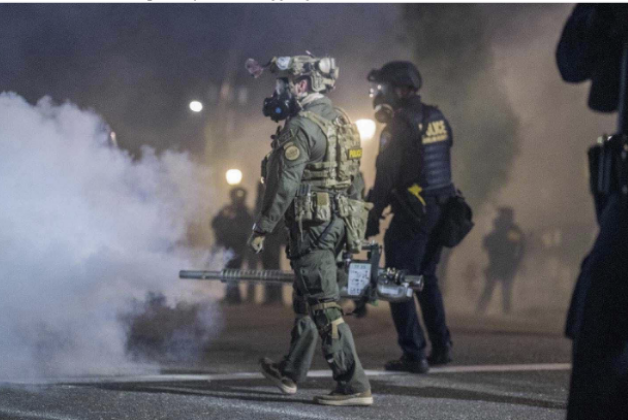 
```
 
<br>

#### Inauguration 2021 {#J20}

The same fogger (or at least the same model) was again brought out at the ICE rental property on January 20th 2021 during the Inauguration Day ("J20") Abolish ICE protests in response to an individual spray painting a piece of plywood tacked outside the building [@Recompiler2021_01_20]. 
The fogged up and down multiple blocks, with visible plumes entering units in the adjacent apartment complexes and covering the playground of an adjacent public school [@Recompiler2021_01_20; @Simonis2021].

<br>

(ref:imgportland20210120) CBP officer holding thermal fogger [@Staab2021].

```{r imgportland20210120, echo = FALSE, out.width = out_width_500, fig.cap = "(ref:imgportland20210120)", fig.align = "center", fig.alt = "Night in a city, building lights in the background. One person standing alone in the center of a road, shown from the waist to the ankles. The person is wearing work pants with covered pockets at the thighs and calves, long sleeve shirt, and a glove on the right hand. In the left hand they are gripping the handle of a neon green fogger tool. The long black nozzle, covered with a wire cage, projects backwards and the motor is towards the front. It is being held at hip height; the arm holding it is relaxed down."} 
knitr::include_graphics("img/portland_2021_01_20.png") 
```
 
<br>

That weekend, CBP deployed the fogger again during Abolish ICE protests, this time gassing even more of the neighborhood, including the local public school and veterans-preference housing [@Recompiler2021_01_23; @Simonis2021].


<br>

(ref:imgportland202101231) CBP agent holding thermal fogger [@Lewis-Rolland2021a].

```{r imgportland202101231, echo = FALSE, out.width = out_width_500, fig.cap = "(ref:imgportland202101231)", fig.align = "center", fig.alt = "Night time with the light from a street light visible in the background. Two officers dressed in full protective gear with bulletproof vests holding supplies on, with the word POLICE stenciled in yellow. They are both wearing helmets and gas masks. The nearer one is holding a gas fogger in the right hand. Thefogger looks like a long tube between 3 and 4 feet long with a handle and motor parts near the back. The tube is covered with a wire cage until about the last half foot, which is a plain and narrower tube. Behind these two officers are some dimly lit buildings and one or two other officers but they are not clear."}
knitr::include_graphics("img/portland_2021_01_23_1.png") 
```

<br>


<br>

(ref:imgportland202101232) CBP agent fogging an intersection in the South Waterfront neighborhood [@Lewis-Rolland2021b].

```{r imgportland202101232, echo = FALSE, out.width = out_width_500, fig.cap = "(ref:imgportland202101232)", fig.align = "center", fig.alt = "Nine people wearing full protective gear including helmets and gas masks standing spread out across a street at night. One is holding a gas fogger in one hand and gas is spewing and a cloud is forming in front of them. There is also some gas cloud behind the group. All of them seem to be wearing weapons on their gear but details are not clear. It is night. There is a grey building in the background with a red door and red trim. A white stripe on the roadway has the words MELT ICE spray painted on it."}   
knitr::include_graphics("img/portland_2021_01_23_2.png") 
```
  
<br>


<!--chapter:end:09-cbp.Rmd-->

# Conclusion {#Conclusion}

Although the use of a thermal fogger by US CBP to deploy chemical weapons on racial justice protesters in Portland in 2020 and 2021 appeared novel to many, the truth is that it is just the most recent chapter in a cylical narrative stretching back half a century and spanning the globe.

Spawned from the US military occupation of Vietnam, the thermal fogger has always been a tool for suppressing resistance among the populace.
Its initial transition to the American homefront was rapid and smooth, with retired military law enforcement eager to deploy them against civil rights and anti-war protesters.

As the fogger grew less popular with police and faded from public view in the past few decades, its use was maintained in the carceral system 
Simultaneously, foggers were peddled by US CBP Agents overseas -- a second deployment.
Agents from the same units within CBP then brought the fogger back home again, for a second return.

Throughout all of this, the fogger was used to maim and even kill individuals while targeting the marginalized, many of whom have stories that have not been heard publicly.
I hope that through this work, I can call attention to the shared history across generations, spark conversations, and facilitate story telling to illuminate the impacts of the thermal fogger on human people beings.

Building on the concept of an Imperial Boomerang, I propose that the trajectory of the thermal fogger can be thought of as an Imperial Tetherball, with multiple departures and returns.
Key questions from my perspective are then: 

- what perpetuates the momentum of the fogger, facilitating it to swing around more than once?
- what routes exist for subsequent rotations where the fogger could be deployed overseas and then brought home again?

Clearly, this topic deserves more theoretical evaluation, as well.

While the thermal fogger is still presently _in play_ in Portland, countless other departments around the world have these machines of war sitting in their arsenals, primed and ready.

And we still don't even know what comes out of the exhaust nozzle.

<!--chapter:end:10-conclusion.Rmd-->

\cleardoublepage 

# (APPENDIX) Appendices {-}


# Figure Descriptions {#AltTexts}

Alt-text descriptions for figures in the book:


```{r retrieve-chunk-opt, include = FALSE}
chunks_with_alt <- knitr::all_labels(nzchar(fig.alt))
chunks_content <- knitr::knit_code$get(chunks_with_alt)
chunks_opts <- lapply(chunks_content, function(x) attr(x, "chunk_opts"))
if(any(names(chunks_opts) == "cover")){
  chunks_opts[["cover"]] <- NULL
}
```


```{r write-appendix, results = 'asis', echo = FALSE}

l <- lapply(seq_along(chunks_opts), function(opt_ind) {

  opt <- chunks_opts[[opt_ind]]
  knitr::knit_expand(text = "* Figure \\@ref(fig:{{label}}): {{alt_text}}", 
            alt_text = opt$fig.alt,
            label = opt$label)

})

cat(unlist(l), sep = "\n\n")
```

<!--chapter:end:90-appendices.Rmd-->

# References {- #References}


<!--chapter:end:99-references.Rmd-->

