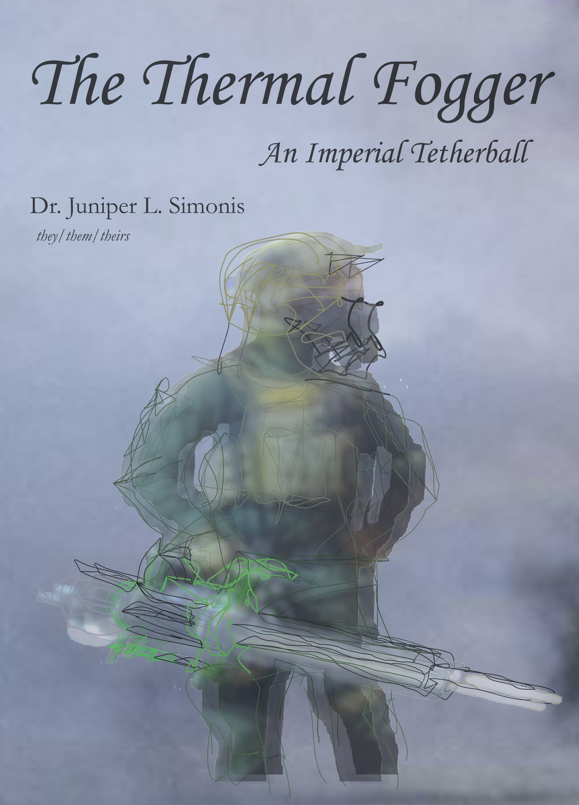

--- 
title: "The Thermal Fogger"
subtitle: "An Imperial Tetherball"
author: "Dr. Juniper L. Simonis (they/them/theirs)"
date: "`r Sys.Date()`"
description: "The history of use of thermal fogging in chemical warfare."
github-repo: "chemicalweaponsresearch/thermal_fogger"
cover-image: "img/cover.png"
url: "chemicalweaponsresearch.com/thermal_fogger"
colorlinks: yes
graphics: yes
bibliography: [packages.bib, references.bib]
biblio-style: apalike
link-citations: yes
knit: bookdown::render_book
site: bookdown::bookdown_site
---

```{r index-1, echo=FALSE}
is_on_ghactions = identical(Sys.getenv("GITHUB_ACTIONS"), "true")
is_online = curl::has_internet()
is_html = knitr::is_html_output()
```


(ref:imgcover) Deployment of a thermal fogger by police in Berkeley CA, 8/31/1968 [@UPIphoto1968]

```{r imgcover, out.width = 500, fig.cap="(ref:imgcover)", fig.alt = "Black and white newspaper clipping. To left is an officer wearing long pants, long sleeved shirt, and a helmet walking forward carrying a fogger in the right hand. The fogger is blowing fog through a tube and a cloud is forming. Background is a storefront window and door. To the right 2 people are moving away from the fog, leaning on one another, and covering their faces with their hands.", echo = FALSE, fig.align = "center"}
    

```  

[An archived version of this book is available on Zenodo](https://doi.org/10.5281/zenodo.4668002).


```{r include=FALSE}

  # automatically create a bib database for R packages

  knitr::write_bib(c(.packages(), 'bookdown', 'knitr', 'rmarkdown'), 'packages.bib')

```