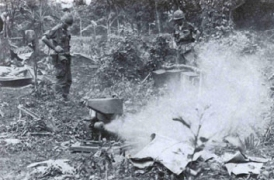
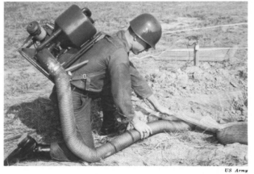
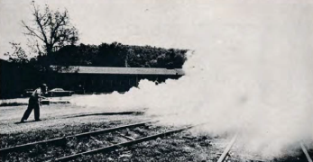
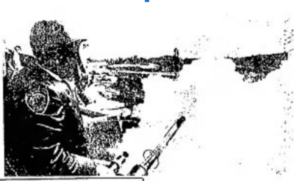

*Deployment of a thermal fogger by police in Berkeley CA, 8/31/1968; UPI Telephoto*

[v0.2.0](https://doi.org/10.5281/zenodo.4668002)

\pagebreak

# Foreward

## Land Acknowledgment

This work's impetus comes from present-day Portland, Oregon, United States of America -- the Indigenous land of the Chinook people, who were colonized and spread across multiple federally recognized tribes in Oregon, Washington and Idaho including Cowlitz, Siletz, Wasco, and Yakima.
The events catalouged in this booklet occur at many locations across the present-day USA and internationally, and thus specific land acknowledgements are included with content.

## Content Warning

This booklet deals with police and corrections violence in frank terminology.
Pictures of chemical weapons being deployed on individuals, including those passively resisting, are included.
Casualties and fatalities are discussed.

## Inherent Bias

This booklet timeline has been produced by collating historical documentation and records, which are inherently biased, as will be planly evident in the documents.
As such, it is important to recognize that there are likely records that have not yet been found by the researchers or which have been lost to time, and even more substantially it is critical to be clear about the fact that many uses of thermal foggers have likely never been recorded, as too will be made clear through the documents that have been recovered.

## Author Position

I, Dr. Juniper L. Simonis (_they/them/theirs_), am a 36-year-old middle-class, white, non-binary, queer, physically and psychologically disabled person. 
I come to the study of the history of chemical weapons use in America via my personal experience being the recipient of law enforcement's chemical weapons and my ensuing scientific research into its impacts on the environment.
I have a PhD in Ecology and Evolutionary Biology from Cornell, where I studied aquatic ecology and biogeochemistry -- disciplines I have put to use to studying the impact of chemical weapons.
Through my ecological research, I have uncovered historical and current information into the impacts of chemical weapons that I was not seeing being represented in the present day broad cultural discourse.
From this need to share historical information came this booklet, a concise way for me to pass along a window into the racist, classist, capitalistic, and colonialistic throughline of the thermal fogger.
I am an abolitionist in multiple senses: I believe that the use of chemical weapons, police, and the carceral system should all be abolished, full-stop.

## Financial Statement

All work for this product was conducted by Dr. Juniper L. Simonis via internal time at DAPPER Stats.
No external funding was provided.

## Acknowledgements

My deepest heartfelt condolences to the family of Robert Forsythe.
I cannot even begin to imagine the impact Bobby's murder and the subsequent trial and media presence had on you and your community.
I hope that by shining a light on his story now, more people will come to understand just how horrendous the prison system is and fight for its abolition.

This booklet is based on a variety of sources (cited within) past and present, and to the journalists and photographers: thank you for sharing your work with the world. 

I have no idea how many people have been involved in digitizing historical newspapers, as their names are never on anything, but y'all are fantastic and I appreciate you so much.

Sandra Simonis provided significant help with writing alt-text for images.

## Contribute Information 

If you are aware of incidents where a pepper fogger was used to deploy chemical weapons that we have not included, please [reach out](mailto:chemicalweaponsresearch@protonmail.com)!

\pagebreak

# Introduction

On July 29th, 2020 federal agents of the Department of Homeland Security deployed unknown chemical agents via a thermal fogger on racial justice protesters outside the Hatfield Federal Courthouse in Portland, Oregon.  

!["Fully riot-geared and for some reason in green camo US Homeland Security agents (to the middle and the left of the photo) behind a row of two-foot tall, one-foot radius metal posts, behind a metal grate wall over 7 feet tall with metal support beams and concrete pylon buttressing. In the front of the left side is an agent holding a plastic clear riot shield, through which you can see a patch that say 'Border Patrol Federal Agent' in yellow and some insignia patches as well. In the middle are the agents in camo, one with a hand on the shoulder of another who is operating a thermal fogger machine shooting gas through the fence. The machine is maybe four or five feet long and has a body not unlike a bush whacker with a two-cycle engine, but fueling a vaporizer instead of a rotor. The agent is holding the machine with their right hand visibly and there is a black strap across their shoulder holding it up. The machine is mostly shiny metal, although the tip is showing signs of corrosion (no surprise based on the compounds and heat) and the supports of the body are a bright green. source: https://twitter.com/dougbrown8/status/1288727075197657088/photo/1"](images/portland_2020_07_29.jpg)  
*US DHS agent deploying chemical agent via thermal fogger, Portland OR, 7/29/2020; D. Brown*  

In awakening a dormant [Foucault’s Boomerang](https://www.opendemocracy.net/en/opensecurity/foucaults-boomerang-new-military-urbanism/) (Graham 2013), DHS instantly made a large swath of the populace aware of an insidious weapon that was birthed in the American occupation of Vietnam and perfected for use against domestic protesters in the 1960s and '70s. 

Despite repeated use of thermal foggers to deploy chemical weapons over the last half century, the device appears to have slipped from the zeitgeist, only to reemerge in the city which experienced the most visible novel federal deployment of chemical weapons, the most chemical weapons-based incidents of police brutality at racial justice protests across American cities (regardless of population size), and an notable density of photographers and videographers (both professional and amateur). 

Not all of the weapon's history is documented, but enough is that we can dispel the myth that this deployment was _new_ in any notable sense other than being recent.

Indeed, through this work, I (Dr. Juniper L. Simonis) have discovered an extensive history of its deployment and can say that I feel a deep connection to my protest elders who experienced thermal foggers decades ago, and I hope that my work will bring light to their stories.
We are but the most recent chapter in a long history of United States Law Enforcement using chemical weapons against its own populace.

\pagebreak

# Vietnam

The modern day thermal fogger was born from the American colonization of Vietnam in the mid-to-late-20th Century. 

## Context 

Early on in the deployment of US troops to occupy Vietnam, the need for large scale mosquito control became so great that soldiers began improvising insecticide foggers by mounting pesticide sprayers to diesel truck exhaust (Spicknall 1969). 
The hack turned out to be much more effective, covering nine square miles per day, compared to 50,000 square feet (0.002 square miles) per day using a conventional manually operated fogger (Spicknall 1969).

As the occupation continued, US Army Soldiers were tasked with "rooting out" Viet Cong and People's Army of Vietnam soldiers, as well as innocents, from tunnels.
Tear gas was part of the "Tunnel Rat" (Hemmings 2019) arsenal used to "flush" individuals from caves (Linh _personal observations_ 1966) and was regularly deployed via pyrotechnic grenades and powdered explosives (Rottman 2006).

  
*Tunnel rat in a gas mask, undated; Unknown credit from War History Online*  

## Genesis

In 1965, the US Chemical Advisor to the Army's III Corps (Training Corps) participated in planning a "search and destroy" operation in the Iron Triangle, which was known to house an elaborate Viet Cong tunnel system, and suggested using a Mity Mite fogger to aid in clearing tunnels (US Army 1969).
On the first day of the operation (August 8th), the force located a tunnel and set into motion an elaborate scheme to fog the tunnels with [hexachloroethane (HC)](/hc) smoke from burning pots (US Army 1969).
Overall, the endeavor was dubbed a success despite the tunnel having been empty already and although only HC was used in this application, it was noted that tear gas would be "very effective in flushing VC from tunnels" should there been any present (US Army 1969). 

  
*US Army 1969*  

## Expansion

The practice caught on, as the Army was using foggers to pump "air" or "smoke" into tunnels in combination with "riot control agents" during Operation Cedar falls in 1967 (Lehrer 1968). 
And by 1968's Battle of Khe Sanh, it was standard practice to use foggers for tunnel excavation as well as mosquito and fly control (Rottman 2006).  

  
*Engineers unpack and test a Mitey-Mite blower in the Vietnamese jungle, undated; US Army Engineering School*  

  
*A soldier uses a backpack Mity Mite to fog a tunnel, undated; US Army"*  

\pagebreak

# The Boomerang

As to be expected, following [Foucault’s Boomerang](https://www.opendemocracy.net/en/opensecurity/foucaults-boomerang-new-military-urbanism/), the repressive technique (thermal fogging) developed by a country (USA) to control colonial territories (Vietnam) will be used by the same country (USA) on its own people (Graham 2013).  

Indeed, it took only (and _exactly_) three years from initial deployment in Vietnam on August 8 1965 to first application in the United States to gas Black racial justice protesters in Miami on August 8th 1968 (Tschenschlok 1995, Lorentzen 2018).  

The return of the boomerang was aided significantly by the weapons industry, militarization of US police forces, the transition of veterans to law enforcement occupations upon returning home, and substantial propaganda in a variety of specialized and generalized outlets.  

## General Ordnance Equipment Corporation

The General Ordnance Equipment Corporation (GOEC), who developed and trademarked Chemical Mace the year prior, began using the phrase "Pepper Fog" in July 1968 on their thermal fogger line and applied for a trademark on the phrase in October of the same year (USTPO 2018).
By the end of August 1969, GOEC had received the trademark on "Pepper Fog", which they (and their subsequent owners including Smith and Wesson, Federal Laboratories, and Safariland) retained until it expired in 1991 (USTPO 2018).  

  
*Product image for thermal fogger; GOEC 1968*  

Indeed, to this day, the current owner of the legacy branding ([Safariland](https://www.safariland.com) subsidiary [Defense Technology](https://www.defense-technology.com)) continues to sell items under a ["Pepper Fog" line](https://www.defense-technology.com/product-category/pepper-foggers/), including a ["pepper fog generator"](https://www.defense-technology.com/product/pepper-fog-generator/) that utilizes the same pulse-jet generation technique:

  
*Product image for thermal fogger; 2021 Defense Technology*

## Rex Applegate

A major figure in the translation of military "riot suppression" tactics to domestic law enforcement in the 1960s and 1970s was a former US Army Lt. Colonel named [Rex Applegate](https://en.wikipedia.org/wiki/Rex_Applegate).
Applegate took a commission as a second leuitenant, but had a lung ailment kept him from serving in combat in World War II and so was assigned to Military Police Company before being tapped by [Col. William Donovan](https://en.wikipedia.org/wiki/William_J._Donovan) to build and run the School for Spies and Assassins in the Office of Strategic Services (Goldstein 1998).
Larger than life, Rex even served as bodyguard to President Franklin Roosevelt, before retiring and moving to Mexico at the end of World War II to consult with Central and South American governments on "riot control" (Goldstein 1998).

Applegate returned to the US in the 1960s during the civil rights and anti-war protest era and began prosthelytizing the good word of the thermal fogger (Applegate 1969, Applegate 1970).
Indeed, Rex published what can only be described as a long-form written sales pitch for the GOEC Pepper Fog thermal fogger in the highly circulated _Guns_ magazine in 1970 (Applegate 1970).  

  
*Demo image from Guns article; 1970 Rex Applegate*  

## Gary Willis

Alongside the more overtly pro-police-use-of-chemical-weapons propaganda of Rex Applegate were other, perhaps more subtle forms.
For example, Pulitizer Prize-winning [Garry Wills](https://en.wikipedia.org/wiki/Garry_Wills) (who at the time was considerably more conservative than he became to be later) penned an op-ed that ran in (at least) The Herald Statesman (Yonkers, New York) and The Charlotte News (Charlotte, North Carolina) in April 1971 titled "Tear Gas Tears" in which he basically tells all the cry babies (pun intended) to suck it up because he "would not be afraid to undergo such experiences [as being pepper fogged] again" (Wills 1971).
Notably, he touts the leading belief at the time that somehow thermal fogging is a "safe immobilizer of individuals" (Wills 1971), despite the weapon not being demonstrably safer than gas grenades and notonly not "immobolizing" but explicitly designed to mobilize immobile resisters.
Interesting, Wills compares indiscriminate and uncontrollable chemical weapons as "safer than dogs, which get out of control, bit bystanders (and even other cops) as well as 'the bad guys'" (Wills 1971).
He concludes his piece by calling tear gas "human in ... foreign wars [and] domestic encounters" (Wills 1971), speaking clearly to the boomerang's return.  

\pagebreak

# Deployments 

## Miami FL, August 8 1968

The first use of a thermal fogger to deploy chemical weapons in the US that I have been able to uncover took place during The Liberty City Riots, which took place in a Black neighborhood during the Republican National Convention (McArdle 2018).  

Florida Highway Patrol used a truck with multiple foggers (Lorentzen 2018), described as "essentially a modified version of an insect-control machine" that "spread a thick fog of tear gas throughout the riot zone" (Tschenschlok 1995).   

The impacts of the fog quickly impacted residents in the neighborhood within their homes, forcing them out of the buildings to seek fresh air (Tschenschlok 1995).  

## Berkeley CA, August 31 1968

   
*Deployment of a thermal fogger by police in Berkeley CA, 8/31/1968; UPI Telephoto*  

A demonstration was called by the Young Socialist Alliiance, Independent Socialist Club, and the Black Panther Party in solidarity with anti-war protesters in Chicago who the police had brutalized.
In response, police brutalized the protesters, including use of the pepper fogger, a "new police weapon... which produced a gas that caused sneezing" (UPI 1968).  

Deployment of the thermal fogger was covered in newspapers around the country including The News (Paterson, New Jersey), St. Louis Post-Dispatch (St. Louis, Missouri), The News-Herald (Franklin, Pennsylvania), and El Paso Herald-Post (El Paso, Texas) on August 31 and The Honolulu Advertiser (Honolulu, Hawaii) on September 1.  

## Durham NC, February 13 1969

Durham Police broke up the "Allen Building Demonstration" on the campus of Duke University in Durham using a variety of weapons, including a thermal fogger (Schreiber et al. 1971).
The police reportedly chased protesters across campus with the fogger, including using it inside Duke Chapel (Schreiber et al. 1971).  

  
*Deployment of a thermal fogger by police on Duke Campus, Durham NC, 2/13/1969; UPI Telephoto*  

  
*Police with pepper fogger on Duke campus, Durham NC 2/13/1969; UPI Telephoto*  

## Berkeley CA, February 21 1969

Police deployed a fogger to clear demonstraters including striking students from outside a University Regents and Sproul Hall plaza on the University of California campus. 

![B/W newspaper clipping. Four people walking towards camera wearing helmets with face shields. Person on the left wearing white shirt and tie has several items hanging from belt. In right hand carrying radio with extended antenna. On right side person dressed in all black standing with a wide stance and holding pepper-fogger at hip height in right hand aimed forward. In center two more people dressed in all black, one with a short stick or club in left hand. Background is mostly cloudy with someone behind white shirt person, holding some sort of stick aloft.  Glimpses of additional bodies are visible in the cloudy background." ](images/berkeley_1969_02_21.jpg)  
*Police use a pepper fogger and other weapons to clear a University plaza, Berkeley CA 2/21/1969; AP Wirephoto*  

This deployment was covered across the country and in Canada on February 21 [Press-Telegram (Long Beach, California), Red Deer Advocate Red Deer, Alberta, Canada), The Sumter Daily Item (Sumter, South Carolina), The New Mexican (Santa Fe, New Mexico), The Leader-Post (Regina, Saskatchewan), The Jackson Sun (Jackson, Tennessee), and The Daily Tribune (Wisconsin Rapids, Wisconsin)] and 22 [Janesville Daily Gazette (Janesville, Wisconsin) and Messenger-Inquirer (Owensboro, Kentucky)], 1969.  

## Berkeley CA, February 28 1969

The following week, the police were joined by California National Guard troops to attack strikers, and continued to use the pepper fogger.  

![Guardsmen with bayonetted rifles and sheriff's deputies with tear and and pepper fogger walking through UC campus: B/W newspaper clipping:  Eight people in masks, shields, and tied boots walking from left to right, the one in front wearing a spray fogger strapped on back and holding the hose and nozzle in front. A cloud of fog is spraying from the nozzle. The second person is carrying a bayoneted rifle upright. The others are only partially visible as they are passing behind a tree. On the right ahead of the others an additional helmeted person can be seen turning towards the left. Two slim trees are in the foreground."](images/berkeley_1969_02_28_1.jpg)  
*National guardsmen and police use a pepper fogger and other weapons on striking students, Berkeley CA 2/28/1969; AP Wirephoto*  

  
*View from behind of the police using a pepper fogger on striking students, Berkeley CA 2/28/1969; AP Wirephoto*  

This deployment was covered in the Miami News (Miami, Florida) and the Press and Sun-Bulletin (Binghamton, New York) on March 1st 1969.  

## Berkeley CA, May 15 1969

Alameda County sheriffs deployed a pepper fogger on UC Berkeley's campus again during the "People's Park Riots" of 1969 (LA Times 1969, Hayes 1970).

The riot apparently started when the university tried to prevent individuals living on the street from a volunteer-run park they built on a lot owned by the school (UPI 1970).

## Danville IL, Aug 10 1969

Danville Police used a pepper fogger to disperse a crowd of Black protesters that had used picnic tables to barricade a street through their neighborhood on a second night of demonstrations (AP 1969a).  

## Seattle WA, August 14 1969

Seattle police deployed CN and CS gas via a new pepper fogger in their clash with "hundreds of unruly youths in the University District" (AP 1969b).
Witnesses recounted that the machine was "highly effective", filling "2-3 blocks of a street with tear gas in about a minute" (AP 1969b).  

## San Bernardino CA, Unknown 1969

Although undated, this photograph printed in The Delta Democrat-Times (Greenville, Mississippi Thursday) on November 20, 1969 references a "recent" use of the fogger on students. 
Bolstered by the well-reported use of the fogger on students in 1971, this event appears credible.  
 

  
*Police use a pepper fogger on a crowd of students at San Gordonio High School, San Bernardino 1969; UPI Photo*  

## Iowa City IA, May 6 1971

Johnson County sheriffs used chemical weapons against protesters in Iowa City, including two deputies carrying pepper foggers (Eckholt 1971).

The chemicals deployed smelled like insecticides and were described in print as "unidentified" because the Sheriff refused to identify the compounds (Eckholt 1971).

## San Bernardino CA, December 3 1971

A combination of San Bernardino police, San Bernardino County sheriffs, and California Highway Patrol used tear gas from a pepper fogger to break up a "major racial confrontation" among students at San Gorgonio High School and across a 20-block area surrounding campus (Yetzer et al. 1971).

## Minneapolis MN, May 10 1972 

Thousands of anti-war protesters gathered in cities around the US to demonstrate against the use of mines in Vietnam harbors (AP 1972a).
In Minneapolis, crowds totalling a thousand protestered gathered on and near the University of Minnesota campus and police responded with chemical weapons deployed via grenades, sprays, a helicopter and a thermal fogger (AP 1972b, Star Tribune 1972).

The fogger was used to direct the crowd around campus and spread gas over large areas, such as the area known as Scholars Walk (~0.25 mile from Washington Avenue to the Auditorium) (Star Tribune 1972).

## Gainesville FL, May 10 1972 

Similarly, on the campus of the University of Florida in Gainesville, Florida Highway Patrol deployed a riot vehicle dubbed "The Monster" which "spewed tear gas" (AP 1972b).
Although a fogger is not mentioned specifically, this is the same agency (Florida Highway Patrol) that first deployed thermal foggers via a truck in 1968 (Tschenschlok 1995, Lorentzen 2018). 

## McAlester OK, May 20 1974

Like many chemical weapons devices, thermal foggers are used in the carceral system, but unfortunately most deployments go undocumented or their documents never see the light of day. 
It seems that the only time we find out about prisoners being fogged is when a serious incident occurs triggering outside investigations and the judicial system.

In the 1970s, the McAlester ("Big Mac") Oklahoma State Penitentiary was the site of considerable resistance and rioting by inmates (The Rag 1975, Winter Soldier 1975).
A major tool used by the guards in retaliation was tear gas, which they deployed via shot shells, grenades, and pepper foggers (Allen 1974a, Allen 1975a,b, Coffey 1975b).
Given its use here, it is highly likely that the Oklahoma State Penitentiary systen used pepper foggers before (and likely after) (Johnson 1975).

The guards regularly isolated the uprising's leaders in the solitary confinement building known as "The Rock", sealed the building, and gassed it so thick it lasted for days (Allen 1974b, The Rag 1975).
During the May 20 gassings in response to riots, Black prisoner Robert Forsythe, a 33-year old serving time for a robbery, happened to be in solitary confinement due to being caught with contraband money and was not associated with the uprising direclty, and so inexperienced with the effects of gas (Johnson 1974, The Rag 1975, Wilson 1993).
Although reports are conflicting on details, guards started fogging and gassing prisoners who were, at most, rattling their doors (Hobbs 1974).
The likely reason for the barrage was retaliatory, as it was "unjustified" according to a veteran guard (Coffey 1975a).

During the gassings, a pepper fogger was specifically used in the building and created "fumes of gas [that] were awfully heavy, one of the worst I've ever seen" according to veteran corrections officers' trial testimony (Allen 1975b, Coffey 1975a).
The gassing lasted for four hours despite yells for help, resulting in serious injuries including burned and blistered skin, eyes swollen shut, and breathing difficulties (Coffey 1975b). 
That intense fogging and lack of medical attention over the next two days were main factors contributing to Forsythe's injuries and death two days later, according to medical experts' testimony (Allen 1974b, Allen 1975a,b).

Although the guards involved were indicted by a grand jury and brought to trial, they ultimately were acquitted of all charges (UPI 1975a,b).

## Miami FL, July 17 1974
 
Dade County Sherrifs used foggers to sweep a field in search of a murder suspect that had elluded K-9 units, helicopters, a plane, and an attempt to flush him out by burning the field (Tampa Bay Times 1974). 
The suspect was so well dug in that he could withstand significant gassing that suprised a Sheriff's seargent who participated in the operation (Tampa Bay Times 1974).

## Clermont IN, Septmeber 1 1974 

Indiana State Police used a pepper fogger and gas grenades on a crowd of 2,000 drag racing fans blocking a highway between the track and campsites at the Hot Rod Association's US Nationals in 1974 (AP 1974).

Versions of an AP article describing the incident were published in The Courier (Waterloo, Iowa) on September 2, 1974 and The Billings Gazette (Billings, Montana) on September 3, 1974 (AP 1974).

## Ft Lauderdale FL, December 31 1975 

New Year's Eve 1975 was apparently quite raucous in Florida, as many cities experienced celebrations that got out-of-hand enough to elicit police use of force (UPI 1976).
In Ft. Lauderdale, revelers pulled down at traffic light and police deployed multiple foggers on a crowd of 2,500 on the beach (UPI 1976).

  
*Police carrying pepper foggers towards a crowd in the street, Ft Lauderdale, FL 12/31/1975; UPI Photo*  

The mayhem was noteworthy enough to garner publication in the Berkeley Gazette (Berkeley, California) as well as the Tampa Tribune (Tampa, Florida) (UPI 1976).

## Raiford FL, July 5 1981

According to the superintendent, a riot was caused in the Florida State Prison's Union Correctional Institution on July 5th by 22 prisoners who were intoxicated, and the only way to subdue them was to deploy a thermal fogger (UPI 1981).
As a result of two officers being "slightly injured" and three inmates being stabbed, an investigation was launched that caused the event to be picked up in the newspapers (UPI 1981).

## Bullitt KY, December 15 1981

Although not an intentional deployment, in at least one documented incident, a pepper fogger used in firefighter training exercises caused severe symptoms and led to an investigation (Judd 1981).
The Southeast Bullitt Volunteer Fire Department In Kentucky was conducting a smoke training exercise using a pepper fogger on loan from the fire marshal's office when their "victim" and 16 others (including firefighters) began experiencing coughing fits, headaches, and chest pains (Judd 1981).

Although Smith and Wesson (the Pepper Fogger manufacturer at the time) claimed this was a one-off incident, the Kentucky State Fire Marshal's office had received other reports of firefighters becoming sick when using foggers in smoke training (Judd 1981). 
Residue tests later revealed no unexpected compounds (Courier-Journal 1982), indicating the toxicity had come from the design-for-use "safe" smoke.

## North Kingstown RI, March 22 1982

The Brown and Sharpe company called in local police and Rhode Island State Police officers to help try to break a (at the time) 22-long strike at their factory in North Kigston, Rhode Island (AP 1982, Carbone 2017). 
A North Kingstown officer named TJ Varone deployed tear gas via a pepper fogger on a group of 75 people, primarily workers' wives and Brown University students, that was blocking the main entrance to the tool factory  (AP 1982, Carbone 2017).
The picketers braved the gas for a considerable amount of time, requiring close-range fogging to finally disperse them (Carbone 2017).

The fogging did not, however, break the strike (Carbone 2017).

  
*Police fogging striking workers, North Kingstown RI 3/22/1982; AP Wirephoto*

Newspaper and television coverage of the fogging circled the globe (Carbone 2017).

## Portland OR, July 29 2020

At the beginning of July 2020, then-president Trump deployed Department of Homeland Security agents to "protect" federal property in Portland, OR (Homeland Security 2020, Flanigan 2020, Trump 2020).
During the final days of the visible presence and response of federal agents in Summer 2020, they unveiled their thermal fogger, which has been identified through photos as an [IGEBA TF35](https://www.nixalite.com/product/igeba-tf-35) thermal fogger from Nixalite of America Inc.
This machine is designed and marketed for bird control, and while "_training tool for military/law enforcement_" is listed among its uses (Nixalite 2009a), its safety requirements explicitly state: 

> "_**19. Do not fog directly against persons...During operation keep distance of minimum [10 ft].**_"

(Nixalite 2009b).

![Fully riot-geared and for some reason in green camo US Homeland Security agents (to the middle and the left of the photo) behind a row of two-foot tall, one-foot radius metal posts, behind a metal grate wall over 7 feet tall with metal support beams and concrete pylon buttressing. In the front of the left side is an agent holding a plastic clear riot shield, through which you can see a patch that say 'Border Patrol Federal Agent' in yellow and some insignia patches as well. In the middle are the agents in camo, one with a hand on the shoulder of another who is operating a thermal fogger machine shooting gas through the fence. The machine is maybe four or five feet long and has a body not unlike a bush whacker with a two-cycle engine, but fueling a vaporizer instead of a rotor. The agent is holding the machine with their right hand visibly and there is a black strap across their shoulder holding it up. The machine is mostly shiny metal, although the tip is showing signs of corrosion (no surprise based on the compounds and heat) and the supports of the body are a bright green. source: https://twitter.com/dougbrown8/status/1288727075197657088/photo/1"](images/portland_2020_07_29.jpg)  
*US DHS agent deploying chemical agent via thermal fogger, Portland OR, 7/29/2020; D. Brown*  

## Portland OR, October 17 2020

While the thermal fogger hasn't been deployed at the Courthouse in Portland since July 29 2020, it has been used repeatedly by Department of Homeland Security agents at the private property US Immigration and Customs Enforcement rents to use as a holding center for deportees in South Waterfront neighborhood (Simonis, personal observation).

The first of such deployments occurred during the fall of 2020.

![One person in green protective gear, wearing a bulletproof vest with weapons strapped to the body and wearing a helmet and gas mask is walking to the left carrying a fogger in the right hand arm extended down, nozzle pointing forward. A cloud of gas is coming from the nozzle. Next to them is someone dressed all in black with a bullet proof vest with the word POLICE across the back, also wearing a helmet and gas mask. It is night and there are additional clouds of gas and the shapes of people in the background. source: https://twitter.com/MasonLakePhoto/status/1317869903345414144"](images/portland_2020_10_17.png)  
*US DHS agent deploying chemical agent via thermal fogger, Portland OR, 10/17/2020; M. Lake*  

## Portland OR, January 20 2021

The same fogger (or at least the same model) was again brought out at the ICE rental property in response to a protester spray painting a piece of plywood tacked outside the building on Inauguration Night 2021 (Simonis, personal observation). 

![Night in a city, building lights in the background. One person standing alone in the center of a road, shown from the waist to the ankles. The person is wearing work pants with covered pockets at the thighs and calves, long sleeve shirt, and a glove on the right hand. In the left hand they are gripping the handle of a neon green fogger tool. The long black nozzle, covered with a wire cage, projects backwards and the motor is towards the front. It is being held at hip height; the arm holding it is relaxed down. source: https://twitter.com/MaranieRae/status/1352394871080816641/photo/1"](images/portland_2021_01_20.jpg)  
*US DHS holding thermal fogger, Portland OR, 1/20/2021; M. Staab*  

## Portland OR, January 23 2021

![Night time with the light from a street light visible in the background. Two officers dressed in full protective gear with bulletproof vests holding supplies on, with the word POLICE stenciled in yellow. They are both wearing helmets and gas masks. The nearer one is holding a gas fogger in the right hand. Thefogger looks like a long tube between 3 and 4 feet long with a handle and motor parts near the back. The tube is covered with a wire cage until about the last half foot, which is a plain and narrower tube. Behind these two officers are some dimly lit buildings and one or two other officers but they are not clear. source: https://twitter.com/MathieuLRolland/status/1353427314348986373/photo/1 "](images/portland_2021_01_23_1.jpg)  
*US DHS agent holding thermal fogger, Portland OR, 1/23/2021; M. Lewis-Rolland*  

![Nine people wearing full protective gear including helmets and gas masks standing spread out across a street at night. One is holding a gas fogger in one hand and gas is spewing and a cloud is forming in front of them. There is also some gas cloud behind the group. All of them seem to be wearing weapons on their gear but details are not clear. It is night. There is a grey building in the background with a red door and red trim. A white stripe on the roadway has the words MELT ICE spray painted on it. source: https://twitter.com/MathieuLRolland/status/1353427325405126656/photo/3" ](images/portland_2021_01_23_2.jpg)  
*US DHS agent deploying chemical agent via thermal fogger, Portland OR, 1/23/2021; M. Lewis-Rolland*  

\pagebreak

# References 

## Literature Cited

Allen, R. B. 1974a. Dying man's pleas related by convict. The Daily Oklahoman (Oklahoma City, Oklahoma) 7 June 1974.

Allen, R. B. 1974b. Move isolates rebel convicts. The Daily Oklahoman (Oklahoma City, Oklahoma) 10 October 1974.

Allen, R. B. 1975a. Jurors hear witness to prison gas death.  Daily Oklahoman (Oklahoma City, Oklahoma) 7 January 1975.

Allen, R. B. 1975b. Unavailability of medical aid at "Rock" cited. The Daily Oklahoman (Oklahoma City, Oklahoma) 10 December 1975.

Applegate, R. 1969. Riot Control - Materiel and Technique. Stackpole Books. Harrisburg, PA.

Applegate, R. 1970. Guns and the Law: Pepper foggers. Guns. September 1970 30-31. 

Associated Press. 1969a. Negroes and police battle in Illinois. 11 August 1969. Sourced from the Palladium-Item (Richmond, Indiana) 11 August 1969.

Associated Press. 1969b. Pepper fogger stops unruly youth in Seattle. 17 August 1969.

Associated Press. 1972a. Thousands demonstrate against mines. 11 May 1972. Sourced from the Argus-Leader (Sioux Falls, South Dakota) 11 May 1972.

Associated Press. 1972b. Guards arrive on campus at Minnesota. 11 May 1972. Sourced from the Argus-Leader (Sioux Falls, South Dakota) 11 May 1972.

Associated Press. 1974. Melee breaks out at NHRA Nationals. 2 September 1974. Sourced from the Courier (Waterloo, Iowa) 2 September 1974 and the Billings Gazette (Billings, Montana) 3 Septemer 1974.

Associated Press. 1982. Protest at factory. 23 March 1982. Sourced from the Lexington Herald (Lexington, Kentucky) 23 March 1982.

Carbone, G. M. 2017. Brown & Sharpe and the Measure of American Industry: Making the Precision Machine Tools That Enabled Manufacturing, 1833-2001. McFarland & Company, Inc., Jefferson NC.

Coffey, I. 1975a. Veteran guard terms gassing "unjustified". The Daily Oklahoman (Oklahoma City, Oklahoma) 26 June 1975.

Coffey, I. 1975b. Trio gives testimony in fatal gassing trial. The Daily Oklahoman (Oklahoma City, Oklahoma) 27 June 1975.

Courier-Journal. 1982. Fire-training smoke wasn't tainted. The Courier-Journal (Louisville, Kentucky). 10 January 1982.
 
Department of Homeland Security. 2020. DHS Announces New Task Force to Protect American Monuments, Memorials, and Statues. 1 July 2020.  https://www.dhs.gov/news/2020/07/01/dhs-announces-new-task-force-protect-american-monuments-memorials-and-statues. 

Eckhold, L. 1971. Offer $5,000 reward for Iowa City blast arrests; Protest leaders schedule workshops aimed at U of I. Des Moines Register (Des Moines, Iowa) 8 May 1971.

Flanigan, K. 2020. Docs: Homeland Security’s Portland protest mission called “Operation Diligent Valor”. KOIN. 23 July 2020. https://www.koin.com/news/protests/docs-homeland-securitys-portland-protests-mission-called-operation-diligent-valor/.

Goldstein, R. 1998. Rex Applegate, 84, Instructor of Deadly Skills. The New York Times 27 July 1998.

Graham, S. 2013. Foucault’s boomerang: the new military urbanism. openDemocracy, 14 February 2013. https://www.opendemocracy.net/en/opensecurity/foucaults-boomerang-new-military-urbanism/ 

Hayes, E. 1970. Grand jury riot report reviewed. Oakland Tribune. September 4 1970. 

Hemmings, J. 2019. Amazing Pictures of Tunnel Rats: The Warriors Who Infiltrated Underground Tunnels In The Vietnam War. War History Online. https://www.warhistoryonline.com/instant-articles/the-tunnel-rats-vietnam-war.html

Hobbs, C. 1974. Jury to probe prison gassing. The Daily Oklahoman (Oklahoma City, Oklahoma) 10 October 1974.

Johnson, J. 1974. Permanent gassing ban under study. The Daily Oklahoman (Oklahoma City, Oklahoma) 25 May 1974.

Johnson, J. 1975. Gassing death jury winds up testimony. The Daily Oklahoman (Oklahoma City, Oklahoma) 18 January 1975.

Judd, A. 1981. State fire marshal begins proble into illness during rescue session. The Courier-Journal (Louisville, Kentucky). 22 December 1981.

Lehrer, G. H. 1968. Viet Cong Tunnels. The Military Engineer. Vietnam Commemorative Issue. 61 - 63. First Published July-August 1968.

Linh, N. T. 1966. Personal Observations. Interviewed by Horst Faas in the New York Times. 13 October 1977. https://www.nytimes.com/1977/10/13/archives/vietnamese-recalls-agonies-of-tunnel-war.html.

Lorentzen, C. 2018. The Riot Stuff. Bookforum Summer 2018. https://www.bookforum.com/print/2502/covering-the-chaos-outside-1968-s-presidential-conventions-19685.

Los Angeles Times. 1969. People's Park not with the battle so far. Printed in The Delta Democrat-Times (Greenville, Mississippi) 20 November 1969.

McArdle, T. 2018. How three violent days gripped a black Miami neighborhood as Nixon was nominated in 1968. The Washington Post. 7 August 2018. https://www.washingtonpost.com/news/retropolis/wp/2018/08/07/how-three-violent-days-gripped-a-black-miami-neighborhood-as-nixon-was-nominated-in-1968/.

Nixalite. 2009. TF-35 Thermal Fogger Brochure. https://www.nixalite.com/SiteContent/Documents/PDFs/TF35.pdf

Nixalite. 2009. TF-35 Thermal Fogger Owners Manual. https://www.nixalite.com/SiteContent/Documents/PDFs/IGEBA%20TF35%20OWNERS%20MANUAL.pdf

Rottman 2006. Viet Cong and NVA Tunnels and Fortifications of the Vietnam War. Fortress 48. Osprey Pulishing Limited. New York, NY.

Schreiber, W. L., S. K. Billingsley, R. E. Schafer, J. G. Rogers, and E. W. Rounds. 1971. The identification, description, and evaluation of law enforecement command and control problems related to crowds and demonstrations Vol II. Submitted to the US Department of Justice Law Enforecement Assistance Administration.  NCJRS 1972. https://www.ojp.gov/ncjrs/virtual-library/abstracts/identification-description-and-evaluation-law-enforcement-command 

Spicknall, T. E. 1969. Civilian Repairs and Utilities in the Combat Zone. The Military Engineer. Vietnam Commemorative Issue. 74 - 77. First Published March-April 1969.

Star Tribune. 1972. Guard moves to 'U' after antiwar violence. Star Tribune (Minneapolis, Minnesota) 11 May 1972.

Tampa Bay Times. 1974. Abductor collects payment, slays two. Compiled from AP, UPI Wires. Tampa Bay Times (St. Petersburg, Florida), 18 July 1974.

Trump, D. J. 2020. Executive Order on Protecting American Monuments, Memorials, and Statues and Combating Recent Criminal Violence. 26 June 2020.   https://www.whitehouse.gov/presidential-actions/executive-order-protecting-american-monuments-memorials-statues-combating-recent-criminal-violence/.

United Press International. 1968. Berkeley Violent. 31 August 1968.

United Press International. 1970. Ex-lawman shot because "not practical to arrest". 13 October 1970.

United Press International. 1975a. In prison probe -- US grand jury indicts officers. 28 January 1975. Sourced from the Sapulpa Daily News (Sapulpa Oklahoma) 28 January 1975.

United Press International. 1975b. US jury aquits prison guards. 11 July 1975. Sourced from the Sapulpa Daily News (Sapulpa Oklahoma) 11 July 1975.

United Press International. 1976. New Year's Revelers, Police Clash. 2 January 1976. Sourced from the Tampa Tribune (Tampa, Florida) 2 January 1976.

United Press International. 1981. Prisoners moved after disturbance. 7 July 1981. Sourced from the Tallahassee Democrat (Tallahasee, Florida) 7 July 1981.

US Army. 1969. Operations Report Lesson Learned. Report 9-66. 

US Army Corps of Engineers. 2003. How Army Engineers Cleared Viet Cong Tunnels. Historical Vignettes: Military Construction Combat 062. https://www.usace.army.mil/About/History/Historical-Vignettes/Military-Construction-Combat/062-Viet-Cong-Tunnels/ 

USTPO. 2018. General Ordnance Equipment Corporation: Pepper Fog. https://uspto.report/TM/72310456

The Rag. 1975. Oklahoma prison guards indicted in death of prisoner. Volume IX #17. 24 February 1975.

Tschenschlok, E. G. 1995. Long Road To Rebellion: Miami’s Liberty City Riot of 1968. Florida Atlantic University MA Thesis.

Wills, G. 1971. Tear Gas Tears. The Herald Statesman (Tonkers, New York) 7 April 1971.

Wilson, S. D. 1993. Coming home: the birth and spirit in america's gulag. Chapter 7 in The American Indian in the White Man's Prisons: A story of Genocide. A collective statement by Native American prisoners, former prisoners, and spiritual leaders of North America. Compiled and Edited by L. R. Reed.

Winter Soldier. 1975. McAlester. Winter Soldier Volume 5 Issue 2. February 1975.

Yetzer, C., B. Smith, P. Sheeran, L. Harris, and D. Pollock. 1971. Police use tear gas to break up fights at San Gorgonio High. The San Bernardino County Sun, 4 December 1971.

## Photography Credits

Applegate, R. 1970. Demo image from Guns article. Source: Guns, September 1970 30-31. 

Associated Press. 1969. Police use a pepper fogger and other weapons to clear a University plaza, Berkeley CA 2/21/1969. AP Wirephoto. 21 February 1969.

Associated Press. 1969. National guardsmen use a pepper fogger and other weapons on striking students, Berkeley CA 2/28/1969. AP Wirephoto. 28 February 1969.

Associated Press. 1969. View from behind of the police using a pepper fogger on striking students, Berkeley CA 2/28/1969. AP Wirephoto. 28 February 1969.

Associated Press. 1982. Police fogging striking workers, North Kingstown RI 3/22/1982. AP Wirephoto. 23 March 1982.

Brown, D. 2020. US DHS agent deploying chemical agent via thermal fogger, Portland OR 7/29/2020. https://twitter.com/dougbrown8/status/1288727075197657088/photo/1

Defense Technology. 2021. Product image for thermal fogger. https://www.defense-technology.com/product/pepper-fog-generator/

General Ordnance Equipment Corporation. 1968. Product image for thermal fogger. Sourced from Applegate, R. 1969. Riot Control - Materiel and Technique.

Lake, M. 2020. US DHS agent deploying chemical agent via thermal fogger, Portland OR, 10/17/2020. https://twitter.com/MasonLakePhoto/status/1317869903345414144

Lewis-Rolland, M. 2021. US DHS agent holding thermal fogger, Portland OR, 1/23/2021. https://twitter.com/MathieuLRolland/status/1353427314348986373/photo/1

Lewis-Rolland, M. 2021. US DHS agent deploying chemical agent via thermal fogger, Portland OR, 1/23/2021. https://twitter.com/MathieuLRolland/status/1353427325405126656/photo/3

Staab, M. 2021. US DHS holding thermal fogger, Portland OR, 1/20/2021. https://twitter.com/MaranieRae/status/1352394871080816641/photo/1

United Press International. 1968. Deployment of a thermal fogger by police in Berkeley CA, 8/31/1968. UPI Telephoto. 31 August 1968.

United Press International. 1971. Police use a pepper fogger on a crowd of students at San Gordonio High School, San Bernardino 1969. UPI Telephoto. 20 November 1969.

Unknown. Undated. Tunnel rat in a gas mask. Sourced from War History Online: https://www.warhistoryonline.com/instant-articles/the-tunnel-rats-vietnam-war.html

US Army. Undated. A soldier uses a backpack Mity Mite to fog a tunnel. Source: Military Notes, Military Review, August 1966. 

US Army. 1969. Operations Report Lesson Learned. Report 9-66.

US Army Engineer School. Undated. Engineers unpack and test a Mitey-Mite blower in the Vietnamese jungle.  The Army Engineer in Vietnam. Fort Belvoir, VA. 

