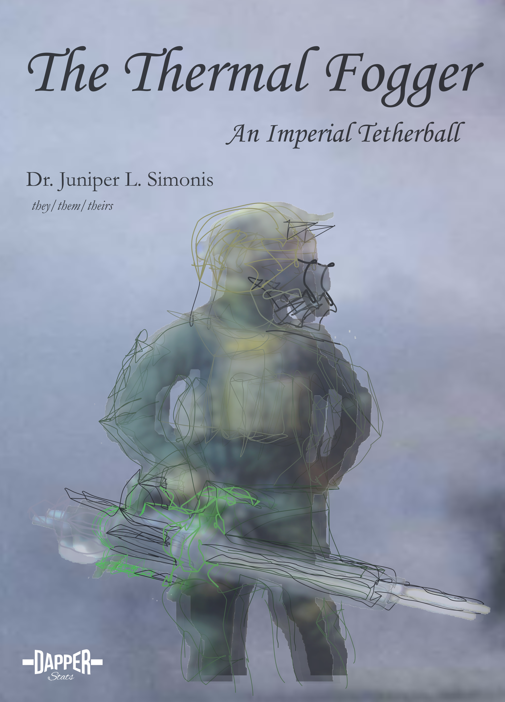

--- 
title: "The Thermal Fogger"
subtitle: "An Imperial Tetherball"
author: "Dr. Juniper L. Simonis (they/them/theirs)"
date: "`r Sys.Date()`"
description: "The history of use of thermal fogging in chemical warfare."
github-repo: "chemicalweaponsresearch/thermal_fogger"
cover-image: "img/cover.png"
url: "chemicalweaponsresearch.com/thermal_fogger"
colorlinks: yes
graphics: yes
bibliography: [packages.bib, references.bib]
biblio-style: apalike
link-citations: yes
knit: bookdown::render_book
site: bookdown::bookdown_site
---

```{r index-1, echo=FALSE}
is_on_ghactions = identical(Sys.getenv("GITHUB_ACTIONS"), "true")
is_online = curl::has_internet()
is_html = knitr::is_html_output()
```

```{asis index-2, echo=is_html}
#  {-}

This is the online home of *The Thermal Fogger: An Imperial Tetherball*, an open-source, actively curated book on the history of thermal foggers in chemical warfare.
[An archived version is available on Zenodo](https://doi.org/10.5281/zenodo.4668002).

<br>
<div style="text-align: center;">
<figure>
  
  <figcaption>
  Deployment of a thermal fogger by police in Berkeley CA, 8/31/1968; UPI Telephoto
  </figcaption>
</figure>
</div>

<br>

```


```{r include=FALSE}

  # automatically create a bib database for R packages

  knitr::write_bib(c(.packages(), 'bookdown', 'knitr', 'rmarkdown'), 'packages.bib')

```